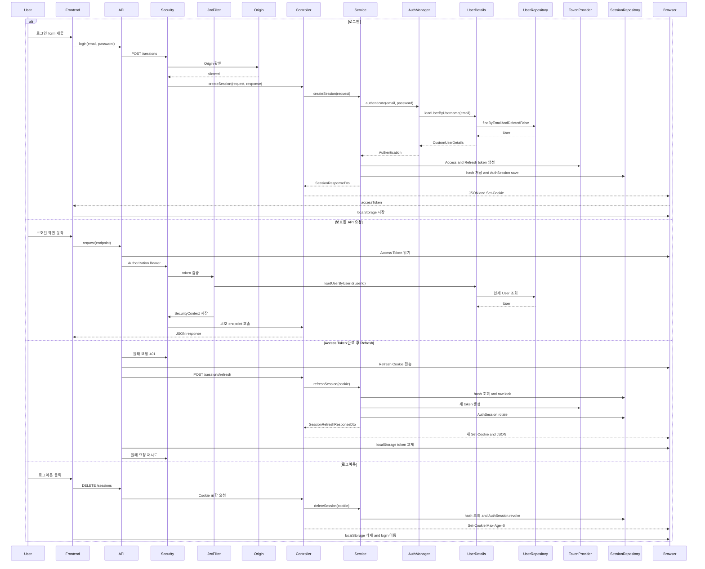

# 인증 통합 학습 문서: 로그인부터 세션 정리까지



이 문서는 기존 인증 문서 04~08을 하나의 실행 흐름으로 연결해 이해하기 위한 주 학습
문서입니다. 파일을 하나씩 외우는 것이 아니라 사용자의 동작 하나가 프론트와 백엔드를
통과하면서 값이 어디에서 만들어지고 어디에서 소비되는지를 따라갑니다.

기존 04~08 문서는 전체 원문과 세부 설명을 보존한 참고 자료입니다. 이 문서에서는 먼저
전체 흐름과 짧은 코드 구간을 학습하고, 필요한 경우 canonical 실제 파일로 원문을
대조합니다.

기준 저장소:

- 백엔드: `/Users/miles/Documents/GitHub/KTB4_Miles_Week12_Back`
- 프론트엔드: `/Users/miles/Documents/GitHub/KTB4_Miles_Week12_Front`
- 학습 문서: `/Users/miles/Documents/GitHub/kakao_tech_bootcamp_study/study12/project-study/actual-code-learning`

이 문서는 현재 소스의 정적 확인을 기준으로 작성했습니다. 애플리케이션·테스트·Docker·
Redis·MySQL·CI를 이 문서 작성 중 실행하지 않았습니다.

---

## 1. 이번 문서의 목표

다음 질문에 답할 수 있는 것을 목표로 합니다.

1. 로그인할 때 이메일·비밀번호는 어디에서 시작해 어디에서 검증되는가?
2. 로그인 성공 후 Access Token과 Refresh Token은 각각 어디에 저장되는가?
3. 보호된 API 요청에서 Access Token이 어떻게 `SecurityContext`로 바뀌는가?
4. Access Token이 만료되면 프론트와 백엔드가 어떤 순서로 Refresh하는가?
5. 로그아웃은 DB 세션과 브라우저 Cookie를 어떻게 각각 무효화하는가?
6. 비밀번호 변경·회원 탈퇴가 이미 발급된 인증 정보를 어떻게 무효화하는가?
7. 정상 요청과 인증 실패 요청은 각각 어느 응답 처리 경로로 이동하는가?

### 1.1 이번 문서 목표의 모범 답안

1. 로그인 입력은 `LoginPage.handleSubmit`에서 시작합니다. `authApi.login`과 `api.request`를 거쳐 `POST /sessions`가 되고, `SessionController`와 `SessionService`를 지나 `AuthenticationManager`가 사용자 조회·비밀번호 검증을 수행합니다.
2. Access Token은 JSON response로 frontend에 돌아와 `localStorage`의 `accessToken`에 저장됩니다. Refresh Token 원문은 `Set-Cookie` header로 browser Cookie에 저장되고, backend DB에는 원문이 아니라 SHA-256 hash가 `AuthSession`으로 저장됩니다.
3. `api.js`가 localStorage의 Access Token을 `Authorization: Bearer` header에 붙입니다. `JwtAuthenticationFilter`가 JWT를 검증하고 현재 User·`authVersion`을 확인한 뒤 `UsernamePasswordAuthenticationToken`을 `SecurityContextHolder`에 저장합니다.
4. 보호 요청이 401이면 `api.js`가 Refresh 제외 목록인지 확인합니다. 제외되지 않은 요청은 공유 `refreshPromise`로 `POST /sessions/refresh`를 한 번 실행하고, browser Cookie로 인증한 뒤 새 Access Token을 저장하고 원래 요청을 재시도합니다.
5. 로그아웃은 프론트가 Cookie를 직접 지우는 것이 아닙니다. `SessionService.deleteSession`이 DB AuthSession을 revoke하고, `SessionController.deleteSession`이 `Max-Age=0`인 `Set-Cookie`를 보냅니다. 프론트 `finally`는 localStorage token을 삭제하고 `/login`으로 이동합니다.
6. 비밀번호 변경은 `User.authVersion`을 증가시키고 active AuthSession을 revoke합니다. 회원 탈퇴는 `deleted=true`와 active session revoke를 수행합니다. 이후 Filter의 현재 User 조회·version 비교에서 기존 Access Token이 거부되고, Refresh도 무효 session으로 거부됩니다.
7. Controller·Service 예외는 `GlobalExceptionHandler`가 처리하고, Filter·Security·Interceptor 단계의 오류는 `ErrorResponseWriter` 또는 Security handler가 response를 직접 작성합니다. 따라서 모든 인증 오류가 같은 handler로 이동하지 않습니다.

---

## 2. 시작 전 최소 개념

### 2.1 Access Token과 Refresh Token

이 프로젝트는 두 Token을 서로 다른 저장·전달 방식으로 사용합니다.

| 종류 | 브라우저 위치 | 서버 전달 방식 | 서버 검증·저장 방식 |
|---|---|---|---|
| Access Token | `localStorage`의 `accessToken` | `Authorization: Bearer ...` header | JWT 서명·만료·`authVersion` 검증 후 현재 User 재조회 |
| Refresh Token | 브라우저가 관리하는 HttpOnly Cookie | `Cookie: refreshToken=...` | 원문을 SHA-256 hash로 바꿔 `auth_sessions`의 hash와 비교 |

Access Token은 프론트 JavaScript가 읽어 header에 붙입니다. Refresh Token은 `HttpOnly`
Cookie이므로 프론트 JavaScript가 원문을 읽지 않고, `fetch`의
`credentials: "include"` 설정에 따라 브라우저가 요청에 포함합니다.

### 2.2 Filter, Interceptor, Controller의 차이

```text
Security Filter
→ MVC Interceptor
→ Controller
→ Service
```

- **Filter**: Spring Security가 Controller보다 앞에서 HTTP 요청과 JWT를 처리합니다.
- **MVC Interceptor**: Spring MVC가 Controller를 호출하기 직전에 Origin과 요청 로그를 처리합니다.
- **Controller**: URL과 HTTP 입력을 Java 매개변수로 바꾸고 Service를 호출합니다.
- **Service**: 로그인·Refresh·로그아웃 업무 규칙과 DB transaction을 처리합니다.

Filter나 Interceptor의 callback은 Controller가 직접 호출하지 않습니다. Spring이 등록된
객체의 method를 실행하고, callback의 반환값을 다음 단계 진행 여부에 사용합니다.

### 2.3 Bean 생성 시점과 업무 method 호출 시점

`SecurityConfig`의 `AuthenticationManager` Bean은 애플리케이션 시작 때 준비됩니다.
그 객체가 실제 이메일·비밀번호를 검증하는 `authenticate()` method는 로그인 요청이
들어왔을 때 `SessionService.createSession()`이 호출합니다.

```text
애플리케이션 시작
→ 인증에 필요한 객체 준비

로그인 요청
→ 준비된 AuthenticationManager.authenticate() 실행
→ 실제 사용자 조회·비밀번호 검증
```

### 2.4 JWT와 `authVersion`

현재 JWT에는 다음 값이 들어갑니다.

- `subject`: 사용자 ID
- `authVersion`: 사용자 인증 버전
- 발급 시각
- 만료 시각

비밀번호를 변경하면 DB User의 `authVersion`이 증가합니다. 이후 기존 JWT의 버전과
DB의 현재 버전이 달라져 기존 Access Token이 거부됩니다.

### 2.5 Refresh Session

`AuthSession`은 Spring Security의 서버 HTTP session이 아닙니다. Refresh Token을
안전하게 다시 사용할 수 있도록 DB에 보관하는 별도의 인증 세션 Entity입니다.

```text
원문 Refresh Token
→ SHA-256 hash
→ AuthSession.refreshTokenHash에 저장
```

DB에는 Cookie 원문을 저장하지 않습니다.

---

## 3. 전체 실행 지도

### 3.1 애플리케이션 시작

```text
SpringdatajpaApplication.main
→ SpringApplication.run
→ @SpringBootApplication component scan
→ SecurityConfig가 SecurityFilterChain·AuthenticationManager·PasswordEncoder 등록
→ InterceptorConfig가 MVC Interceptor 등록 규칙 제공
→ @EnableScheduling이 AuthSessionCleanupScheduler 활성화
```

### 3.2 프론트 진입과 route guard

```text
index.html
→ main.jsx
→ App.jsx
→ AppRoutes.jsx
→ ProtectedRoute 또는 PublicOnlyRoute
→ LoginPage 또는 보호된 Page
```

프론트 route guard는 JWT 유효성을 검사하지 않습니다. `localStorage`에 `accessToken`
문자열이 있는지만 확인합니다. 실제 토큰 만료 여부는 API 요청이 백엔드에서 401을
받을 때 확인됩니다.

### 3.3 인증 전체 지도

```text
로그인
LoginPage
→ authApi.login
→ api.request
→ POST /sessions
→ SessionOriginInterceptor
→ SessionController.createSession
→ SessionService.createSession
→ AuthenticationManager
→ CustomUserDetailsService
→ UserRepository·PasswordEncoder
→ JwtProvider·RefreshTokenProvider
→ AuthSessionRepository
→ Access Token JSON + Refresh Cookie

보호 요청
보호된 Page
→ api.request
→ Authorization: Bearer Access Token
→ JwtAuthenticationFilter
→ JwtProvider
→ 현재 User 재조회·authVersion 비교
→ SecurityContextHolder
→ authorizeHttpRequests
→ Controller·Service

Refresh
401 응답
→ refreshPromise
→ POST /sessions/refresh + Cookie
→ hash 조회·row lock·active 검사
→ AuthSession.rotate
→ 새 Access Token·새 Cookie
→ 원래 요청 재시도

로그아웃
AppHeader
→ authApi.logout
→ DELETE /sessions
→ SessionService.deleteSession
→ AuthSession.revoke
→ 만료 Cookie 응답
→ localStorage 삭제·/login 이동
```

---

## 4. 현재까지 본 개념 목록

| 이름 | 선언·생성 위치 | 이번 인증 흐름에서의 역할 |
|---|---|---|
| `authStorage` | 프론트 `src/auth/authStorage.js` | Access Token을 `localStorage`에 저장·조회 |
| `authApi` | 프론트 `src/api/authApi.js` | 로그인·로그아웃 endpoint 함수 제공 |
| `request` | 프론트 `src/api/api.js` | header·Cookie·401·Refresh·retry 공통 처리 |
| `SessionRequestDto` | 백엔드 `dto/user` | 로그인 JSON body를 담는 객체 |
| `SessionController` | 백엔드 `controller` | `/sessions` HTTP 입력·응답 처리 |
| `SessionService` | 백엔드 `service` | 인증·token·DB session 업무 처리 |
| `AuthenticationManager` | Spring Security Bean | 이메일·비밀번호 검증 실행 |
| `CustomUserDetailsService` | 백엔드 `auth` | email 또는 userId로 User 조회·wrapper 생성 |
| `CustomUserDetails` | 백엔드 `auth` | User Entity를 Spring Security 형식으로 감쌈 |
| `JwtProvider` | 백엔드 `auth` | Access Token 생성·검증 |
| `RefreshTokenProvider` | 백엔드 `auth` | 원문 생성·hash·만료 시각 생성 |
| `RefreshCookieProvider` | 백엔드 `auth` | `Set-Cookie`에 넣을 Cookie 생성 |
| `AuthSession` | 백엔드 `entity` | Refresh Token hash와 활성·만료·revoke 상태 저장 |
| `JwtAuthenticationFilter` | 백엔드 `auth` | 보호 요청의 Bearer Token을 인증 객체로 변환 |
| `SecurityContextHolder` | Spring Security | 현재 요청의 Authentication 보관 |
| `SessionOriginInterceptor` | 백엔드 `config` | Cookie session endpoint의 Origin 검사 |
| `ErrorResponseWriter` | 백엔드 `config` | Filter·Interceptor 단계의 직접 JSON 오류 응답 |

새 코드가 나올 때마다 이름만 외우지 않고 현재 흐름에서 입력과 반환값이 어떻게 다시
사용되는지 연결합니다.

---

## 5. 흐름 1: 로그인

### 5.1 목표

로그인 화면의 입력이 `POST /sessions` 요청이 되어, 서버에서 검증된 뒤 Access Token은
JSON으로, Refresh Token은 Cookie로 나뉘어 브라우저에 저장되는 과정을 이해합니다.

### 5.2 프론트 화면의 진입점

실제 파일:

`/Users/miles/Documents/GitHub/KTB4_Miles_Week12_Front/src/pages/auth/LoginPage.jsx`

```jsx
async function handleSubmit(event) {
    event.preventDefault();

    if (!isValid) {
        setErrors({
            email: getFieldError("email", form.email),
            password: getFieldError("password", form.password),
        });
        return;
    }

    try {
        setIsSubmitting(true);
        setErrors({ email: "", password: "" });
        const result = await authApi.login({
            email: form.email.trim(),
            password: form.password,
        });
        authStorage.setAccessToken(result.accessToken);
        navigate("/posts", { replace: true });
    } catch (error) {
        // error.code에 따라 modal 또는 field error를 갱신한다.
    } finally {
        setIsSubmitting(false);
    }
}
```

#### 이 코드의 연결 정보

- **선언**: `LoginPage.jsx`의 `LoginPage` 함수 내부
- **호출자**: `LoginForm`에 `onSubmit={handleSubmit}`으로 전달되고 사용자가 form을 제출할 때 React가 호출
- **입력 출처**: `form` state의 `email`, `password`
- **API 호출**: `authApi.login(...)`
- **반환값 사용**: `api.request()`가 반환한 JSON의 `accessToken`을 `authStorage.setAccessToken()`에 전달
- **성공 후 상태**: `localStorage`에 Access Token 저장 후 `/posts`로 이동
- **실패 후 상태**: `error.code`를 정지 계정 modal 또는 password field 오류로 변환

`LoginForm`은 화면 입력과 submit callback을 표시하는 컴포넌트입니다. API를 직접
호출하지 않습니다. 실제 업무 시작점은 `LoginPage.handleSubmit`입니다.

### 5.3 `authApi.login`이 만드는 요청

실제 파일:

`/Users/miles/Documents/GitHub/KTB4_Miles_Week12_Front/src/api/authApi.js`

```js
login({ email, password }) {
    return request("/sessions", {
        method: "POST",
        body: JSON.stringify({ email, password }),
    });
}
```

- `email`, `password`: `LoginPage.handleSubmit`가 전달한 객체에서 구조 분해됩니다.
- `JSON.stringify`: JavaScript 객체를 HTTP body에 넣을 문자열로 바꿉니다.
- 반환값: `request()`가 반환하는 Promise를 그대로 LoginPage에 돌려줍니다.
- `request` 선언 위치: `src/api/api.js`

이 함수는 `SessionController`를 직접 호출하지 않습니다. `/sessions` 문자열과 HTTP
method·body를 `request`에 전달하고, 실제 `fetch`는 공통 모듈이 수행합니다.

### 5.4 공통 `request`가 header와 Cookie를 준비하는 과정

실제 파일:

`/Users/miles/Documents/GitHub/KTB4_Miles_Week12_Front/src/api/api.js`

```js
async function sendRequest(endpoint, options = {}, includeAccessToken = true) {
    const accessToken = authStorage.getAccessToken();
    const headers = {
        "Content-Type": "application/json",
        ...options.headers,
    };

    if (includeAccessToken && accessToken) {
        headers.Authorization = `Bearer ${accessToken}`;
    }

    const response = await fetch(`${API_BASE_URL}${endpoint}`, {
        ...options,
        headers,
        credentials: "include",
    });

    return {
        response,
        data: await readResponseData(response),
    };
}
```

로그인 시점에는 Access Token이 없을 수 있으므로 Authorization header가 생략될 수
있습니다. 그래도 `credentials: "include"`는 사용됩니다. 이 설정은 브라우저가 Cookie를
요청에 포함하고, 응답의 `Set-Cookie`를 처리할 수 있도록 하는 요청 옵션입니다.

`API_BASE_URL`은 `VITE_API_BASE_URL`이 있으면 그 값을 쓰고, 없으면
`http://localhost:8080`을 사용합니다. 운영 frontend image는 `/api`를 기본값으로
빌드합니다.

### 5.5 로그인 요청이 Backend Controller까지 도달하는 조건

로그인 요청은 인증을 시작하는 요청이므로 아직 Access Token이 없습니다. 그래서 두 규칙을
구분해야 합니다.

#### JWT Filter 제외

실제 파일:

`/Users/miles/Documents/GitHub/KTB4_Miles_Week12_Back/src/main/java/kr/adapterz/springdatajpa/auth/JwtAuthenticationFilter.java`

```java
protected boolean shouldNotFilter(HttpServletRequest request) {
    String method = request.getMethod();
    String path = request.getServletPath();

    return method.equals("OPTIONS")
            || method.equals("POST") && path.equals("/users")
            || method.equals("POST") && path.equals("/sessions")
            || method.equals("POST") && path.equals("/sessions/refresh")
            || method.equals("DELETE") && path.equals("/sessions");
}
```

`POST /sessions`이면 `true`입니다. `true`는 JWT Filter 내부 검증을 건너뛴다는 뜻이지,
endpoint가 자동으로 공개된다는 뜻은 아닙니다.

#### Security 공개 endpoint

실제 파일:

`/Users/miles/Documents/GitHub/KTB4_Miles_Week12_Back/src/main/java/kr/adapterz/springdatajpa/config/SecurityConfig.java`

```java
.authorizeHttpRequests(auth -> auth
        .requestMatchers(
                HttpMethod.POST,
                "/sessions",
                "/sessions/refresh"
        ).permitAll()
        .requestMatchers(HttpMethod.DELETE, "/sessions").permitAll()
        .anyRequest().authenticated()
)
```

Filter를 건너뛰는 규칙과 Security가 접근을 허용하는 규칙은 서로 다른 설정입니다.

### 5.6 Origin 검사

`InterceptorConfig`가 다음 객체를 MVC에 등록합니다.

```java
registry.addInterceptor(sessionOriginInterceptor)
        .addPathPatterns("/sessions", "/sessions/refresh");
```

Spring MVC는 요청 경로가 맞는지 확인한 뒤 `SessionOriginInterceptor.preHandle()`을
호출합니다. 이 method는 다음 세 요청만 Origin 검사 대상으로 분류합니다.

```text
POST /sessions
POST /sessions/refresh
DELETE /sessions
```

```java
String origin = request.getHeader("Origin");

if (corsOriginProvider.isAllowed(origin)) {
    return true;
}

errorResponseWriter.write(
        response,
        HttpStatus.FORBIDDEN,
        ApiErrorCode.FORBIDDEN_ORIGIN
);
return false;
```

- `origin`: 브라우저 요청의 `Origin` header에서 나옵니다.
- `isAllowed`: 설정에서 만든 허용 Origin Set과 완전 일치하는지 확인합니다.
- `true`: Spring MVC가 Controller로 계속 진행합니다.
- `false`: `ErrorResponseWriter`가 먼저 403 JSON을 작성하고 Controller 호출을 중단합니다.

이 검사는 로그인 password나 Refresh Cookie의 값이 올바른지 확인하지 않습니다. Cookie가
자동 전송되는 세션 endpoint에 허용되지 않은 출처의 요청이 도달하지 않도록 하는 별도
검사입니다.

### 5.7 Request DTO로 JSON body 받기

실제 파일:

`/Users/miles/Documents/GitHub/KTB4_Miles_Week12_Back/src/main/java/kr/adapterz/springdatajpa/dto/user/SessionRequestDto.java`

```java
public class SessionRequestDto {
    @NotBlank
    @Email
    private String email;

    @NotBlank
    @Pattern(regexp = "^(?=.*[A-Z])(?=.*[a-z])(?=.*\\d)(?=.*[!@#$%^&*()_+\\-=\\[\\]{};':\"\\\\|,.<>\\/?~]).{8,20}$")
    private String password;
}
```

Controller의 `@RequestBody`가 JSON field를 DTO field에 넣고, `@Valid`가 annotation
조건을 실행합니다. 프론트 validation을 통과했더라도 backend validation은 별도로 실행됩니다.

### 5.8 `SessionController.createSession`

실제 파일:

`/Users/miles/Documents/GitHub/KTB4_Miles_Week12_Back/src/main/java/kr/adapterz/springdatajpa/controller/SessionController.java`

```java
@PostMapping
@ResponseStatus(HttpStatus.CREATED)
public SessionResponseDto createSession(
        @Valid @RequestBody SessionRequestDto request,
        HttpServletResponse response
) {
    SessionResponseDto sessionResponse = sessionService.createSession(request);

    response.addHeader(
            HttpHeaders.SET_COOKIE,
            refreshCookieProvider
                    .createRefreshTokenCookie(sessionResponse.getRefreshToken())
                    .toString()
    );

    return sessionResponse;
}
```

- `request`: Jackson이 JSON body로부터 만든 `SessionRequestDto`입니다.
- `response`: Servlet container가 만든 응답 객체를 Spring MVC가 전달합니다.
- `sessionService.createSession(request)`: Controller가 인증 업무를 Service로 위임합니다.
- `sessionResponse.getRefreshToken()`: Service가 내부 DTO에 담아 반환한 원문 Refresh Token입니다.
- `Set-Cookie`: 원문을 브라우저 Cookie로 전달하는 응답 header입니다.
- `return sessionResponse`: Jackson이 `@JsonIgnore`가 아닌 field를 JSON body로 직렬화합니다.

### 5.9 `SessionService.createSession`

실제 파일:

`/Users/miles/Documents/GitHub/KTB4_Miles_Week12_Back/src/main/java/kr/adapterz/springdatajpa/service/SessionService.java`

```java
public SessionResponseDto createSession(SessionRequestDto request) {
    try {
        Authentication authentication = authenticationManager.authenticate(
                new UsernamePasswordAuthenticationToken(
                        request.getEmail(),
                        request.getPassword()
                )
        );

        CustomUserDetails userDetails =
                (CustomUserDetails) authentication.getPrincipal();

        String accessToken = jwtProvider.createAccessToken(
                userDetails.getUserId(),
                userDetails.getAuthVersion()
        );
        String refreshToken = refreshTokenProvider.createRefreshToken();
        String refreshTokenHash = refreshTokenProvider.hashRefreshToken(refreshToken);

        AuthSession authSession = new AuthSession(
                userDetails.getUser(),
                refreshTokenHash,
                refreshTokenProvider.createExpirationTime()
        );
        authSessionRepository.save(authSession);

        return new SessionResponseDto(
                accessToken,
                refreshToken,
                userDetails.getUserId()
        );
    } catch (DisabledException e) {
        throw new LoginFailedException("Suspended_Account");
    } catch (AuthenticationException e) {
        throw new LoginFailedException("Login_Failed");
    }
}
```

#### 이 코드의 값 이동

```text
SessionRequestDto.request
→ request.getEmail(), request.getPassword()
→ UsernamePasswordAuthenticationToken
→ AuthenticationManager.authenticate()
→ Authentication.principal
→ CustomUserDetails userDetails
→ userId·authVersion·User Entity
```

`AuthenticationManager.authenticate()`가 내부에서 사용하는 연결은 다음과 같습니다.

```text
AuthenticationManager.authenticate
→ CustomUserDetailsService.loadUserByUsername(email)
→ UserRepository.findByEmailAndDeletedFalse(email)
→ CustomUserDetails(User)
→ UserDetails.getPassword()
→ PasswordEncoder로 입력 password와 DB hash 비교
```

`CustomUserDetailsService.loadUserByUsername()`은 Controller가 직접 호출하지 않습니다.
Spring Security가 `AuthenticationManager` 내부에서 호출합니다.

#### 성공 후 생성되는 세 값

1. `jwtProvider.createAccessToken(...)`: 다음 API 요청에 사용할 Access Token
2. `refreshTokenProvider.createRefreshToken()`: 브라우저 Cookie에 넣을 원문 Refresh Token
3. `refreshTokenProvider.hashRefreshToken(refreshToken)`: DB에 저장할 hash

`AuthSession` 생성자에는 원문이 아닌 hash가 들어갑니다. `save()`는 새 Entity를 DB
INSERT 대상으로 transaction에 등록합니다.

#### 예외 이동

- 계정이 비활성화되어 `DisabledException`이 발생하면 `Suspended_Account`로 변환됩니다.
- 그 외 Spring Security 인증 실패는 `Login_Failed`로 변환됩니다.
- 두 예외는 `GlobalExceptionHandler`가 401 JSON으로 바꿉니다.

### 5.10 Token 생성과 로그인 성공 결과

`JwtProvider.createAccessToken(userId, authVersion)`은 JWT의 subject·authVersion·발급
시각·만료 시각을 만들고 비밀키로 서명한 문자열을 반환합니다.

`RefreshTokenProvider`는 32 byte 난수를 URL-safe Base64로 바꿔 원문을 만들고,
DB에는 SHA-256 hexadecimal hash만 저장합니다.

```text
SessionService
├─ accessToken → SessionResponseDto.accessToken → JSON body → LoginPage
├─ refreshToken 원문 → SessionResponseDto.refreshToken → Controller Set-Cookie
└─ refreshTokenHash → AuthSession.refreshTokenHash → auth_sessions INSERT
```

프론트는 응답 JSON의 `accessToken`만 `localStorage`에 저장합니다. Refresh Token 원문은
프론트 코드가 읽지 않습니다.

### 5.11 로그인 흐름 checkpoint

- `LoginForm`과 `LoginPage.handleSubmit` 중 실제 API를 호출하는 쪽은 어디인가?
- `authApi.login()`은 Controller를 직접 호출하는가, 아니면 어떤 공통 함수를 호출하는가?
- `request.getEmail()`의 값은 어디에서 시작했는가?
- Access Token과 Refresh Token 원문과 hash는 각각 어디로 가는가?
- `AuthenticationManager` Bean 생성과 `authenticate()` 실행은 언제 각각 일어나는가?
- 로그인 실패가 Filter의 `ErrorResponseWriter`가 아니라 `GlobalExceptionHandler`로 가는 이유는 무엇인가?

### 5.12 로그인 흐름 모범 답안

1. 실제 API를 호출하는 쪽은 `LoginPage.handleSubmit`입니다. `LoginForm`은 `onSubmit` prop으로 받은 callback을 호출할 뿐이고, API module을 직접 부르지 않습니다.
2. `authApi.login()`은 `SessionController`를 직접 호출하지 않습니다. `request("/sessions", ...)`를 호출하고, `request`가 `sendRequest`와 `fetch`를 통해 HTTP 요청을 만듭니다.
3. `request.getEmail()`의 시작값은 사용자가 LoginForm의 email input에 입력한 값입니다. `LoginPage.form.email` state에 저장되고, `handleSubmit`에서 `trim()`된 값이 `authApi.login` body를 거쳐 JSON·`SessionRequestDto`가 됩니다.
4. Access Token은 로그인 response JSON → `LoginPage.result.accessToken` → `authStorage.setAccessToken` → `localStorage`로 이동합니다. Refresh Token 원문은 Service의 DTO에 담겼다가 Controller가 `Set-Cookie` header로 옮깁니다. hash는 `AuthSession.refreshTokenHash`에만 저장됩니다.
5. `SecurityConfig.authenticationManager(...)`의 `@Bean` method는 ApplicationContext를 만드는 시작 시점에 AuthenticationManager 객체를 준비합니다. 실제 `authenticate()`와 사용자 조회·비밀번호 비교는 `POST /sessions` 요청 중 `SessionService.createSession()`이 호출할 때 실행됩니다.
6. 로그인 실패는 `SessionController`까지 도달한 뒤 `SessionService`의 `AuthenticationManager.authenticate()`에서 발생합니다. 예외가 Controller 밖으로 전파되면 `GlobalExceptionHandler`가 처리합니다. `ErrorResponseWriter`는 Controller에 도달하기 전 Filter·Security·Interceptor 단계의 직접 응답에 사용됩니다.

---

## 6. 흐름 2: 보호된 API 요청과 Access Token 인증

### 6.1 목표

로그인 후 `localStorage`의 Access Token이 요청 header로 이동하고, 백엔드 Filter가 이를
검증해 `SecurityContextHolder`에 Authentication을 저장한 뒤 Controller의 인증 사용자
매개변수까지 전달하는 과정을 이해합니다.

### 6.2 프론트 route guard와 서버 인증은 다르다

실제 파일:

`/Users/miles/Documents/GitHub/KTB4_Miles_Week12_Front/src/routes/ProtectedRoute.jsx`

```jsx
function ProtectedRoute() {
    if (!authStorage.isLoggedIn()) {
        return <Navigate to="/login" replace />;
    }

    return <Outlet />;
}
```

`authStorage.isLoggedIn()`은 `localStorage`에 문자열이 있는지만 검사합니다.

```js
isLoggedIn() {
    return Boolean(authStorage.getAccessToken());
}
```

토큰이 만료되었거나 조작되었어도 문자열이 남아 있으면 route guard는 통과할 수 있습니다.
실제 유효성 검사는 보호 API를 요청한 뒤 백엔드에서 실행됩니다.

### 6.3 프론트가 Authorization header를 붙인다

실제 파일:

`/Users/miles/Documents/GitHub/KTB4_Miles_Week12_Front/src/api/api.js`

```js
const accessToken = authStorage.getAccessToken();

if (includeAccessToken && accessToken) {
    headers.Authorization = `Bearer ${accessToken}`;
}
```

이 값은 로그인 성공 때 저장된 token입니다. `api.js`는 요청할 때 다시 읽기 때문에,
Refresh 성공 후 재시도는 새 localStorage 값을 사용할 수 있습니다.

### 6.4 Security FilterChain에 Filter 등록

실제 파일:

`/Users/miles/Documents/GitHub/KTB4_Miles_Week12_Back/src/main/java/kr/adapterz/springdatajpa/config/SecurityConfig.java`

```java
.authorizeHttpRequests(auth -> auth
        .requestMatchers(HttpMethod.OPTIONS, "/**").permitAll()
        .requestMatchers(HttpMethod.GET, "/actuator/health").permitAll()
        .requestMatchers(HttpMethod.POST, "/users").permitAll()
        .requestMatchers(HttpMethod.POST, "/sessions", "/sessions/refresh").permitAll()
        .requestMatchers(HttpMethod.DELETE, "/sessions").permitAll()
        .anyRequest().authenticated()
)
.addFilterBefore(
        jwtAuthenticationFilter,
        UsernamePasswordAuthenticationFilter.class
);
```

- `permitAll()`: 해당 endpoint가 JWT 없이도 Security 인가를 통과하게 합니다.
- `anyRequest().authenticated()`: 나머지는 SecurityContext에 인증이 있어야 합니다.
- `addFilterBefore`: `JwtAuthenticationFilter`를 Security Filter chain에 연결합니다.

### 6.5 `JwtAuthenticationFilter`의 값 이동

실제 파일:

`/Users/miles/Documents/GitHub/KTB4_Miles_Week12_Back/src/main/java/kr/adapterz/springdatajpa/auth/JwtAuthenticationFilter.java`

```java
String authorizationHeader = request.getHeader("Authorization");

if (authorizationHeader == null || !authorizationHeader.startsWith("Bearer ")) {
    filterChain.doFilter(request, response);
    return;
}

String token = authorizationHeader.substring(7);
AccessTokenClaims tokenClaims = jwtProvider.getAccessTokenClaims(token);
CustomUserDetails userDetails =
        customUserDetailsService.loadUserByUserId(tokenClaims.userId());

if (!userDetails.isEnabled()
        || userDetails.getAuthVersion() != tokenClaims.authVersion()) {
    throw new DataNullException("No_User");
}

UsernamePasswordAuthenticationToken authentication =
        new UsernamePasswordAuthenticationToken(
                userDetails,
                null,
                userDetails.getAuthorities()
        );

SecurityContextHolder.getContext().setAuthentication(authentication);
filterChain.doFilter(request, response);
```

실행 순서:

1. `Authorization` header 전체를 읽습니다.
2. Bearer 형식이 아니면 인증하지 않고 다음 Filter로 넘깁니다.
3. `substring(7)`로 JWT 부분만 남깁니다.
4. `JwtProvider`가 서명·만료·claim 형식을 검증합니다.
5. 검증된 JWT의 `userId`로 현재 DB User를 다시 조회합니다.
6. 삭제·정지 여부와 DB `authVersion`을 확인합니다.
7. 사용자와 권한을 Authentication 객체에 넣습니다.
8. `SecurityContextHolder`에 저장합니다.
9. `filterChain.doFilter()`로 이후 Filter와 DispatcherServlet에 넘깁니다.

`filterChain.doFilter()`는 Controller를 직접 호출하지 않습니다. 현재 Filter 뒤의 다음
Filter를 호출하고, 모든 Filter가 끝나면 DispatcherServlet이 Controller를 찾습니다.

### 6.6 `JwtProvider`와 `AccessTokenClaims`

실제 파일:

`/Users/miles/Documents/GitHub/KTB4_Miles_Week12_Back/src/main/java/kr/adapterz/springdatajpa/auth/JwtProvider.java`

```java
public AccessTokenClaims getAccessTokenClaims(String token) {
    try {
        Claims claims = Jwts.parser()
                .verifyWith(secretKey)
                .build()
                .parseSignedClaims(token)
                .getPayload();

        Object authVersionClaim = claims.get(AUTH_VERSION_CLAIM);
        if (!(authVersionClaim instanceof Number authVersion)) {
            throw new AuthException("Invalid_Token");
        }

        return new AccessTokenClaims(
                Long.valueOf(claims.getSubject()),
                authVersion.longValue()
        );
    } catch (JwtException | IllegalArgumentException e) {
        throw new AuthException("Invalid_Token");
    }
}
```

반환 타입 `AccessTokenClaims`는 다음 값을 묶은 Java `record`입니다.

```java
public record AccessTokenClaims(
        Long userId,
        long authVersion
) {
}
```

반환값의 소비자는 `JwtAuthenticationFilter`입니다.

```text
getAccessTokenClaims(token)
→ tokenClaims.userId()
→ loadUserByUserId(userId)
→ tokenClaims.authVersion()
→ DB User.authVersion 비교
```

JWT 검증 실패나 claim 변환 실패는 `AuthException("Invalid_Token")`으로 바뀌고,
Filter의 catch가 401 `INVALID_TOKEN`을 직접 작성합니다.

### 6.7 현재 User를 다시 조회하는 이유

실제 파일:

`/Users/miles/Documents/GitHub/KTB4_Miles_Week12_Back/src/main/java/kr/adapterz/springdatajpa/auth/CustomUserDetailsService.java`

```java
public CustomUserDetails loadUserByUserId(Long userId) {
    User user = userRepository.findByUserIdAndDeletedFalse(userId)
            .orElseThrow(() -> new DataNullException("No_User"));

    return new CustomUserDetails(user);
}
```

- `userId`: request body가 아니라 검증된 JWT `subject`에서 나옵니다.
- `findByUserIdAndDeletedFalse`: 삭제되지 않은 현재 User만 조회합니다.
- 반환값: User Entity를 `CustomUserDetails` wrapper로 감싼 객체입니다.
- Filter 소비 위치: `isEnabled()`, `getAuthVersion()`, `getAuthorities()`

### 6.8 SecurityContext에서 Controller로 이동

실제 파일:

`/Users/miles/Documents/GitHub/KTB4_Miles_Week12_Back/src/main/java/kr/adapterz/springdatajpa/controller/UserController.java`

```java
@GetMapping("/me")
public UserInfoResponseDto getMyInfo(
        @AuthenticationPrincipal CustomUserDetails userDetails
) {
    return userService.getMyInfo(userDetails.getUserId());
}
```

`userDetails`를 Controller가 직접 생성하지 않습니다. Spring Security가
`SecurityContextHolder`에 저장된 Authentication의 principal을 method parameter에 넣습니다.

### 6.9 보호 요청 실패 구분

| 상황 | 처리 주체 | 결과 |
|---|---|---|
| Access Token header 없음 | Filter는 통과, Security 인가 단계 | 401 `UNAUTHORIZED` |
| Bearer 형식이지만 서명·만료·claim 오류 | `JwtAuthenticationFilter` | 401 `INVALID_TOKEN` |
| User 삭제·정지 또는 `authVersion` 불일치 | `JwtAuthenticationFilter` | 401 `INVALID_TOKEN` |
| 인증은 됐지만 권한 부족 | Security access denied handler | 403 `FORBIDDEN` |

### 6.9.1 Access Token을 저장하지 않고 검증하는 이유

현재 backend는 Access Token 원문을 DB나 Redis에 저장하지 않습니다. Access Token 자체가
필요한 정보를 담고 서버 비밀키로 서명된 JWT이기 때문에, backend는 매 요청마다 token을
다시 검증합니다.

```text
Authorization: Bearer <token>
→ JwtAuthenticationFilter
→ JwtProvider.getAccessTokenClaims(token)
→ 서명·만료·claim 검증
→ token의 userId로 현재 User 재조회
→ deleted·suspended·authVersion 확인
→ 통과하면 SecurityContext에 현재 요청의 Authentication 저장
```

#### 1. 발급할 때 서명에 사용할 key를 준비한다

실제 파일:

`/Users/miles/Documents/GitHub/KTB4_Miles_Week12_Back/src/main/java/kr/adapterz/springdatajpa/auth/JwtProvider.java`

```java
public JwtProvider(
        @Value("${jwt.secret}") String secret,
        @Value("${jwt.access-expiration-millis}") long accessExpirationMillis
) {
    this.secretKey = Keys.hmacShaKeyFor(
            secret.getBytes(StandardCharsets.UTF_8)
    );
    this.accessExpirationMillis = accessExpirationMillis;
}
```

Spring이 애플리케이션 시작 때 설정의 `jwt.secret`을 주입하고, 문자열을 HMAC 서명용
`SecretKey`로 변환합니다. 같은 `secretKey`가 `createAccessToken()`의 서명과
`getAccessTokenClaims()`의 검증에 사용됩니다.

```java
return Jwts.builder()
        .subject(String.valueOf(userId))
        .claim(AUTH_VERSION_CLAIM, authVersion)
        .issuedAt(now)
        .expiration(expiration)
        .signWith(secretKey)
        .compact();
```

이때 token 안에 사용자 ID, `authVersion`, 발급 시각, 만료 시각을 넣고 `secretKey`로
서명합니다. 서버는 token 원문을 보관하는 대신 이 서명을 나중에 다시 확인합니다.

#### 2. 요청마다 JWT 서명·만료·claim을 검증한다

```java
Claims claims = Jwts.parser()
        .verifyWith(secretKey)
        .build()
        .parseSignedClaims(token)
        .getPayload();
```

- `verifyWith(secretKey)`: 발급 때 사용한 key로 서명을 확인합니다. token 내용이 변조되었거나 다른 key로 서명되면 검증이 실패합니다.
- `parseSignedClaims(token)`: signed JWT를 parsing하며 형식·서명·만료 같은 JWT 조건을 확인합니다. 현재 코드가 만료 시각을 직접 비교하지 않아도 JWT library가 검증 과정에서 실패시키고, `JwtException` catch가 `Invalid_Token`으로 변환합니다.
- `getPayload()`: 검증이 통과한 claim 묶음을 가져옵니다.

그 다음 custom `authVersion`이 숫자인지 확인하고, JWT subject를 사용자 ID로 변환해
`AccessTokenClaims` record로 반환합니다.

#### 3. token의 userId로 현재 DB User를 다시 확인한다

```java
CustomUserDetails userDetails =
        customUserDetailsService.loadUserByUserId(tokenClaims.userId());

if (!userDetails.isEnabled()
        || userDetails.getAuthVersion() != tokenClaims.authVersion()) {
    throw new DataNullException("No_User");
}
```

JWT 서명만 맞는다고 바로 통과시키지 않습니다.

- `loadUserByUserId`: `UserRepository.findByUserIdAndDeletedFalse`로 현재 활성 User를 다시 조회합니다.
- `isEnabled`: User가 삭제되지 않았고 정지되지 않았는지 확인합니다.
- `getAuthVersion() != tokenClaims.authVersion()`: DB의 현재 인증 버전과 token 발급 당시 버전을 비교합니다.

이 DB 재조회와 version 비교가 있어 비밀번호 변경이나 회원 탈퇴 뒤 기존 Access Token을
만료 전에도 거부할 수 있습니다.

#### 4. 검증 결과는 DB가 아니라 현재 요청에만 저장한다

```java
SecurityContextHolder.getContext()
        .setAuthentication(authentication);
```

이 코드는 Access Token을 DB에 저장하는 코드가 아닙니다. 현재 HTTP 요청이 뒤의 Security
인가 단계와 Controller에서 인증된 요청으로 취급되도록 Authentication을 요청 처리
context에 넣는 코드입니다. 요청 처리가 끝난 뒤에도 영구 인증 session row로 보관되는
방식은 아닙니다.

따라서 현재 인증 저장 위치는 다음처럼 구분합니다.

```text
frontend localStorage
→ Access Token 문자열 보관

backend DB·Redis
→ Access Token 원문 보관하지 않음

backend 현재 요청 SecurityContext
→ 검증이 끝난 Authentication 임시 보관

backend DB User.authVersion
→ 오래된 Access Token을 무효화하기 위한 현재 상태 보관
```

#### 5. 저장하지 않는 구조의 한계

로그아웃 때 `AuthSession`을 revoke해도 이미 발급된 Access Token row를 찾아 삭제할 수는
없습니다. 현재 Access Token은 DB에 없기 때문입니다. 그래서 로그아웃은 Refresh Session과
Cookie를 무효화하지만, 이미 발급된 Access Token은 만료 전까지 남을 수 있습니다.
비밀번호 변경은 `authVersion`을 증가시키고, 탈퇴는 현재 User 조회에서 제외시키므로
별도의 token blacklist 없이도 기존 Access Token을 거부할 수 있습니다.

### 6.10 보호 요청 checkpoint

- `ProtectedRoute`가 token의 서명과 만료를 검사하는가?
- `Authorization` header의 값은 어느 storage에서 오는가?
- `JwtProvider.getAccessTokenClaims()`의 반환값은 누가 소비하는가?
- 왜 JWT의 `userId`로 DB User를 다시 조회하는가?
- `SecurityContextHolder`의 principal은 어느 Controller parameter로 들어가는가?
- header 없음과 invalid JWT의 오류 code가 왜 다른가?

### 6.11 보호 요청 모범 답안

1. `ProtectedRoute`는 token의 서명·만료를 검사하지 않습니다. `localStorage`에 `accessToken` 문자열이 있는지만 확인하고, 실제 검증은 backend `JwtAuthenticationFilter`가 API 요청 중 수행합니다.
2. `Authorization` header의 값은 frontend `authStorage.getAccessToken()`이 `localStorage`에서 읽은 Access Token입니다.
3. `JwtProvider.getAccessTokenClaims()`의 반환값은 `JwtAuthenticationFilter`가 소비합니다. Filter는 `userId`로 User를 재조회하고 `authVersion`을 DB 값과 비교합니다.
4. JWT의 userId만 믿으면 탈퇴·정지·현재 사용자 상태 변경을 반영할 수 없습니다. 매 요청 현재 User를 다시 조회해야 삭제 여부·정지 여부·최신 `authVersion`을 확인할 수 있습니다.
5. Filter가 만든 Authentication의 principal이 `SecurityContextHolder`에 저장되고, Spring Security가 이를 `@AuthenticationPrincipal CustomUserDetails userDetails` Controller parameter에 넣습니다.
6. Bearer header가 없으면 Filter가 인증하지 않은 채 chain을 통과시키고 Security 인가 단계가 401 `UNAUTHORIZED`를 만듭니다. 형식은 있지만 JWT가 잘못되면 Filter가 직접 401 `INVALID_TOKEN`을 작성하므로 오류 code가 다릅니다.

---

## 7. 흐름 3: Refresh Token 재발급과 원래 요청 재시도

### 7.1 목표

보호 API가 401을 반환했을 때 프론트가 Refresh Cookie로 새 Access Token을 받고, 백엔드가
DB의 Refresh Session을 lock·검증·rotation한 뒤 원래 요청을 다시 보내는 과정을 이해합니다.

### 7.2 프론트가 Refresh를 시작하는 조건

실제 파일:

`/Users/miles/Documents/GitHub/KTB4_Miles_Week12_Front/src/api/api.js`

```js
const NO_REFRESH_REQUESTS = new Set([
    "POST /sessions",
    "POST /sessions/refresh",
    "DELETE /sessions",
    "POST /users",
]);

export async function request(endpoint, options = {}) {
    let result = await sendRequest(endpoint, options);

    if (
        result.response.status === 401 &&
        !isRefreshExcludedRequest(endpoint, options)
    ) {
        await refreshAccessToken();
        result = await sendRequest(endpoint, options);
    }

    if (!result.response.ok) {
        if (result.response.status === 401) {
            clearAuthentication();
        }
        throw createRequestError(result.response, result.data);
    }

    return result.data;
}
```

자동 Refresh 제외 요청은 로그인·Refresh·로그아웃·회원가입입니다. Refresh 자체가 401일
때 다시 Refresh하면 무한 반복이 되므로 `POST /sessions/refresh`가 제외됩니다.

### 7.3 동시 Refresh를 하나로 묶는 `refreshPromise`

```js
let refreshPromise = null;

export function refreshAccessToken() {
    if (!refreshPromise) {
        refreshPromise = performRefresh().finally(() => {
            refreshPromise = null;
        });
    }

    return refreshPromise;
}
```

- 첫 번째 401 요청이 `performRefresh()`를 시작합니다.
- 같은 시점의 다른 요청은 같은 Promise를 받습니다.
- 성공 또는 실패가 끝나면 module-level 변수는 다시 `null`이 됩니다.
- Refresh 성공 후 각 원래 요청은 새 localStorage token으로 다시 전송됩니다.

### 7.4 Refresh 요청의 credential

```js
async function performRefresh() {
    const result = await sendRequest(
        "/sessions/refresh",
        { method: "POST" },
        false,
    );

    if (!result.response.ok) {
        throw createRequestError(result.response, result.data);
    }

    if (!result.data?.accessToken) {
        throw new Error("액세스 토큰 재발급 응답이 올바르지 않습니다.");
    }

    authStorage.setAccessToken(result.data.accessToken);
    return result.data;
}
```

세 번째 인자 `false`는 Access Token header를 붙이지 않도록 합니다. 대신
`credentials: "include"`는 그대로 적용되어 브라우저가 Refresh Cookie를 전송합니다.

```text
Refresh response JSON
→ result.data.accessToken
→ authStorage.setAccessToken
→ 원래 요청의 재전송 header
```

### 7.5 Backend Refresh Controller

실제 파일:

`/Users/miles/Documents/GitHub/KTB4_Miles_Week12_Back/src/main/java/kr/adapterz/springdatajpa/controller/SessionController.java`

```java
@PostMapping("/refresh")
public SessionRefreshResponseDto refreshSession(
        @CookieValue(
                name = RefreshCookieProvider.COOKIE_NAME,
                required = false
        ) String refreshToken,
        HttpServletResponse response
) {
    SessionRefreshResponseDto refreshResponse =
            sessionService.refreshSession(refreshToken);

    response.addHeader(
            HttpHeaders.SET_COOKIE,
            refreshCookieProvider
                    .createRefreshTokenCookie(refreshResponse.getRefreshToken())
                    .toString()
    );

    return refreshResponse;
}
```

- `@CookieValue`: 요청 Cookie 이름 `refreshToken`의 값을 찾아 `String refreshToken`에 넣습니다.
- `required = false`: Cookie가 없어도 Controller 진입을 허용하고 null을 Service에 전달합니다.
- Service가 반환한 새 원문은 `Set-Cookie` header에 사용됩니다.
- DTO의 `refreshToken`은 `@JsonIgnore`라 body에는 포함되지 않습니다.

### 7.6 Refresh Service의 검증과 rotation

실제 파일:

`/Users/miles/Documents/GitHub/KTB4_Miles_Week12_Back/src/main/java/kr/adapterz/springdatajpa/service/SessionService.java`

```java
public SessionRefreshResponseDto refreshSession(String refreshToken) {
    if (refreshToken == null || refreshToken.isBlank()) {
        throw new AuthException("Invalid_Refresh_Token");
    }

    String refreshTokenHash = refreshTokenProvider.hashRefreshToken(refreshToken);
    AuthSession authSession = authSessionRepository
            .findByRefreshTokenHash(refreshTokenHash)
            .orElseThrow(() -> new AuthException("Invalid_Refresh_Token"));

    if (!authSession.isActive(LocalDateTime.now())) {
        throw new AuthException("Invalid_Refresh_Token");
    }

    if (authSession.getUser().isDeleted()
            || authSession.getUser().isSuspended()) {
        throw new AuthException("Invalid_Refresh_Token");
    }

    String newRefreshToken = refreshTokenProvider.createRefreshToken();
    String newRefreshTokenHash = refreshTokenProvider.hashRefreshToken(newRefreshToken);
    authSession.rotate(
            newRefreshTokenHash,
            refreshTokenProvider.createExpirationTime()
    );

    String accessToken = jwtProvider.createAccessToken(
            authSession.getUser().getUserId(),
            authSession.getUser().getAuthVersion()
    );

    return new SessionRefreshResponseDto(accessToken, newRefreshToken);
}
```

실행 순서:

```text
Cookie 원문
→ SHA-256 hash
→ AuthSessionRepository.findByRefreshTokenHash
→ row lock
→ isActive(revokedAt·expiresAt)
→ User deleted·suspended 확인
→ 새 원문·새 hash 생성
→ 같은 AuthSession.rotate
→ 새 Access Token 생성
→ Response DTO
```

`SessionService`에 class-level `@Transactional`이 붙어 있습니다. Repository가 조회한
`AuthSession`은 transaction 안에서 관리되는 Entity이므로 `rotate()`가 field를 바꾸면
명시적인 `save()` 없이 transaction 종료 시 JPA dirty checking으로 UPDATE됩니다.

### 7.7 Repository의 row lock

실제 파일:

`/Users/miles/Documents/GitHub/KTB4_Miles_Week12_Back/src/main/java/kr/adapterz/springdatajpa/repository/AuthSessionRepository.java`

```java
@Lock(LockModeType.PESSIMISTIC_WRITE)
Optional<AuthSession> findByRefreshTokenHash(String refreshTokenHash);
```

같은 Refresh Token으로 동시에 Refresh 요청이 들어오면 DB가 같은 row를 쓰기 잠금으로
보호합니다. 이 annotation만으로 모든 동시성 결과를 실행해 확인한 것은 아니며, 실제
lock 결과는 DB·transaction·테스트 환경과 함께 확인해야 합니다.

### 7.8 `AuthSession`의 상태 변경

실제 파일:

`/Users/miles/Documents/GitHub/KTB4_Miles_Week12_Back/src/main/java/kr/adapterz/springdatajpa/entity/AuthSession.java`

```java
public boolean isActive(LocalDateTime now) {
    return revokedAt == null && refreshExpiresAt.isAfter(now);
}

public void rotate(
        String refreshTokenHash,
        LocalDateTime refreshExpiresAt
) {
    this.refreshTokenHash = refreshTokenHash;
    this.refreshExpiresAt = refreshExpiresAt;
}
```

`isActive`는 revoke되지 않았고 만료 시각이 현재보다 뒤일 때만 `true`입니다. `rotate`는
새 row를 만드는 것이 아니라 같은 세션 row의 hash와 만료 시각을 교체합니다.

### 7.9 Refresh 실패와 원래 요청

다음 상황은 `AuthException("Invalid_Refresh_Token")`이 됩니다.

- Cookie 없음 또는 빈 문자열
- hash에 맞는 AuthSession 없음
- 이미 revoke됨
- 만료됨
- 연결 User가 삭제됨
- 연결 User가 정지됨

Controller를 통과해 Service에서 발생한 `AuthException`은 `GlobalExceptionHandler`가
401 `INVALID_REFRESH_TOKEN`으로 변환합니다. 프론트 `request()`는 Refresh가 401이면
localStorage token을 삭제하고 `/login`으로 이동합니다. Refresh가 성공하면 원래 요청을
한 번 다시 보냅니다.

### 7.10 Refresh 흐름 checkpoint

- 401을 받은 모든 요청이 Refresh를 실행하는가?
- `refreshPromise`가 필요한 이유는 무엇인가?
- Refresh 요청은 Access Token header와 Refresh Cookie 중 무엇을 사용하는가?
- Cookie 원문과 DB hash가 각각 언제 만들어지는가?
- `AuthSession.rotate()` 뒤에 `save()`가 없는 이유는 무엇인가?
- 새 Refresh Token을 발급하면 기존 원문은 왜 다시 사용할 수 없는가?

### 7.11 Refresh 흐름 모범 답안

1. 아닙니다. `POST /sessions`, `POST /sessions/refresh`, `DELETE /sessions`, `POST /users`는 `NO_REFRESH_REQUESTS`에 있어 자동 Refresh에서 제외됩니다.
2. 여러 API가 동시에 401을 받았을 때 하나의 `refreshPromise`를 공유해 Refresh HTTP 요청을 하나만 만들기 위해 필요합니다. 다른 요청은 같은 Promise가 끝나기를 기다립니다.
3. Refresh 요청에는 Access Token header를 붙이지 않습니다. `performRefresh()`가 `sendRequest(..., false)`를 호출하기 때문입니다. 대신 `credentials: "include"`로 browser-managed Refresh Cookie를 전송합니다.
4. 원문 Refresh Token은 로그인 성공 또는 Refresh rotation 때 `createRefreshToken()`으로 만들어집니다. hash는 DB 저장·조회 직전에 `hashRefreshToken()`으로 만들어집니다. 로그인에서는 hash가 AuthSession에 저장되고, Refresh에서는 새 hash가 기존 row를 교체합니다.
5. `SessionService`에 `@Transactional`이 적용되어 있고, Repository가 조회한 `AuthSession`은 영속 상태의 managed Entity입니다. `rotate()`가 field를 바꾸면 transaction commit 때 JPA dirty checking이 UPDATE하므로 별도 `save()`가 필요하지 않습니다.
6. rotation은 같은 AuthSession row의 `refreshTokenHash`를 새 hash로 바꿉니다. 따라서 이전 원문의 hash는 더 이상 row와 일치하지 않아 같은 원문으로 다시 조회할 수 없습니다.

---

## 8. 흐름 4: 로그아웃

### 8.1 목표

로그아웃이 프론트 localStorage, backend DB AuthSession, browser Cookie에 각각 어떤
변경을 만드는지 분리해 이해합니다.

### 8.2 프론트 로그아웃 진입점

실제 파일:

`/Users/miles/Documents/GitHub/KTB4_Miles_Week12_Front/src/components/layout/AppHeader.jsx`

```jsx
async function handleLogout() {
    try {
        await authApi.logout();
    } finally {
        authStorage.removeAccessToken();
        navigate("/login", { replace: true });
    }
}
```

로그아웃 button이 `handleLogout`을 호출합니다. `authApi.logout()`이 성공하든 실패하든
`finally`가 실행되어 localStorage의 Access Token을 삭제하고 `/login`으로 이동합니다.

### 8.3 프론트가 보내는 DELETE 요청

```js
logout() {
    return request("/sessions", { method: "DELETE" });
}
```

이 요청은 자동 Refresh 제외 목록에 들어 있으므로 401을 받아도 Refresh를 시도하지
않습니다. `credentials: "include"`는 유지되어 브라우저의 Refresh Cookie가 backend로
전달됩니다.

### 8.4 Backend의 로그아웃 Controller

실제 파일:

`/Users/miles/Documents/GitHub/KTB4_Miles_Week12_Back/src/main/java/kr/adapterz/springdatajpa/controller/SessionController.java`

```java
@DeleteMapping
@ResponseStatus(HttpStatus.NO_CONTENT)
public void deleteSession(
        @CookieValue(
                name = RefreshCookieProvider.COOKIE_NAME,
                required = false
        ) String refreshToken,
        HttpServletResponse response
) {
    sessionService.deleteSession(refreshToken);

    response.addHeader(
            HttpHeaders.SET_COOKIE,
            refreshCookieProvider
                    .createExpiredRefreshTokenCookie()
                    .toString()
    );
}
```

- `refreshToken`: 요청 Cookie에서 Spring MVC가 넣어주는 원문입니다. 없으면 null입니다.
- Service 호출: DB AuthSession을 revoke하는 역할입니다.
- `createExpiredRefreshTokenCookie`: 같은 이름·path의 Cookie를 즉시 만료하라는 지시를 만듭니다.
- `void`와 204: body 없이 응답 status와 Set-Cookie header를 보냅니다.

### 8.5 Backend의 로그아웃 Service

실제 파일:

`/Users/miles/Documents/GitHub/KTB4_Miles_Week12_Back/src/main/java/kr/adapterz/springdatajpa/service/SessionService.java`

```java
public void deleteSession(String refreshToken) {
    if (refreshToken == null || refreshToken.isBlank()) {
        return;
    }

    String refreshTokenHash = refreshTokenProvider.hashRefreshToken(refreshToken);
    authSessionRepository
            .findByRefreshTokenHash(refreshTokenHash)
            .ifPresent(authSession -> authSession.revoke(LocalDateTime.now()));
}
```

값의 이동:

```text
Cookie 원문
→ hashRefreshToken
→ AuthSessionRepository.findByRefreshTokenHash
→ AuthSession.revoke(now)
→ transaction flush
→ auth_sessions.revoked_at 저장
```

Cookie가 없거나 hash에 맞는 row가 없으면 Service는 정상 종료합니다. 로그아웃은 이미
만료되거나 없는 세션에 대해서도 멱등적으로 동작하도록 작성되어 있습니다.

### 8.6 로그아웃이 무효화하는 것과 무효화하지 않는 것

```text
SessionService → DB Refresh Session revoke
SessionController → 브라우저 Refresh Cookie 만료 지시
AppHeader → localStorage Access Token 삭제
```

현재 로그아웃은 이미 발급된 Access JWT를 DB에서 별도로 revoke하지 않습니다. 프론트
localStorage에서는 삭제되지만, 탈취된 Access Token이 만료 전까지 backend에서 통과할
수 있는지는 별도 문제입니다. User의 `authVersion`이나 상태가 바뀌지 않았다면 DB
AuthSession revoke만으로 Access Token 자체가 무효화되지는 않습니다.

### 8.7 로그아웃 흐름 checkpoint

- 프론트가 Cookie를 직접 삭제하는가?
- DB revoke와 Cookie 만료는 어느 파일의 어느 method가 각각 담당하는가?
- `deleteSession`에서 Cookie가 없어도 예외가 나지 않는 이유는 무엇인가?
- 로그아웃 후 Access Token은 즉시 DB에서 무효화되는가?
- `finally`가 프론트에서 보장하는 상태 변경은 무엇인가?

### 8.8 로그아웃 흐름 모범 답안

1. 프론트 JavaScript가 Cookie를 직접 삭제하지 않습니다. backend가 `Set-Cookie` header에 같은 이름·path와 `Max-Age=0`을 넣고, browser가 그 지시를 처리합니다.
2. DB revoke는 `SessionService.deleteSession()`이 hash로 AuthSession을 찾아 `revoke()`를 호출하며 담당합니다. Cookie 만료는 `SessionController.deleteSession()`이 `RefreshCookieProvider.createExpiredRefreshTokenCookie()`를 호출해 담당합니다.
3. Cookie가 null·blank이면 Service가 즉시 return합니다. 값이 있어도 일치하는 AuthSession이 없으면 `Optional.ifPresent`의 lambda가 실행되지 않아 정상 종료합니다.
4. 아닙니다. 로그아웃은 DB Refresh Session과 browser Cookie, frontend localStorage를 정리하지만 이미 발급된 Access JWT 자체를 revoke하지 않습니다. 현재 `authVersion`이나 User 상태가 바뀌지 않았다면 token 만료 전까지 backend에서 통과할 가능성이 남습니다.
5. `finally`는 `authApi.logout()`의 성공·실패와 관계없이 `authStorage.removeAccessToken()`으로 local Access Token을 삭제하고 `navigate("/login", { replace: true })`로 로그인 화면으로 이동시킵니다.

---

## 9. 흐름 5: Origin·CORS·요청 로그

### 9.1 하나의 목록을 두 책임이 사용한다

실제 파일:

`/Users/miles/Documents/GitHub/KTB4_Miles_Week12_Back/src/main/java/kr/adapterz/springdatajpa/config/CorsOriginProvider.java`

```java
public CorsOriginProvider(
        @Value("${cors.allowed-origins}") String allowedOrigins
) {
    this.allowedOrigins = Arrays.stream(allowedOrigins.split(","))
            .map(String::trim)
            .filter(origin -> !origin.isEmpty())
            .collect(Collectors.toUnmodifiableSet());
}

public boolean isAllowed(String origin) {
    return origin != null && allowedOrigins.contains(origin);
}
```

애플리케이션 시작 때 YAML 또는 환경변수 문자열을 Set으로 정리합니다. HTTP 요청마다
설정 문자열을 다시 파싱하지 않습니다.

```text
CorsOriginProvider.allowedOrigins
├─ WebConfig → Spring MVC CORS 규칙
└─ SessionOriginInterceptor → 세션 요청의 실제 Origin 차단
```

### 9.2 `WebConfig`는 시작 시 CORS 규칙을 등록한다

실제 파일:

`/Users/miles/Documents/GitHub/KTB4_Miles_Week12_Back/src/main/java/kr/adapterz/springdatajpa/config/WebConfig.java`

```java
@Bean
public WebMvcConfigurer corsConfigurer() {
    return new WebMvcConfigurer() {
        @Override
        public void addCorsMappings(CorsRegistry registry) {
            registry.addMapping("/**")
                    .allowedOrigins(corsOriginProvider.getAllowedOrigins())
                    .allowedMethods("GET", "POST", "PATCH", "DELETE", "OPTIONS")
                    .allowedHeaders("*")
                    .allowCredentials(true);
        }
    };
}
```

`@Bean` method과 `addCorsMappings` callback은 애플리케이션 시작 중 실행됩니다. 실제
HTTP 요청마다 `addCorsMappings()`를 다시 호출하는 것이 아니라, 시작 때 준비한 규칙을
Spring MVC가 요청에 적용합니다.

### 9.3 `SessionOriginInterceptor`는 요청마다 실행된다

실제 등록 파일:

`/Users/miles/Documents/GitHub/KTB4_Miles_Week12_Back/src/main/java/kr/adapterz/springdatajpa/config/InterceptorConfig.java`

```java
@Override
public void addInterceptors(InterceptorRegistry registry) {
    registry.addInterceptor(requestLogInterceptor)
            .addPathPatterns("/**");

    registry.addInterceptor(sessionOriginInterceptor)
            .addPathPatterns("/sessions", "/sessions/refresh");
}
```

`InterceptorConfig`는 `WebMvcConfigurer`를 구현하고 `@Configuration` Bean으로 등록됩니다.
Spring MVC가 시작 시 `addInterceptors()`를 호출해 객체와 URL pattern을 연결합니다.
그 뒤 matching request마다 `SessionOriginInterceptor.preHandle()`을 호출합니다.

반환값은 Controller가 받는 값이 아닙니다.

```text
preHandle() == true
→ 다음 Interceptor 또는 Controller 실행

preHandle() == false
→ ErrorResponseWriter가 작성한 응답 유지
→ Controller 호출 중단
```

### 9.4 RequestLogInterceptor의 시작·완료 callback

실제 파일:

`/Users/miles/Documents/GitHub/KTB4_Miles_Week12_Back/src/main/java/kr/adapterz/springdatajpa/config/RequestLogInterceptor.java`

```java
public boolean preHandle(
        HttpServletRequest request,
        HttpServletResponse response,
        Object handler
) {
    request.setAttribute(START_TIME, System.currentTimeMillis());
    log.info("[REQUEST] {} {}", request.getMethod(), request.getRequestURI());
    return true;
}

public void afterCompletion(
        HttpServletRequest request,
        HttpServletResponse response,
        Object handler,
        Exception ex
) {
    Long startTime = (Long) request.getAttribute(START_TIME);
    long elapsedTime = System.currentTimeMillis() - startTime;
    log.info(
            "[RESPONSE] {} {} status={} time={}ms",
            request.getMethod(),
            request.getRequestURI(),
            response.getStatus(),
            elapsedTime
    );
}
```

`preHandle`이 현재 request 객체에 시작 시각을 저장하고, `afterCompletion`이 같은 request
객체에서 꺼내 최종 status와 처리 시간을 계산합니다. `Exception ex`는 현재 구현에서
로그에 사용되지 않습니다.

---

## 10. 흐름 6: 비밀번호 변경·회원 탈퇴와 인증 무효화

### 10.1 비밀번호 변경

실제 파일:

`/Users/miles/Documents/GitHub/KTB4_Miles_Week12_Back/src/main/java/kr/adapterz/springdatajpa/entity/User.java`

```java
public void changePassword(String password) {
    this.password = password;
    this.authVersion++;
}
```

호출 흐름:

```text
UserController.setPassword
→ UserService.setPassword
→ PasswordEncoder.matches로 기존 password 확인
→ PasswordEncoder.encode로 새 password 생성
→ User.changePassword
→ authVersion 증가
→ AuthSessionRepository.revokeAllActiveByUser
→ 현재 Controller가 Refresh Cookie 만료
```

비밀번호 변경은 두 종류의 인증 정보를 모두 무효화합니다.

- Refresh Token: active AuthSession을 bulk revoke합니다.
- Access Token: 기존 JWT의 `authVersion`이 DB의 새 버전과 달라져 다음 보호 요청에서 Filter가 거부합니다.

### 10.2 회원 탈퇴

실제 파일:

`/Users/miles/Documents/GitHub/KTB4_Miles_Week12_Back/src/main/java/kr/adapterz/springdatajpa/service/UserService.java`

```java
public UserDeleteResponseDto deleteUser(Long loginUserId) {
    User user = getLoginUser(loginUserId);
    if (user.isSuspended()) {
        throw new ForbiddenException("Suspended_Account");
    }

    user.delete();
    authSessionRepository.revokeAllActiveByUser(user, LocalDateTime.now());
    return new UserDeleteResponseDto();
}
```

`User.delete()`는 soft delete로 `deleted = true`를 만들고 nickname·profile image를
변경합니다. 이후 다음 Access 요청에서는 User 재조회가 실패해 Filter가 401을 만들고,
다음 Refresh 요청에서는 User 상태 확인이 실패해 `INVALID_REFRESH_TOKEN`이 됩니다.

Controller는 비밀번호 변경·탈퇴가 성공하면 `expireRefreshTokenCookie()`를 호출해 현재
브라우저 Cookie도 만료시킵니다.

### 10.3 사용자 계정 흐름의 실제 DTO 원문

앞의 10.1·10.2에서는 비밀번호 변경과 탈퇴의 핵심 흐름만 발췌했습니다. 이 기능들이
Controller와 Service 사이에서 주고받는 DTO를 생략하면 `@RequestBody`의 실제 타입과
응답 JSON field를 알 수 없으므로, 현재 사용되는 사용자 계정 DTO의 전체 원문을 이어서
확인합니다.

#### `UserInfoResponseDto.java`

실제 파일:

`/Users/miles/Documents/GitHub/KTB4_Miles_Week12_Back/src/main/java/kr/adapterz/springdatajpa/dto/user/UserInfoResponseDto.java`

```java
package kr.adapterz.springdatajpa.dto.user;

import kr.adapterz.springdatajpa.entity.User;
import lombok.Getter;
import lombok.NoArgsConstructor;

@Getter // private field를 JSON 직렬화와 호출 코드에서 읽을 getter를 생성한다.
@NoArgsConstructor // Jackson이 사용할 기본 생성자를 생성한다.
public class UserInfoResponseDto { // 내 정보 조회 응답의 구조를 표현한다.
    private Long userId; // 조회된 사용자 ID다.
    private String email; // 사용자 email이다.
    private String nickname; // 현재 nickname이다.
    private String profileImage; // profile image Data URL 또는 null 값이다.

    public UserInfoResponseDto(User user) { // Service가 User Entity를 응답 DTO로 변환할 때 호출한다.
        this.userId = user.getUserId(); // Entity의 ID를 응답에 복사한다.
        this.email = user.getEmail(); // Entity의 email을 응답에 복사한다.
        this.nickname = user.getNickname(); // Entity의 nickname을 응답에 복사한다.
        this.profileImage = user.getProfileImage(); // Entity의 profile image를 응답에 복사한다.
    }
}
```

`UserService.getMyInfo()`가 `getLoginUser()`로 활성 User를 조회한 뒤 이 생성자를 호출하고,
`UserController.getMyInfo()`가 반환한다. 따라서 이 DTO는 DB 조회를 수행하지 않고, 이미
조회된 Entity의 값을 JSON 응답용 field로 복사하는 역할만 한다.

#### `UserDeleteResponseDto.java`

실제 파일:

`/Users/miles/Documents/GitHub/KTB4_Miles_Week12_Back/src/main/java/kr/adapterz/springdatajpa/dto/user/UserDeleteResponseDto.java`

```java
package kr.adapterz.springdatajpa.dto.user;

import lombok.Getter;
import lombok.NoArgsConstructor;

@Getter // response field를 읽을 getter를 생성한다.
@NoArgsConstructor // framework가 사용할 기본 생성자를 생성한다.
public class UserDeleteResponseDto { // 회원 탈퇴 결과의 응답 구조다.
    private String message="remove_success"; // 탈퇴 성공 code를 field 초기값으로 설정한다.
}
```

`UserService.deleteUser()`가 성공 후 새 객체를 반환하고, Controller는 `204 No Content`와
Cookie 만료 header를 함께 설정한다. 따라서 이 DTO가 존재한다고 해서 body가 항상 실제로
전송된다고 단정하지 않고, 최종 HTTP body는 Controller annotation과 응답 처리까지 함께 본다.

#### `UserPatchRequestDto.java`와 `UserPatchResponseDto.java`

실제 파일:

- `/Users/miles/Documents/GitHub/KTB4_Miles_Week12_Back/src/main/java/kr/adapterz/springdatajpa/dto/user/UserPatchRequestDto.java`
- `/Users/miles/Documents/GitHub/KTB4_Miles_Week12_Back/src/main/java/kr/adapterz/springdatajpa/dto/user/UserPatchResponseDto.java`

```java
package kr.adapterz.springdatajpa.dto.user;

import jakarta.validation.constraints.NotBlank;
import jakarta.validation.constraints.Pattern;
import jakarta.validation.constraints.Size;
import lombok.Getter;
import lombok.NoArgsConstructor;

@Getter // Controller와 Service가 field를 읽을 getter를 생성한다.
@NoArgsConstructor // Jackson이 PATCH JSON을 객체로 만들 때 사용할 생성자를 생성한다.
public class UserPatchRequestDto { // nickname/profileImage 수정 요청 body다.
    @NotBlank // nickname이 null·빈 문자열·공백만인 경우를 거부한다.
    @Size(max = 10) // nickname의 최대 길이를 10자로 제한한다.
    @Pattern(regexp = "^\\S+$") // nickname 안에 공백이 포함되지 않도록 검사한다.
    private String nickname; // PATCH JSON의 nickname이 저장된다.
    private String profileImage; // PATCH JSON의 profileImage가 저장된다.
}
```

```java
package kr.adapterz.springdatajpa.dto.user;

import lombok.Getter;
import lombok.NoArgsConstructor;

@Getter // response field를 읽을 getter를 생성한다.
@NoArgsConstructor // framework가 사용할 기본 생성자를 생성한다.
public class UserPatchResponseDto { // 사용자 정보 수정 결과의 응답 구조다.
    private String message="fix_success"; // 수정 성공 code를 초기값으로 설정한다.
}
```

`UserController.patchUser()`의 `@Valid @RequestBody`가 요청 DTO를 만들고 검증한 뒤
`UserService.patchUser()`에 전달한다. Service는 nickname 중복과 profile image를 다시
검사하고 `User.update()`로 managed Entity를 바꾼다. 응답 DTO는 성공 code만 담는다.

#### `UserPasswordRequestDto.java`와 `UserPasswordResponseDto.java`

실제 파일:

- `/Users/miles/Documents/GitHub/KTB4_Miles_Week12_Back/src/main/java/kr/adapterz/springdatajpa/dto/user/UserPasswordRequestDto.java`
- `/Users/miles/Documents/GitHub/KTB4_Miles_Week12_Back/src/main/java/kr/adapterz/springdatajpa/dto/user/UserPasswordResponseDto.java`

```java
package kr.adapterz.springdatajpa.dto.user;

import jakarta.validation.constraints.NotBlank;
import jakarta.validation.constraints.Pattern;
import lombok.Getter;
import lombok.NoArgsConstructor;

@Getter // Service가 세 password field를 읽는 getter를 생성한다.
@NoArgsConstructor // Jackson이 password 변경 JSON을 객체로 만들 때 사용할 생성자를 생성한다.
public class UserPasswordRequestDto { // 비밀번호 변경 요청 body다.
    @NotBlank // 기존 비밀번호가 비어 있지 않아야 한다.
    private String currentPassword; // 사용자가 입력한 기존 비밀번호다.

    @NotBlank // 새 비밀번호가 비어 있지 않아야 한다.
    @Pattern(regexp = "^(?=.*[A-Z])(?=.*[a-z])(?=.*\\d)(?=.*[!@#$%^&*()_+\\-=\\[\\]{};':\"\\\\|,.<>\\/?~]).{8,20}$") // 새 비밀번호의 대·소문자·숫자·특수문자·길이를 검사한다.
    private String password; // 사용자가 설정하려는 새 비밀번호다.

    @NotBlank // 새 비밀번호 확인값이 비어 있지 않아야 한다.
    @Pattern(regexp = "^(?=.*[A-Z])(?=.*[a-z])(?=.*\\d)(?=.*[!@#$%^&*()_+\\-=\\[\\]{};':\"\\\\|,.<>\\/?~]).{8,20}$") // 확인값에도 같은 형식 조건을 적용한다.
    private String passwordCheck; // 새 비밀번호 확인 입력값이다.
}
```

```java
package kr.adapterz.springdatajpa.dto.user;

import lombok.Getter;
import lombok.NoArgsConstructor;

@Getter // response field를 읽을 getter를 생성한다.
@NoArgsConstructor // framework가 사용할 기본 생성자를 생성한다.
public class UserPasswordResponseDto { // 비밀번호 변경 성공 응답 구조다.
    private String message ="fix_success"; // 수정 성공 code를 초기값으로 설정한다.
}
```

`@Pattern`은 형식만 검사하고 기존 비밀번호와 새 비밀번호가 같은지 확인하지 않는다.
기존 비밀번호 비교는 `UserService.setPassword()`가 `PasswordEncoder.matches()`로 수행하고,
새 비밀번호 확인값 비교와 `authVersion` 증가·active Refresh Session revoke도 Service가
담당한다.

### 10.4 사용자 계정 Controller 전체 원문

실제 파일:

`/Users/miles/Documents/GitHub/KTB4_Miles_Week12_Back/src/main/java/kr/adapterz/springdatajpa/controller/UserController.java`

```java
package kr.adapterz.springdatajpa.controller;

import jakarta.servlet.http.HttpServletResponse;
import jakarta.validation.Valid;
import kr.adapterz.springdatajpa.auth.CustomUserDetails;
import kr.adapterz.springdatajpa.auth.RefreshCookieProvider;
import kr.adapterz.springdatajpa.dto.user.*;
import kr.adapterz.springdatajpa.service.UserService;
import lombok.RequiredArgsConstructor;
import org.springframework.http.HttpHeaders;
import org.springframework.http.HttpStatus;
import org.springframework.security.core.annotation.AuthenticationPrincipal;
import org.springframework.web.bind.annotation.*;

@RestController // /users endpoint의 HTTP 입력을 받고 반환값을 JSON body로 응답한다.
@RequestMapping("/users") // 이 Controller의 모든 경로 앞에 /users를 붙인다.
@RequiredArgsConstructor // final field를 받는 생성자를 Lombok이 생성해 Spring 주입에 사용한다.
public class UserController {
    private final UserService userService; // 사용자 업무 흐름을 실행할 Service다.
    private final RefreshCookieProvider refreshCookieProvider; // 탈퇴·비밀번호 변경 후 Cookie 만료를 만든다.

    @PostMapping // POST /users 요청을 회원가입 method에 연결한다.
    @ResponseStatus(HttpStatus.CREATED) // 회원가입 성공 HTTP status를 201로 지정한다.
    public UserResponseDto createUser(@Valid @RequestBody UserRequestDto request){ // JSON을 검증해 Service에 전달한다.
        return userService.createUser(request); // 가입 결과 DTO를 반환해 JSON body로 직렬화한다.
    }

    @GetMapping("/me") // GET /users/me 요청을 내 정보 조회에 연결한다.
    public UserInfoResponseDto getMyInfo(@AuthenticationPrincipal CustomUserDetails userDetails){ // SecurityContext principal을 받는다.
        return userService.getMyInfo(userDetails.getUserId()); // 인증된 사용자 ID를 Service에 전달한다.
    }

    @DeleteMapping // DELETE /users 요청을 회원 탈퇴에 연결한다.
    @ResponseStatus(HttpStatus.NO_CONTENT) // 성공 status를 204로 지정한다.
    public UserDeleteResponseDto deleteUser( // 탈퇴 결과와 Cookie header를 준비한다.
            @AuthenticationPrincipal CustomUserDetails userDetails, // Filter가 SecurityContext에 저장한 사용자다.
            HttpServletResponse response // Servlet container가 현재 HTTP response를 전달한다.
    ){
        UserDeleteResponseDto responseDto = userService.deleteUser(userDetails.getUserId()); // DB soft delete와 session revoke를 실행한다.
        expireRefreshTokenCookie(response); // 현재 브라우저의 Refresh Cookie 삭제 지시를 response header에 추가한다.
        return responseDto; // Controller 반환값은 response body 처리 단계로 넘어간다.
    }
    @PatchMapping // PATCH /users 요청을 nickname/profileImage 수정에 연결한다.
    public UserPatchResponseDto patchUser( // 요청 DTO를 검증한 뒤 Service에 전달한다.
            @AuthenticationPrincipal CustomUserDetails userDetails, // 현재 인증 사용자다.
            @Valid @RequestBody UserPatchRequestDto request // JSON body를 DTO로 만들고 validation을 실행한다.
    ){
        return userService.patchUser(userDetails.getUserId(), request); // 수정 결과 DTO를 반환한다.
    }
    @PatchMapping("/password") // PATCH /users/password 요청을 비밀번호 변경에 연결한다.
    public UserPasswordResponseDto setPassword( // 비밀번호 변경 후 body와 Cookie header를 준비한다.
            @AuthenticationPrincipal CustomUserDetails userDetails, // 현재 인증 사용자다.
            @Valid @RequestBody UserPasswordRequestDto request, // JSON body를 검증된 DTO로 받는다.
            HttpServletResponse response // Cookie 만료 header를 기록할 response 객체다.
    ){
        UserPasswordResponseDto responseDto = userService.setPassword(userDetails.getUserId(), request); // password·authVersion·session을 변경한다.
        expireRefreshTokenCookie(response); // 기존 Refresh Cookie를 즉시 만료시킨다.
        return responseDto; // 성공 code를 HTTP response body 처리에 넘긴다.
    }

    private void expireRefreshTokenCookie(HttpServletResponse response) { // 탈퇴·비밀번호 변경 공통 Cookie 삭제를 담당한다.
        response.addHeader( // 현재 response의 header collection에 값을 추가한다.
                HttpHeaders.SET_COOKIE, // Spring 상수로 HTTP header 이름 Set-Cookie를 지정한다.
                refreshCookieProvider.createExpiredRefreshTokenCookie().toString() // Max-Age=0 Cookie를 문자열로 만들어 header 값으로 넣는다.
        );
    }
}
```

Controller는 권한·검증·DB 변경을 직접 처리하지 않는다. `@AuthenticationPrincipal`은
앞선 `JwtAuthenticationFilter`가 현재 request의 `SecurityContext`에 저장한 principal을
Spring Security가 주입하는 값이다. `HttpServletResponse`는 Controller method parameter로
Servlet container가 전달하며, `addHeader()` 호출은 반환 DTO와 별개로 같은 HTTP response에
Cookie header를 기록한다.

### 10.5 사용자 계정 Service 전체 원문

실제 파일:

`/Users/miles/Documents/GitHub/KTB4_Miles_Week12_Back/src/main/java/kr/adapterz/springdatajpa/service/UserService.java`

```java
package kr.adapterz.springdatajpa.service;

import kr.adapterz.springdatajpa.dto.user.*;
import kr.adapterz.springdatajpa.entity.User;
import kr.adapterz.springdatajpa.exception.DataNullException;
import kr.adapterz.springdatajpa.exception.ForbiddenException;
import kr.adapterz.springdatajpa.exception.InvalidRequestException;
import kr.adapterz.springdatajpa.repository.AuthSessionRepository;
import kr.adapterz.springdatajpa.repository.UserRepository;
import kr.adapterz.springdatajpa.validation.ImageDataUrlValidator;
import lombok.RequiredArgsConstructor;
import org.springframework.security.crypto.password.PasswordEncoder;
import org.springframework.stereotype.Service;
import org.springframework.transaction.annotation.Transactional;

import java.time.LocalDateTime;

@Service // Spring이 UserService를 업무 Bean으로 등록한다.
@RequiredArgsConstructor // final dependency를 받는 생성자를 생성한다.
@Transactional // public 업무 method를 기본적으로 하나의 DB transaction으로 실행한다.
public class UserService {
    private final UserRepository userRepository; // User 조회·저장 query를 실행한다.
    private final AuthSessionRepository authSessionRepository; // password 변경·탈퇴 시 active Refresh Session을 revoke한다.
    private final PasswordEncoder passwordEncoder; // 비밀번호 hash 생성과 입력값 비교를 담당한다.

    public UserResponseDto createUser(UserRequestDto request) { // 회원가입 입력을 검증하고 User를 저장한다.
        if (!request.getPassword().equals(request.getPasswordCheck())) { // 두 password 입력값이 같은지 확인한다.
            throw new InvalidRequestException("Invalid_Password"); // 다르면 Controller 밖으로 업무 예외를 전파한다.
        }

        if (userRepository.existsByEmailAndDeletedFalse(request.getEmail())) { // 활성 계정에 같은 email이 있는지 query한다.
            throw new InvalidRequestException("Existed_Email"); // 중복이면 가입을 중단한다.
        }

        if (userRepository.existsByNicknameAndDeletedFalse(request.getNickname())) { // 활성 계정에 같은 nickname이 있는지 query한다.
            throw new InvalidRequestException("Existed_Nickname"); // 중복이면 가입을 중단한다.
        }

        int previousReceivedReportCount = // 삭제된 과거 계정의 신고 수까지 확인할 결과를 저장한다.
                userRepository.findMaxReceivedReportCountByEmailIncludingDeleted( // email 기준 최대 신고 수 query를 호출한다.
                        request.getEmail() // query parameter는 요청 DTO에서 온 email이다.
                );

        if (previousReceivedReportCount >= User.SUSPENSION_REPORT_THRESHOLD) { // 과거 신고 수가 정지 기준 이상인지 확인한다.
            throw new InvalidRequestException("Suspended_Account"); // 정지 기준을 넘으면 새 가입을 막는다.
        }

        ImageDataUrlValidator.validateProfileImage(request.getProfileImage()); // profile image 형식·signature를 검증한다.

        User user = new User( // 검증된 입력과 hash password로 새 Entity를 만든다.
                request.getEmail(), // email은 요청 DTO에서 온다.
                passwordEncoder.encode(request.getPassword()), // 원문 password는 encoder가 hash로 변환한다.
                request.getNickname(), // nickname은 요청 DTO에서 온다.
                request.getProfileImage(), // profile image는 검증된 요청값이다.
                previousReceivedReportCount // 과거 신고 수를 새 Entity 초기 상태에 전달한다.
        );

        User savedUser = userRepository.save(user); // 새 Entity를 persistence context에 저장하고 결과 Entity를 받는다.

        return new UserResponseDto(savedUser); // 저장 결과를 응답 DTO로 변환해 Controller에 반환한다.
    }

    @Transactional(readOnly = true) // 조회만 수행하므로 변경 감지를 위한 write transaction을 사용하지 않는다.
    public UserInfoResponseDto getMyInfo(Long loginUserId){ // 인증 사용자 자신의 정보를 조회한다.
        User user = getLoginUser(loginUserId); // 삭제되지 않은 User를 조회한다.
        return new UserInfoResponseDto(user); // Entity 값을 응답 DTO로 복사한다.
    }

    public UserDeleteResponseDto deleteUser(Long loginUserId){ // 현재 사용자를 soft delete하고 session을 무효화한다.
        UserDeleteResponseDto userDeleteResponseDto = new UserDeleteResponseDto(); // 성공 응답 객체를 먼저 만든다.
        User user = getLoginUser(loginUserId); // 현재 활성 User를 조회한다.
        if (user.isSuspended()) { // 정지된 사용자의 탈퇴 허용 여부를 확인한다.
            throw new ForbiddenException("Suspended_Account"); // 정지 상태면 탈퇴를 중단한다.
        }
        user.delete(); // managed Entity의 deleted 상태와 공개 profile 값을 변경한다.
        authSessionRepository.revokeAllActiveByUser(user, LocalDateTime.now()); // 모든 active Refresh Session에 revoke 시각을 기록한다.
        return userDeleteResponseDto; // Controller에 탈퇴 성공 DTO를 반환한다.
    }

    public UserPatchResponseDto patchUser(Long loginUserId, UserPatchRequestDto request){ // nickname과 profile image를 수정한다.
        User user = getLoginUser(loginUserId); // 현재 활성 User를 조회한다.

        if (userRepository.existsByNicknameAndDeletedFalseAndUserIdNot(request.getNickname(), user.getUserId())) { // 자기 자신을 제외한 nickname 중복을 query한다.
            throw new InvalidRequestException("Existed_Nickname"); // 다른 활성 사용자가 사용 중이면 수정하지 않는다.
        }

        ImageDataUrlValidator.validateProfileImage(request.getProfileImage()); // 새 profile image를 검증한다.

        user.update(request.getNickname(), request.getProfileImage()); // managed Entity field를 변경하고 transaction flush에 맡긴다.
        UserPatchResponseDto userPatchResponseDto = new UserPatchResponseDto(); // 수정 성공 응답 객체를 만든다.
        return userPatchResponseDto; // Controller가 JSON response 처리에 사용할 DTO다.
    }

    public UserPasswordResponseDto setPassword(Long loginUserId, UserPasswordRequestDto request){ // 기존 password를 확인하고 새 password를 설정한다.
        if (!request.getPassword().equals(request.getPasswordCheck())) { // 새 password와 확인값이 같은지 비교한다.
            throw new InvalidRequestException("Invalid_Password"); // 다르면 변경을 중단한다.
        }

        User user = getLoginUser(loginUserId); // 현재 활성 User를 조회한다.

        if (!passwordEncoder.matches(request.getCurrentPassword(), user.getPassword())) { // 입력한 기존 password와 저장 hash를 비교한다.
            throw new InvalidRequestException("Invalid_Current_Password"); // 일치하지 않으면 변경을 중단한다.
        }

        UserPasswordResponseDto userPasswordResponseDto = new UserPasswordResponseDto(); // 성공 응답 객체를 만든다.

        user.changePassword(passwordEncoder.encode(request.getPassword())); // 새 hash 저장과 authVersion 증가를 Entity에 요청한다.
        authSessionRepository.revokeAllActiveByUser(user, LocalDateTime.now()); // 기존 Refresh Session을 모두 무효화한다.
        return userPasswordResponseDto; // Controller에 성공 DTO를 반환한다.
    }

    private User getLoginUser(Long loginUserId) { // 여러 public method가 공유하는 활성 User 조회다.
        return userRepository.findByUserIdAndDeletedFalse(loginUserId) // ID와 deleted=false 조건으로 조회한다.
                .orElseThrow(() -> new DataNullException("No_User")); // 없으면 예외가 GlobalExceptionHandler로 이동한다.
    }
}
```

#### `UserService`의 공통 실행 구조

```text
Controller 입력
→ UserService public method
→ getLoginUser 또는 UserRepository query
→ validation·권한·비밀번호·이미지 검사
→ User Entity 또는 AuthSession 상태 변경
→ transaction commit/rollback
→ Response DTO 반환
```

`@Transactional`은 public method가 호출될 때 transaction을 시작하게 하는 설정이지,
Service Bean이 애플리케이션 시작과 동시에 회원 수정 업무를 실행한다는 뜻이 아니다.
`getMyInfo()`만 `readOnly = true`로 재정의해 조회 전용 transaction 속성을 사용한다.
`User.delete()`와 `User.changePassword()`는 메서드 안에서 repository save를 다시 호출하지
않아도 managed Entity 변경이 transaction flush·dirty checking을 통해 DB에 반영된다.

### 10.6 사용자 Repository 전체 원문

앞의 Service 전체 코드가 호출하는 `UserRepository`의 전체 method를 확인합니다. 회원가입에서
이미 본 email·nickname 중복 query 외에도 로그인 email 조회, Access Token 사용자 재조회,
닉네임 수정, 신고 시 작성자 row lock에 사용되는 method가 같은 Repository에 있습니다.

실제 파일:

`/Users/miles/Documents/GitHub/KTB4_Miles_Week12_Back/src/main/java/kr/adapterz/springdatajpa/repository/UserRepository.java`

```java
package kr.adapterz.springdatajpa.repository;

import kr.adapterz.springdatajpa.entity.User;
import jakarta.persistence.LockModeType;
import org.springframework.data.jpa.repository.JpaRepository;
import org.springframework.data.jpa.repository.Lock;
import org.springframework.data.jpa.repository.Query;
import org.springframework.data.repository.query.Param;

import java.util.Optional;

public interface UserRepository extends JpaRepository<User, Long> { // User Entity의 기본 CRUD와 사용자 전용 query를 선언한다.

    Optional<User> findByUserIdAndDeletedFalse(Long userId); // 활성 사용자 ID 조회다. 로그인 후 사용자 재조회와 Service 공통 조회가 호출한다.

    boolean existsByEmailAndDeletedFalse(String email); // 활성 email 중복 여부를 Spring Data method name으로 query한다.

    boolean existsByNicknameAndDeletedFalse(String nickname); // 활성 nickname 중복 여부를 method name으로 query한다.

    boolean existsByNicknameAndDeletedFalseAndUserIdNot(String nickname, Long userId); // 수정 대상 본인은 제외하고 활성 nickname 중복을 검사한다.

    Optional<User> findByEmailAndDeletedFalse(String email); // 로그인 AuthenticationManager가 email로 활성 User를 조회하는 과정에서 사용한다.

    @Lock(LockModeType.PESSIMISTIC_WRITE) // 신고 시 작성자 User row를 DB write lock으로 잠그도록 query에 지정한다.
    @Query("""
            SELECT user
            FROM User user
            WHERE user.userId = :userId
            """) // User Entity field 이름으로 특정 사용자를 조회하는 JPQL을 직접 선언한다.
    Optional<User> findByUserIdForUpdate(@Param("userId") Long userId); // 잠금이 걸린 작성자 User를 반환한다.

    @Query(
            value = """
                    SELECT COALESCE(MAX(received_report_count), 0)
                    FROM users
                    WHERE email = :email
                    """, // 삭제된 계정도 포함하기 위해 users table을 직접 조회하는 SQL이다.
            nativeQuery = true // 위 문자열을 JPQL이 아닌 실제 DB SQL로 실행한다.
    )
    int findMaxReceivedReportCountByEmailIncludingDeleted(@Param("email") String email); // 같은 email의 과거 최대 신고 수를 반환한다.
}
```

#### method별 실제 호출 위치

- `findByUserIdAndDeletedFalse`: `CustomUserDetailsService.loadUserByUserId()`와 `UserService.getLoginUser()`가 호출한다. 삭제되지 않은 User만 반환하므로 Access Token 인증과 사용자 업무의 현재 상태 확인에 사용된다.
- `existsByEmailAndDeletedFalse`: `UserService.createUser()`가 회원가입 email 중복을 검사할 때 호출한다.
- `existsByNicknameAndDeletedFalse`: `UserService.createUser()`가 회원가입 nickname 중복을 검사할 때 호출한다.
- `existsByNicknameAndDeletedFalseAndUserIdNot`: `UserService.patchUser()`가 현재 사용자의 ID를 제외하고 다른 활성 사용자의 nickname 중복을 검사할 때 호출한다.
- `findByEmailAndDeletedFalse`: Spring Security의 `AuthenticationManager`가 로그인 email 인증을 수행하면서 `CustomUserDetailsService.loadUserByUsername()`를 통해 사용한다.
- `findByUserIdForUpdate`: `PostService.reportPost()`가 게시글 작성자 User를 잠근 뒤 신고 수와 정지 상태를 변경할 때 호출한다.
- `findMaxReceivedReportCountByEmailIncludingDeleted`: 회원가입 때 삭제된 과거 계정의 신고 수까지 확인해 정지 기준을 적용할 때 호출한다.

`findByUserIdForUpdate()`의 `@Lock`은 Repository interface에 있지만 lock의 목적은 Service의
신고 transaction에서 동시에 같은 작성자의 신고 수를 변경할 때 row를 보호하는 것입니다.
`@Query`의 `SELECT user FROM User user`는 table 이름이 아니라 Entity 이름과 field를
사용하는 JPQL이고, 반대로 마지막 query는 `users`, `received_report_count` 같은 실제 DB
이름을 사용하므로 `nativeQuery = true`가 필요합니다. `COALESCE(..., 0)`은 해당 email의
row가 없거나 MAX 결과가 null일 때 Java `int`로 0을 받을 수 있게 합니다.

### 10.7 무효화 흐름 checkpoint

- 비밀번호 변경이 `authVersion`을 증가시키는 이유는 무엇인가?
- `revokeAllActiveByUser`는 어떤 token을 무효화하는가?
- 회원 탈퇴 후 기존 Access Token이 User 재조회에서 왜 실패하는가?
- Cookie 만료와 DB session revoke가 모두 필요한 이유는 무엇인가?

### 10.8 인증 무효화 흐름 모범 답안

1. 비밀번호 변경 시 DB `authVersion`을 증가시키면 기존 JWT에 들어 있는 이전 버전과 현재 DB 버전이 달라집니다. 다음 보호 요청에서 Filter가 두 값을 비교해 기존 Access Token을 거부할 수 있습니다.
2. `revokeAllActiveByUser`는 해당 User의 `revokedAt == null`인 active AuthSession을 bulk update합니다. 즉 Refresh Token session들을 무효화합니다. Access Token은 별도로 저장된 row가 없으므로 `authVersion` 비교나 deleted User 재조회가 무효화 역할을 합니다.
3. 회원 탈퇴가 `User.deleted = true`를 만들고, Filter의 `loadUserByUserId` query는 `deleted=false` User만 찾기 때문입니다. 따라서 기존 JWT의 subject가 맞아도 현재 User 조회가 실패해 `INVALID_TOKEN` 401이 됩니다.
4. DB revoke는 서버가 기존 Refresh Token을 다시 발급하지 못하게 하고, Cookie 만료는 browser가 다음 요청에 그 원문을 보내지 않게 합니다. 한쪽만 처리하면 다른 쪽 상태가 남습니다.

---

## 11. 흐름 7: 만료 세션 정리 scheduler

### 11.1 HTTP 요청과 독립된 실행

실제 파일:

`/Users/miles/Documents/GitHub/KTB4_Miles_Week12_Back/src/main/java/kr/adapterz/springdatajpa/service/AuthSessionCleanupScheduler.java`

```java
@Component
@RequiredArgsConstructor
public class AuthSessionCleanupScheduler {

    private final AuthSessionRepository authSessionRepository;

    @Scheduled(
            initialDelayString = "${jwt.refresh-session-cleanup-interval-millis}",
            fixedDelayString = "${jwt.refresh-session-cleanup-interval-millis}"
    )
    @Transactional
    public void deleteExpiredSessions() {
        authSessionRepository.deleteAllExpiredAtOrBefore(LocalDateTime.now());
    }
}
```

`@EnableScheduling`이 활성화된 ApplicationContext에서 Spring scheduler가 이 method를
주기적으로 호출합니다. Controller가 호출하지 않습니다.

### 11.2 Repository query

```java
@Modifying(clearAutomatically = true, flushAutomatically = true)
@Query("""
        DELETE FROM AuthSession authSession
        WHERE authSession.refreshExpiresAt <= :now
        """)
int deleteAllExpiredAtOrBefore(@Param("now") LocalDateTime now);
```

스케줄러가 전달한 현재 시각 이하의 `refreshExpiresAt`을 가진 row를 삭제합니다. 이 작업은
브라우저 Cookie를 삭제하지 않습니다. Cookie 만료는 Controller의 HTTP 응답에서 수행되고,
scheduler는 DB에 남은 만료 row를 나중에 정리합니다.

---

## 12. 오류 응답의 두 갈래

### 12.1 Filter·Interceptor가 직접 작성하는 오류

실제 파일:

`/Users/miles/Documents/GitHub/KTB4_Miles_Week12_Back/src/main/java/kr/adapterz/springdatajpa/config/ErrorResponseWriter.java`

```java
public void write(
        HttpServletResponse response,
        HttpStatus status,
        ApiErrorCode errorCode
) throws IOException {
    response.setStatus(status.value());
    response.setContentType("application/json;charset=UTF-8");
    objectMapper.writeValue(
            response.getWriter(),
            new ErrorResponseDto(
                    errorCode.getCode(),
                    errorCode.getMessage(),
                    status.value()
            )
    );
}
```

이 Bean은 다음 단계에서 직접 사용됩니다.

- `JwtAuthenticationFilter`: 401 `INVALID_TOKEN`
- `SessionOriginInterceptor`: 403 `FORBIDDEN_ORIGIN`
- `SecurityConfig.authenticationEntryPoint`: 401 `UNAUTHORIZED`
- `SecurityConfig.accessDeniedHandler`: 403 `FORBIDDEN`

이 경로는 Controller 호출 전에 response를 직접 끝내므로 `GlobalExceptionHandler`까지
예외가 이동하지 않습니다.

### 12.2 Controller·Service 예외

실제 파일:

`/Users/miles/Documents/GitHub/KTB4_Miles_Week12_Back/src/main/java/kr/adapterz/springdatajpa/controller/GlobalExceptionHandler.java`

| 발생 상황 | 예외 또는 단계 | 응답 |
|---|---|---|
| 로그인 password·사용자 검증 실패 | `LoginFailedException` | 401 `LOGIN_FAILED` |
| 정지 계정 로그인 | `LoginFailedException` | 401 `SUSPENDED_ACCOUNT` |
| Refresh session 무효 | `AuthException` | 401 `INVALID_REFRESH_TOKEN` |
| Request DTO validation 실패 | `MethodArgumentNotValidException` | 400 `INVALID_REQUEST` |
| 보호 요청 token 없음 | Security authentication entry point | 401 `UNAUTHORIZED` |
| Bearer JWT invalid·stale | `JwtAuthenticationFilter` 직접 응답 | 401 `INVALID_TOKEN` |
| Origin 없음·허용 목록 불일치 | `SessionOriginInterceptor` 직접 응답 | 403 `FORBIDDEN_ORIGIN` |

같은 `DataNullException`이라도 발생 위치가 다르면 결과가 달라질 수 있습니다. Controller·
Service에서 발생하면 advice가 404로 처리하지만, JWT Filter의 User 조회 중 발생하면
Filter가 잡아 401 `INVALID_TOKEN`으로 처리합니다.

---

## 13. 운영 환경에서 URL과 Cookie 경로

프론트 개발 fallback:

```text
VITE_API_BASE_URL이 없을 때 → http://localhost:8080
```

운영 frontend Docker build 기본값:

```text
VITE_API_BASE_URL=/api
```

따라서 브라우저는 `/api/sessions`를 요청하고 frontend Nginx가 backend로 proxy합니다.
배포 Nginx template의 trailing slash 설정에 따라 backend Controller에는 `/sessions`가
전달되는 구조입니다.

Cookie path 설정은 profile마다 다릅니다.

- local: `/sessions`
- prod YAML: `/api/sessions`

실제 운영 `.env`, Nginx 실행 상태, browser Cookie 동작은 이 문서 작성 중 실행해 확인하지
않았습니다. 소스에 설정된 값과 실제 배포 환경의 결과를 같은 사실로 단정하지 않습니다.

---

## 14. 인증 테스트 지도

테스트 파일은 인증 흐름을 검증하는 근거이지만, 이 통합 문서 작성 중 실행하지 않았습니다.

| 테스트 | 확인하는 범위 |
|---|---|
| `JwtProviderTest` | JWT claim·서명 키·만료 token 검증 |
| `RefreshTokenProviderTest` | 원문 token 형태·SHA-256 hash·만료 시각 |
| `CustomUserDetailsServiceTest` | email 조회와 사용자 없음 예외 |
| `JwtAuthenticationFilterTest` | 유효 token의 SecurityContext 저장·stale version·invalid token 401 |
| `SessionServiceTest` | 로그인 성공·실패·Refresh rotation·logout·무효 session |
| `AuthSessionTest` | active 판정·rotate·revoke 상태 변경 |
| `SecurityConfigTest` | 보호 endpoint·공개 session endpoint·Origin 403 |
| `ControllerDelegationTest` | Cookie 생성·교체·만료와 Controller-Service 위임 |
| `UserServiceTest` | password 변경·authVersion 증가·탈퇴·session revoke |
| `SpringdatajpaApplicationTests` | ApplicationContext 로딩 |

현재 프론트에는 Jest, Vitest, Playwright, Cypress 등 인증 자동화 테스트가 없습니다.
프론트의 401·Refresh·retry 동작은 현재 `api.js` 코드와 backend 계약을 정적으로 확인한
범위입니다.

---

## 15. 인증 전체 흐름 종료 요약

### 로그인 성공

```text
form state
→ LoginPage.handleSubmit
→ authApi.login
→ api.request/fetch
→ Origin·permitAll
→ SessionController
→ SessionService.authenticate
→ User 조회·password 비교
→ Access JWT 생성
→ Refresh 원문·hash 생성
→ AuthSession 저장
→ JSON Access Token + Set-Cookie Refresh Token
→ localStorage 저장
```

### 보호 요청 성공

```text
localStorage Access Token
→ Authorization header
→ JwtAuthenticationFilter
→ JWT claims 검증
→ 현재 User 조회
→ authVersion·enabled 확인
→ SecurityContextHolder
→ authenticated 인가
→ @AuthenticationPrincipal
→ Controller·Service
```

### Refresh 성공

```text
보호 요청 401
→ shared refreshPromise
→ Cookie 원문
→ hash·pessimistic lock
→ active·User 확인
→ 같은 AuthSession rotate
→ 새 Access Token·Cookie
→ localStorage 교체
→ 원래 요청 retry
```

### 로그아웃

```text
DELETE /sessions
→ DB AuthSession revoke
→ Set-Cookie Max-Age=0
→ frontend localStorage 삭제
→ /login 이동
```

---

## 16. 다음 학습 checkpoint

다음 문서로 넘어가기 전에 아래 항목을 설명할 수 있어야 합니다.

- `authStorage.isLoggedIn()`과 backend JWT 검증의 차이
- `SessionService.createSession()`에서 `AuthenticationManager`가 호출되는 시점
- `CustomUserDetailsService.loadUserByUsername()`과 `loadUserByUserId()`의 호출자 차이
- Access Token 원문과 Refresh Token 원문·hash의 저장 위치 차이
- `JwtAuthenticationFilter`가 `SecurityContextHolder`를 변경하는 이유
- `refreshPromise`가 동시 요청에서 하는 역할
- `AuthSession.rotate()`와 `AuthSession.revoke()`의 상태 차이
- Cookie 만료와 DB session revoke의 책임 분리
- `GlobalExceptionHandler`와 `ErrorResponseWriter`의 사용 단계 차이
- 비밀번호 변경 후 `authVersion`이 기존 Access Token을 무효화하는 과정

### 16.1 종합 checkpoint 모범 답안

- `authStorage.isLoggedIn()`은 localStorage에 token 문자열이 있는지만 확인하고, backend JWT 검증은 서명·만료·현재 User·`authVersion`을 확인합니다.
- `AuthenticationManager` Bean은 애플리케이션 시작 때 준비되고, `authenticate()`는 로그인 요청 중 `SessionService.createSession()`이 실행합니다.
- `loadUserByUsername()`은 로그인 email 인증 과정에서 Spring Security가 호출하고, `loadUserByUserId()`는 Bearer JWT를 처리하는 `JwtAuthenticationFilter`가 호출합니다.
- Access Token은 localStorage에 저장되고 Authorization header로 전달됩니다. Refresh Token 원문은 HttpOnly Cookie에 있고, DB에는 SHA-256 hash만 저장됩니다.
- Filter가 만든 Authentication을 현재 요청의 `SecurityContextHolder`에 저장해야 이후 Security 인가 단계와 `@AuthenticationPrincipal`이 인증 사용자를 사용할 수 있습니다.
- `refreshPromise`는 동시에 401을 받은 여러 요청이 하나의 Refresh HTTP 요청을 공유하게 합니다.
- `rotate()`는 같은 AuthSession의 Refresh Token hash와 만료 시각을 새 값으로 교체하고, `revoke()`는 `revokedAt`을 기록해 session을 무효화합니다.
- Cookie 만료는 browser가 다음에 Refresh Token을 보내지 않게 하는 응답 처리이고, DB revoke는 서버가 기존 hash를 유효한 session으로 인정하지 않게 하는 처리입니다.
- `GlobalExceptionHandler`는 Controller·Service까지 도달해 전파된 예외를 HTTP response로 바꿉니다. `ErrorResponseWriter`는 Filter·Security·Interceptor 단계에서 Controller 밖의 response를 직접 작성합니다.
- 비밀번호 변경은 User의 `authVersion`을 증가시키므로 기존 JWT claim과 DB 값이 달라지고, Filter가 다음 요청을 거부합니다. 동시에 active Refresh Session도 revoke합니다.

이 checkpoint를 통과하기 전에는 게시글·Redis 학습으로 넘어가지 않고, 이해가 막힌 항목의
선언 위치·호출자·인자·반환값을 다시 현재 흐름 안에서 확인합니다.

---

## 17. 전체 원문 대조 위치

아래 파일이 이 문서의 코드 구간 원문입니다. 새 설명은 이 목록의 현재 canonical source와
대조해 작성해야 합니다.

### 프론트엔드

- `/Users/miles/Documents/GitHub/KTB4_Miles_Week12_Front/src/auth/authStorage.js`
- `/Users/miles/Documents/GitHub/KTB4_Miles_Week12_Front/src/api/api.js`
- `/Users/miles/Documents/GitHub/KTB4_Miles_Week12_Front/src/api/authApi.js`
- `/Users/miles/Documents/GitHub/KTB4_Miles_Week12_Front/src/pages/auth/LoginPage.jsx`
- `/Users/miles/Documents/GitHub/KTB4_Miles_Week12_Front/src/components/auth/LoginForm.jsx`
- `/Users/miles/Documents/GitHub/KTB4_Miles_Week12_Front/src/components/layout/AppHeader.jsx`
- `/Users/miles/Documents/GitHub/KTB4_Miles_Week12_Front/src/routes/ProtectedRoute.jsx`
- `/Users/miles/Documents/GitHub/KTB4_Miles_Week12_Front/src/routes/PublicOnlyRoute.jsx`

### 백엔드 요청·보안

- `/Users/miles/Documents/GitHub/KTB4_Miles_Week12_Back/src/main/java/kr/adapterz/springdatajpa/config/SecurityConfig.java`
- `/Users/miles/Documents/GitHub/KTB4_Miles_Week12_Back/src/main/java/kr/adapterz/springdatajpa/config/CorsOriginProvider.java`
- `/Users/miles/Documents/GitHub/KTB4_Miles_Week12_Back/src/main/java/kr/adapterz/springdatajpa/config/WebConfig.java`
- `/Users/miles/Documents/GitHub/KTB4_Miles_Week12_Back/src/main/java/kr/adapterz/springdatajpa/config/InterceptorConfig.java`
- `/Users/miles/Documents/GitHub/KTB4_Miles_Week12_Back/src/main/java/kr/adapterz/springdatajpa/config/SessionOriginInterceptor.java`
- `/Users/miles/Documents/GitHub/KTB4_Miles_Week12_Back/src/main/java/kr/adapterz/springdatajpa/config/RequestLogInterceptor.java`
- `/Users/miles/Documents/GitHub/KTB4_Miles_Week12_Back/src/main/java/kr/adapterz/springdatajpa/config/ErrorResponseWriter.java`
- `/Users/miles/Documents/GitHub/KTB4_Miles_Week12_Back/src/main/java/kr/adapterz/springdatajpa/auth/JwtAuthenticationFilter.java`

### 백엔드 인증 모델·업무

- `/Users/miles/Documents/GitHub/KTB4_Miles_Week12_Back/src/main/java/kr/adapterz/springdatajpa/dto/user/SessionRequestDto.java`
- `/Users/miles/Documents/GitHub/KTB4_Miles_Week12_Back/src/main/java/kr/adapterz/springdatajpa/dto/user/SessionResponseDto.java`
- `/Users/miles/Documents/GitHub/KTB4_Miles_Week12_Back/src/main/java/kr/adapterz/springdatajpa/dto/user/SessionRefreshResponseDto.java`
- `/Users/miles/Documents/GitHub/KTB4_Miles_Week12_Back/src/main/java/kr/adapterz/springdatajpa/dto/user/UserInfoResponseDto.java`
- `/Users/miles/Documents/GitHub/KTB4_Miles_Week12_Back/src/main/java/kr/adapterz/springdatajpa/dto/user/UserDeleteResponseDto.java`
- `/Users/miles/Documents/GitHub/KTB4_Miles_Week12_Back/src/main/java/kr/adapterz/springdatajpa/dto/user/UserPatchRequestDto.java`
- `/Users/miles/Documents/GitHub/KTB4_Miles_Week12_Back/src/main/java/kr/adapterz/springdatajpa/dto/user/UserPatchResponseDto.java`
- `/Users/miles/Documents/GitHub/KTB4_Miles_Week12_Back/src/main/java/kr/adapterz/springdatajpa/dto/user/UserPasswordRequestDto.java`
- `/Users/miles/Documents/GitHub/KTB4_Miles_Week12_Back/src/main/java/kr/adapterz/springdatajpa/dto/user/UserPasswordResponseDto.java`
- `/Users/miles/Documents/GitHub/KTB4_Miles_Week12_Back/src/main/java/kr/adapterz/springdatajpa/auth/CustomUserDetails.java`
- `/Users/miles/Documents/GitHub/KTB4_Miles_Week12_Back/src/main/java/kr/adapterz/springdatajpa/auth/CustomUserDetailsService.java`
- `/Users/miles/Documents/GitHub/KTB4_Miles_Week12_Back/src/main/java/kr/adapterz/springdatajpa/auth/JwtProvider.java`
- `/Users/miles/Documents/GitHub/KTB4_Miles_Week12_Back/src/main/java/kr/adapterz/springdatajpa/auth/AccessTokenClaims.java`
- `/Users/miles/Documents/GitHub/KTB4_Miles_Week12_Back/src/main/java/kr/adapterz/springdatajpa/auth/RefreshTokenProvider.java`
- `/Users/miles/Documents/GitHub/KTB4_Miles_Week12_Back/src/main/java/kr/adapterz/springdatajpa/auth/RefreshCookieProvider.java`
- `/Users/miles/Documents/GitHub/KTB4_Miles_Week12_Back/src/main/java/kr/adapterz/springdatajpa/entity/AuthSession.java`
- `/Users/miles/Documents/GitHub/KTB4_Miles_Week12_Back/src/main/java/kr/adapterz/springdatajpa/repository/UserRepository.java`
- `/Users/miles/Documents/GitHub/KTB4_Miles_Week12_Back/src/main/java/kr/adapterz/springdatajpa/repository/AuthSessionRepository.java`
- `/Users/miles/Documents/GitHub/KTB4_Miles_Week12_Back/src/main/java/kr/adapterz/springdatajpa/service/SessionService.java`
- `/Users/miles/Documents/GitHub/KTB4_Miles_Week12_Back/src/main/java/kr/adapterz/springdatajpa/controller/SessionController.java`

### 무효화·정리·오류

- `/Users/miles/Documents/GitHub/KTB4_Miles_Week12_Back/src/main/java/kr/adapterz/springdatajpa/entity/User.java`
- `/Users/miles/Documents/GitHub/KTB4_Miles_Week12_Back/src/main/java/kr/adapterz/springdatajpa/service/UserService.java`
- `/Users/miles/Documents/GitHub/KTB4_Miles_Week12_Back/src/main/java/kr/adapterz/springdatajpa/controller/UserController.java`
- `/Users/miles/Documents/GitHub/KTB4_Miles_Week12_Back/src/main/java/kr/adapterz/springdatajpa/service/AuthSessionCleanupScheduler.java`
- `/Users/miles/Documents/GitHub/KTB4_Miles_Week12_Back/src/main/java/kr/adapterz/springdatajpa/controller/GlobalExceptionHandler.java`
- `/Users/miles/Documents/GitHub/KTB4_Miles_Week12_Back/src/main/java/kr/adapterz/springdatajpa/exception/ApiErrorCode.java`

---

## 18. 현재 문서 상태

- 이 문서는 04~08 인증 문서를 하나의 요청 중심 학습 문서로 통합한 문서입니다.
- 기존 04~08 문서는 삭제하지 않았으며 원문 대조용으로 남겨둡니다.
- 통합 문서 작성 자체는 새로운 backend source 파일의 학습 완료로 계산하지 않습니다.
- 인증 통합 문서 자체는 새 source 파일 완료로 계산하지 않지만, 이후 9번 조회수 문서에서 새로 확인한 14개 파일을 반영해 공식 파일 진행도는 `55/213(약 25.8%)`가 되었습니다.
- 현재 인증 흐름 이해 checkpoint는 사용자가 이 문서를 읽고 질문하는 과정에서 갱신합니다.
- 테스트와 실제 배포 동작은 이 문서 작성 중 실행하지 않았습니다.
