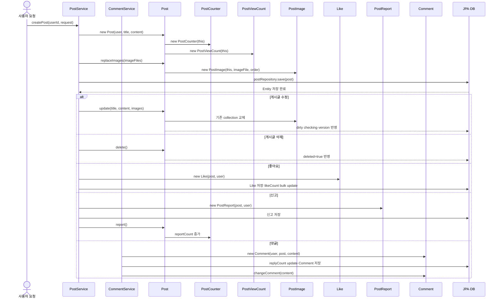

# 09. 게시글·댓글 Entity와 상태 흐름



이 문서는 인증 흐름 다음에 학습할 게시글·댓글 도메인의 Entity를 다룹니다. HTTP DTO,
Repository query, Service 전체 구현은 다음 자료에서 다루고, 이 문서에서는 Entity가
어떤 DB 상태를 표현하며 누가 생성·변경·삭제하는지에 집중합니다.

기준 저장소:

- 백엔드 기준 저장소: `/Users/miles/Documents/GitHub/KTB4_Miles_Week12_Back`
- `isFixed` 변경 대조 source: `/Users/miles/Documents/GitHub/kakao_tech_bootcamp_study/study12/backend`
- 현재 학습 자료: `/Users/miles/Documents/GitHub/kakao_tech_bootcamp_study/study12/project-study/actual-code-learning/09_게시글_댓글_Entity_실제흐름.md`
- Redis 보관 자료: `/Users/miles/Documents/GitHub/kakao_tech_bootcamp_study/study12/project-study/actual-code-learning/98_Redis_조회수_처리.md`

이 문서는 현재 backend source를 정적으로 확인해 작성했습니다. Entity test·DB·Redis는
작성 중 실행하지 않았습니다.

---

## 09.1 이번 문서의 목표

다음 질문에 답할 수 있어야 합니다.

1. `Post` Entity는 어떤 상태와 연관관계를 가지는가?
2. `Post`가 생성될 때 왜 `PostCounter`와 `PostViewCount`도 함께 만들어지는가?
3. `PostImage` collection은 누가 만들고, 이미지 교체 때 어떻게 바뀌는가?
4. `PostCounter`와 `PostViewCount`는 왜 별도 Entity인가?
5. `Like`와 `PostReport`의 unique 제약은 무엇을 막는가?
6. `Comment`는 게시글·사용자와 어떤 관계를 가지는가?
7. 게시글 삭제와 댓글 삭제는 각각 soft delete인가, physical delete인가?
8. Entity method를 실제 Service가 사용하는 경우와 테스트·이전 코드에만 남은 경우를 어떻게 구분하는가?

### 이 문서의 코드 설명 형식

각 Entity는 `실제 파일 경로 → 전체 원문 → 코드 일부와 학습용 주석 → 바로 아래 상세
설명` 순서로 읽습니다. 전체 원문은 프로젝트 파일과 대조하기 위한 원문이고, 뒤의
부분 코드에만 학습용 `//` 주석을 붙입니다. 부분 코드의 주석은 실제 Java 파일을
수정했다는 뜻이 아니라, 위 원문의 어느 줄을 설명하는지 표시하는 문서용 주석입니다.
package/import는 앞 장에서 이미 설명한 문법이므로 부분 코드에서는 반복하지 않지만,
각 전체 원문에는 생략하지 않습니다.

---

## 09.2 8장 이후 새로 시작하는 흐름

앞선 인증 자료에서는 로그인 사용자 정보가 `CustomUserDetails`로 Controller에 전달되는
것까지 확인했습니다. 이제 그 `userId`가 게시글 도메인에서 Entity와 연결되는 흐름을
학습합니다.

```text
인증된 userId
→ PostService.createPost
→ new Post(user, title, content)
→ PostCounter 생성
→ PostViewCount 생성
→ PostImage 생성·연결
→ PostRepository.save
```

수정·상호작용 흐름은 Entity별로 다음과 같습니다.

```text
PostService.fixPost
→ Post.update
→ 이미지 collection 교체
→ JPA dirty checking·version 반영

PostService.deletePost
→ Post.delete
→ deleted=true soft delete

PostService.likePost
→ new Like(post, user)
→ LikeRepository 저장
→ PostCounterRepository count 증가

PostService.reportPost
→ new PostReport(post, reporter)
→ Post.report
→ User.receiveReport

CommentService.commentPost
→ new Comment(user, post, content)
→ CommentRepository 저장

CommentService.commentFix
→ Comment.changeComment

CommentService.commentDelete
→ CommentRepository.delete
→ Comment physical delete
```

---

## 09.3 Entity 관계 전체 지도

```text
User
├─ 1 : N Post
├─ 1 : N Like
├─ 1 : N PostReport
├─ 1 : N Comment
└─ 1 : N AuthSession

Post
├─ N : 1 User
├─ 1 : N PostImage
├─ 1 : 1 PostCounter
├─ 1 : 1 PostViewCount
├─ 1 : N Like
├─ 1 : N PostReport
└─ 1 : N Comment
```

`PostCounter`와 `PostViewCount`는 `Post`와 shared primary key 구조를 사용합니다. 두
Entity의 `post_id`는 각각 자기 primary key이면서 Post를 가리키는 foreign key입니다.

---

## 09.4 `Post.java`: 게시글의 중심 Entity

### 09.4.0 파일을 읽는 이유

다른 Entity 대부분이 `Post`를 참조하거나 `Post` 생성 과정에서 함께 만들어집니다.
먼저 `Post`의 field와 생성자를 알아야 이미지·counter·조회수 Entity의 존재 이유를
이해할 수 있습니다.

### `Post.java` 전체 코드

실제 파일:

`/Users/miles/Documents/GitHub/kakao_tech_bootcamp_study/study12/backend/src/main/java/kr/adapterz/springdatajpa/entity/Post.java`

```java
package kr.adapterz.springdatajpa.entity;

import java.time.*;
import java.util.ArrayList;
import java.util.List;

import jakarta.persistence.*;
import lombok.AccessLevel;
import lombok.Getter;
import lombok.NoArgsConstructor;


@Getter
@Entity
@Table(name="posts")
@NoArgsConstructor(access = AccessLevel.PROTECTED)

public class Post {
    public static final int REPORT_BLOCK_THRESHOLD = 5;

    @Id
    @GeneratedValue(strategy = GenerationType.IDENTITY)
    @Column(name="post_id")
    private Long postId;

    @Version
    @Column(name = "version", nullable = false)
    private Long version;

    @ManyToOne(fetch = FetchType.LAZY)
    @JoinColumn(name = "user_id", nullable = false)
    private User user;

    @Column(name = "post_title", nullable = false, length = 26)
    private String postTitle;

    @Column(name = "post_content", nullable = false)
    private String postContent;

    @OneToMany(mappedBy = "post", cascade = CascadeType.ALL, orphanRemoval = true)
    @OrderBy("imageOrder ASC")
    private List<PostImage> postImages = new ArrayList<>();

    @OneToOne(
            mappedBy = "post",
            fetch = FetchType.LAZY,
            cascade = CascadeType.ALL,
            orphanRemoval = true,
            optional = false
    )
    private PostCounter postCounter;

    @OneToOne(
            mappedBy = "post",
            fetch = FetchType.LAZY,
            cascade = CascadeType.ALL,
            orphanRemoval = true,
            optional = false
    )
    private PostViewCount postViewCount;

    @Column(name ="created_at", nullable = false, updatable = false)
    private LocalDateTime createdAt;

    @Column(name ="deleted", nullable = false)
    private boolean deleted;

    public Post(User user, String postTitle, String postContent)
    {
        this.user=user;
        this.postTitle=postTitle;
        this.postContent=postContent;

        postCounter = new PostCounter(this);
        postViewCount = new PostViewCount(this);
        createdAt = LocalDateTime.now();
        deleted=false;
    }


    public void update(String title, String contents, List<String> imageFiles) {
        this.postTitle = title;
        this.postContent = contents;
        replaceImages(imageFiles);
    }

    public void replaceImages(List<String> imageFiles) {
        postImages.clear();

        if (imageFiles == null) {
            return;
        }

        for (int i = 0; i < imageFiles.size(); i++) {
            String imageFile = imageFiles.get(i);

            if (imageFile == null || imageFile.isBlank()) {
                continue;
            }

            addImage(imageFile, i);
        }
    }

    public void addImage(String imageFile, int imageOrder) {
        PostImage postImage = new PostImage(this, imageFile, imageOrder);
        postImages.add(postImage);
    }

    public void addReply(){
        postCounter.addReply();
    }
    public void deleteReply(){
        postCounter.deleteReply();
    }

    public void like(){
        postCounter.like();
    }

    public void likeCancle(){
        postCounter.cancelLike();
    }

    public void delete(){deleted=true;}

    public void report() {
        postCounter.report();
    }

    public boolean isBlockedByReports() {
        return postCounter.getReportCount() >= REPORT_BLOCK_THRESHOLD;
    }

    public int getLikeCount() {
        return postCounter.getLikeCount();
    }

    public int getReportCount() {
        return postCounter.getReportCount();
    }

    public int getReplyCount() {
        return postCounter.getReplyCount();
    }

}
```

### 09.4.1 전체 원문 바로 아래에서 보는 핵심 코드

```java
@Getter // Lombok이 각 field의 getter를 생성해 DTO와 Service가 상태를 읽게 한다.
@Entity // JPA가 Post 객체를 posts table의 row와 매핑한다.
@Table(name="posts") // Entity 이름과 다른 실제 table 이름을 지정한다.
@NoArgsConstructor(access = AccessLevel.PROTECTED) // JPA가 사용할 기본 생성자를 외부에는 제한한다.
public class Post {
    public static final int REPORT_BLOCK_THRESHOLD = 5; // 신고 수가 이 값 이상이면 차단 여부를 판단한다.

    @Id // postId를 primary key로 지정한다.
    @GeneratedValue(strategy = GenerationType.IDENTITY) // INSERT 시 DB auto-increment가 ID를 만든다.
    @Column(name="post_id") // Java field와 DB column 이름을 연결한다.
    private Long postId;

    @Version // 수정 시 version을 비교해 오래된 요청의 덮어쓰기를 감지한다.
    @Column(name = "version", nullable = false) // version column은 null을 허용하지 않는다.
    private Long version;

    @ManyToOne(fetch = FetchType.LAZY) // 여러 게시글이 한 User를 참조하는 관계를 선언한다.
    @JoinColumn(name = "user_id", nullable = false) // Post가 보관하는 user_id foreign key를 지정한다.
    private User user;
}
```

이 부분은 클래스가 단순한 Java 자료 객체가 아니라 JPA가 영속 상태를 관리하는 Entity라는
뜻입니다. `postId`는 생성자에서 넣지 않고 DB INSERT 때 만들어지며, `version`은 수정
충돌을 판단하는 값입니다. `user`의 실제 관계 주인은 `@JoinColumn`이 붙은 Post 쪽이며,
Service가 `User` 객체를 생성자에 전달할 때 이 연관관계가 채워집니다.

```java
@OneToMany(mappedBy = "post", cascade = CascadeType.ALL, orphanRemoval = true) // 이미지 여러 개를 Post가 묶어 관리한다.
@OrderBy("imageOrder ASC") // 조회한 collection을 imageOrder 오름차순으로 정렬한다.
private List<PostImage> postImages = new ArrayList<>(); // 새 Post는 빈 이미지 목록으로 시작한다.

@OneToOne(mappedBy = "post", fetch = FetchType.LAZY, cascade = CascadeType.ALL,
        orphanRemoval = true, optional = false) // Post 하나와 Counter 하나의 필수 관계다.
private PostCounter postCounter;

@OneToOne(mappedBy = "post", fetch = FetchType.LAZY, cascade = CascadeType.ALL,
        orphanRemoval = true, optional = false) // Post 하나와 영구 조회수 하나의 필수 관계다.
private PostViewCount postViewCount;
```

`mappedBy = "post"`는 Post가 foreign key column을 직접 관리하지 않고, 자식 Entity의
`post` field가 관계를 관리한다는 뜻입니다. 반면 `cascade`는 Post 저장·삭제 작업을
연관 Entity에도 전달하고, `orphanRemoval`은 collection에서 빠진 이미지 같은 고아
Entity를 삭제 대상으로 만듭니다. `new ArrayList<>()`는 아직 DB에 저장된 이미지가
없다는 Java 객체의 초기 상태입니다.

```java
public Post(User user, String postTitle, String postContent) {
    this.user = user; // Service가 조회한 활성 User를 게시글 작성자로 연결한다.
    this.postTitle = postTitle; // 요청 DTO에서 전달된 제목을 저장한다.
    this.postContent = postContent; // 요청 DTO에서 전달된 본문을 저장한다.
    postCounter = new PostCounter(this); // 같은 게시글의 숫자 row를 함께 만든다.
    postViewCount = new PostViewCount(this); // 영구 조회수 row를 0부터 함께 만든다.
    createdAt = LocalDateTime.now(); // 생성 시각을 현재 서버 시각으로 기록한다.
    deleted = false; // 새 글은 soft delete 상태가 아니다.
}

public void update(String title, String contents, List<String> imageFiles) {
    this.postTitle = title; // 기존 managed Entity의 제목을 변경한다.
    this.postContent = contents; // 기존 managed Entity의 본문을 변경한다.
    replaceImages(imageFiles); // 기존 이미지 목록을 비우고 새 목록을 연결한다.
}

public void delete() { deleted = true; } // row를 삭제하지 않고 조회 제외 상태만 변경한다.

public void report() {
    postCounter.report(); // 연결된 counter의 reportCount를 1 증가시킨다.
}
```

이 생성자는 현재 `/Users/miles/Documents/GitHub/kakao_tech_bootcamp_study/study12/backend/src/main/java/kr/adapterz/springdatajpa/service/PostService.java`의
`createPost()`에서 호출됩니다. `update()`와 `delete()`도 각각 `fixPost()`와 `deletePost()`가
호출하고, `report()`는 `reportPost()`가 호출합니다. Entity method는 값을 반환하지 않고
현재 managed Entity의 field를 바꾸므로, 같은 transaction이 commit될 때 JPA dirty
checking이 DB 변경으로 이어집니다.

### 현재 코드 변경: `isFixed` 제거

현재 기준 source는 `Post` Entity에서 `isFixed` field와 `is_fixed` column mapping을
제거했습니다. 생성자에서 `false`를 넣거나 `update()`에서 `true`로 바꾸는 코드도
없습니다. 게시글이 수정되었는지를 별도 상태로 저장하지 않고, JPA `@Version`과
`PostService.fixPost()`의 실제 값 비교가 수정 충돌과 version 증가를 담당합니다.

따라서 다음 문장은 현재 코드 설명으로 사용하면 안 됩니다.

```text
새 글은 isFixed=false로 시작한다
수정하면 isFixed=true가 된다
PostViewResponseDto가 isFixed를 JSON으로 반환한다
```

위 내용은 변경 전 코드의 흐름입니다. 현재 DB에서는 `V5__remove_post_is_fixed.sql`이
기존 `posts.is_fixed` column을 제거하며, migration 이후 Hibernate Entity와 DB schema에
해당 column이 없어야 합니다.

```java
public void replaceImages(List<String> imageFiles) {
    postImages.clear(); // 현재 Java collection에서 기존 이미지 연결을 모두 제거한다.

    if (imageFiles == null) { // 이미지 자체가 없는 요청인지 확인한다.
        return; // 이 method만 종료하고 호출한 update/create 흐름으로 돌아간다.
    }

    for (int i = 0; i < imageFiles.size(); i++) { // 요청 순서대로 각 이미지 값을 읽는다.
        String imageFile = imageFiles.get(i); // 현재 순번의 Data URL을 꺼낸다.
        if (imageFile == null || imageFile.isBlank()) { // 비어 있는 항목은 저장하지 않는다.
            continue; // 현재 반복만 건너뛰고 다음 이미지로 이동한다.
        }
        addImage(imageFile, i); // Post를 부모로 하는 PostImage를 만든다.
    }
}
```

`clear()`는 DB DELETE SQL을 그 자리에서 실행한다는 뜻이 아닙니다. transaction 안에서
collection 관계를 바꾸고, `orphanRemoval = true`가 commit 시 제거된 기존 PostImage를
삭제 대상으로 판단하게 합니다. `return`은 `replaceImages()`만 끝내므로 호출자인
생성자·`update()` 전체가 자동으로 종료되는 것은 아닙니다. 현재 `Post`에는 문자열 하나를
받는 이미지 생성자·`replaceImages(String)` overload·첫 이미지를 반환하는
`getImageFile()` method가 없으며, `List<String>` 목록만 이미지 입력으로 사용합니다.

```java
public boolean isBlockedByReports() {
    return postCounter.getReportCount() >= REPORT_BLOCK_THRESHOLD; // counter 값이 기준 이상인지 boolean으로 반환한다.
}

public int getLikeCount() {
    return postCounter.getLikeCount(); // Controller/DTO가 사용할 좋아요 수를 counter에서 읽는다.
}
```

`isBlockedByReports()`의 반환값은 `PostService.getViewablePost()`와 수정 권한 검사에서
사용됩니다. `getLikeCount()` 같은 getter는 Lombok `@Getter`와 달리 counter 안의 값을
호출해 반환하는 도메인 method입니다. 반대로 `addReply()`, `like()`, `likeCancle()`는
현재 production Service에서 직접 호출되지 않고 Repository bulk update가 counter를
변경하므로, 선언만 보고 현재 요청의 실행 경로라고 판단하지 않습니다.

### 09.4.2 Entity 선언과 field

```java
@Entity
@Table(name="posts")
public class Post {
    public static final int REPORT_BLOCK_THRESHOLD = 5;
```

- `@Entity`: JPA가 이 class를 DB와 연결되는 Entity로 관리합니다.
- `@Table(name="posts")`: 실제 DB table 이름을 지정합니다.
- `REPORT_BLOCK_THRESHOLD`: 신고 수가 5 이상이면 게시글을 차단하는 현재 기준입니다.

```java
@Id
@GeneratedValue(strategy = GenerationType.IDENTITY)
@Column(name="post_id")
private Long postId;

@Version
@Column(name = "version", nullable = false)
private Long version;
```

- `postId`: DB가 생성하는 primary key입니다.
- `@Version`: JPA optimistic lock에 사용하는 version입니다.
- 수정 요청이 화면에서 본 version과 다르면 Service가 충돌로 처리합니다.

```java
@ManyToOne(fetch = FetchType.LAZY)
@JoinColumn(name = "user_id", nullable = false)
private User user;
```

여러 `Post`가 한 `User`를 참조하는 N:1 관계입니다. `Post`의 `user` field가 Java 객체
연결을 보관하고, `@JoinColumn`의 `user_id`가 DB foreign key입니다. `LAZY`이므로
Post를 읽는 순간 User 전체를 항상 즉시 읽는다고 단정하지 않습니다.

### 09.4.3 이미지·counter·조회수 관계

```java
@OneToMany(mappedBy = "post", cascade = CascadeType.ALL, orphanRemoval = true)
@OrderBy("imageOrder ASC")
private List<PostImage> postImages = new ArrayList<>();
```

- `mappedBy = "post"`: foreign key를 관리하는 쪽은 `PostImage.post` field입니다.
- `cascade = ALL`: Post 저장·삭제 작업을 PostImage에 전파합니다.
- `orphanRemoval = true`: collection에서 제거된 image를 DB에서도 삭제 대상으로 봅니다.
- `@OrderBy`: 읽을 때 `imageOrder` 오름차순으로 정렬합니다.

```java
@OneToOne(
        mappedBy = "post",
        fetch = FetchType.LAZY,
        cascade = CascadeType.ALL,
        orphanRemoval = true,
        optional = false
)
private PostCounter postCounter;

@OneToOne(
        mappedBy = "post",
        fetch = FetchType.LAZY,
        cascade = CascadeType.ALL,
        orphanRemoval = true,
        optional = false
)
private PostViewCount postViewCount;
```

Post 하나에는 PostCounter 하나와 PostViewCount 하나가 연결됩니다. 두 관계의 foreign key
주인은 반대편 Entity의 `post` field입니다.

### 09.4.4 생성자가 만드는 객체

```java
public Post(User user, String postTitle, String postContent)
{
    this.user=user;
    this.postTitle=postTitle;
    this.postContent=postContent;

    postCounter = new PostCounter(this);
    postViewCount = new PostViewCount(this);
    createdAt = LocalDateTime.now();
    deleted=false;
}
```

이 생성자는 `PostService.createPost()`가 호출합니다.

```text
PostService.createPost
→ new Post(user, title, content)
→ Post 생성자 실행
→ new PostCounter(this)
→ new PostViewCount(this)
→ post.replaceImages(...)
→ postRepository.save(post)
```

따라서 Post만 만들고 counter와 view count를 나중에 따로 만드는 구조가 아닙니다.
`cascade = ALL`이 있으므로 Post를 저장할 때 연관 Entity도 persistence 대상이 됩니다.

### 09.4.5 상태 변경 method

```java
public void update(String title, String contents, List<String> imageFiles) {
    this.postTitle = title;
    this.postContent = contents;
    replaceImages(imageFiles);
}

public void delete(){deleted=true;}

public void report() {
    postCounter.report();
}
```

- `update`: `PostService.fixPost()`가 호출하며 제목·내용·이미지를 바꿉니다. 수정 여부를 별도 `isFixed` field에 저장하지 않고 JPA `@Version`으로 충돌을 관리합니다.
- `delete`: `PostService.deletePost()`가 호출하며 `deleted=true`만 바꿉니다. 현재 게시글 삭제는 soft delete입니다.
- `report`: `PostService.reportPost()`가 호출하며 연결된 `PostCounter.reportCount`를 증가시킵니다.

### 09.4.6 이미지 교체

```java
public void replaceImages(List<String> imageFiles) {
    postImages.clear();

    if (imageFiles == null) {
        return;
    }

    for (int i = 0; i < imageFiles.size(); i++) {
        String imageFile = imageFiles.get(i);

        if (imageFile == null || imageFile.isBlank()) {
            continue;
        }

        addImage(imageFile, i);
    }
}
```

먼저 기존 collection을 clear한 뒤 새 목록을 순회해 `addImage`를 호출합니다. 기존
PostImage는 `orphanRemoval` 대상이 되고, 새 Image는 Post와 연결됩니다.

### 09.4.7 Entity method 사용 여부

현재 production Service가 실제 사용하는 Post method와 확인된 사용 위치는 다음과 같습니다.

| Post method | 현재 주요 호출 위치 | 역할 |
|---|---|---|
| `update` | `PostService.fixPost` | 제목·내용·이미지 목록 변경 |
| `delete` | `PostService.deletePost` | soft delete |
| `report` | `PostService.reportPost` | PostCounter 신고 수 증가 |
| `replaceImages` | 생성자·`update` | 이미지 collection 교체 |
| `isBlockedByReports` | Post 조회·수정 흐름 | 신고 차단 여부 판단 |
| `addReply` | 현재 production Service 직접 호출 없음 | 이전/Entity 단위 구조와 비교 대상 |
| `like` | 현재 production Service 직접 호출 없음 | 현재는 Repository bulk update 사용 |
| `likeCancle` | 현재 production Service 직접 호출 없음 | 현재는 Repository bulk update 사용 |

코드에 method가 선언되어 있다는 사실만으로 현재 요청에서 실행된다고 결론내리지 않습니다.
반드시 실제 호출 위치를 검색합니다.

### 09.4 checkpoint

- `Post` 생성자가 `PostCounter`와 `PostViewCount`를 함께 만드는 이유는 무엇인가?
- `mappedBy`와 `@JoinColumn` 중 foreign key를 실제 관리하는 쪽은 어디인가?
- `orphanRemoval`은 이미지 교체 때 어떤 효과를 내는가?
- `Post.delete()`는 row를 즉시 삭제하는가?
- `Post.like()`가 선언되어 있어도 현재 production 흐름에서 사용된다고 단정할 수 없는 이유는 무엇인가?

---

## 09.5 `PostImage.java`: 이미지 Entity

### `PostImage.java` 전체 코드

실제 파일:

`/Users/miles/Documents/GitHub/KTB4_Miles_Week12_Back/src/main/java/kr/adapterz/springdatajpa/entity/PostImage.java`

```java
package kr.adapterz.springdatajpa.entity;

import jakarta.persistence.*;
import lombok.AccessLevel;
import lombok.Getter;
import lombok.NoArgsConstructor;

@Getter
@Entity
@Table(name = "post_images")
@NoArgsConstructor(access = AccessLevel.PROTECTED)
public class PostImage {
    @Id
    @GeneratedValue(strategy = GenerationType.IDENTITY)
    @Column(name = "post_image_id")
    private Long postImageId;

    @ManyToOne(fetch = FetchType.LAZY)
    @JoinColumn(name = "post_id", nullable = false)
    private Post post;

    @Lob
    @Column(name = "image_file", nullable = false, columnDefinition = "LONGTEXT")
    private String imageFile;

    @Column(name = "image_order", nullable = false)
    private int imageOrder;

    public PostImage(Post post, String imageFile, int imageOrder) {
        this.post = post;
        this.imageFile = imageFile;
        this.imageOrder = imageOrder;
    }
}
```

### 09.5.1 전체 원문 바로 아래에서 보는 핵심 코드

```java
@Getter // DTO가 imageFile과 imageOrder를 읽을 수 있도록 getter를 생성한다.
@Entity // 이 class를 post_images table과 매핑한다.
@Table(name = "post_images") // 실제 table 이름을 지정한다.
@NoArgsConstructor(access = AccessLevel.PROTECTED) // JPA용 기본 생성자를 외부 생성에서 제한한다.
public class PostImage {
    @Id // 이미지 row의 primary key를 지정한다.
    @GeneratedValue(strategy = GenerationType.IDENTITY) // INSERT 시 DB가 ID를 생성한다.
    @Column(name = "post_image_id") // Java ID와 DB column을 연결한다.
    private Long postImageId;

    @ManyToOne(fetch = FetchType.LAZY) // 여러 이미지가 하나의 Post에 속한다.
    @JoinColumn(name = "post_id", nullable = false) // 이 Entity가 foreign key를 관리한다.
    private Post post;

    @Lob // 긴 문자열을 저장할 수 있는 대용량 column 매핑이다.
    @Column(name = "image_file", nullable = false, columnDefinition = "LONGTEXT") // Data URL 문자열을 LONGTEXT로 저장한다.
    private String imageFile;

    @Column(name = "image_order", nullable = false) // 이미지 표시 순서를 저장한다.
    private int imageOrder;
}
```

`PostImage`는 파일 시스템 경로가 아니라 현재 코드의 Data URL 문자열을 DB에 보관하는
Entity입니다. 생성자는 `/Users/miles/Documents/GitHub/kakao_tech_bootcamp_study/study12/backend/src/main/java/kr/adapterz/springdatajpa/entity/Post.java`의
`addImage()`에서 호출되고, 전달된 `Post`, 문자열, 순번이 각각 `post`, `imageFile`,
`imageOrder`로 들어갑니다. `Post`의 `mappedBy = "post"`와 짝을 이루므로 foreign key는
이쪽 `post` field가 관리합니다.

### 생성자와 연결 위치

```java
public PostImage(Post post, String imageFile, int imageOrder) {
    this.post = post;
    this.imageFile = imageFile;
    this.imageOrder = imageOrder;
}
```

이 생성자는 `Post.addImage()`가 호출합니다.

```java
public void addImage(String imageFile, int imageOrder) {
    PostImage postImage = new PostImage(this, imageFile, imageOrder);
    postImages.add(postImage);
}
```

- 왼쪽 `this`는 현재 Post Entity입니다.
- `new PostImage(this, ...)`가 child Entity를 생성합니다.
- `postImages.add`가 양방향 Java collection에 새 객체를 추가합니다.
- `@JoinColumn(name = "post_id")`는 DB에서 PostImage가 Post를 가리키는 foreign key입니다.

### `imageOrder`가 필요한 이유

Post 하나에 여러 이미지가 있으므로 각 이미지의 순서를 저장합니다. Post의
`@OrderBy("imageOrder ASC")`가 조회 시 이 순서를 사용합니다. 별도의 대표 이미지 필드는
두지 않고, 응답에서는 `PostViewResponseDto`가 모든 이미지를 순회해 반환합니다.

```java
for (PostImage postImage : post.getPostImages()) {
    result.add(postImage.getImageFile());
}
```

현재 코드에서 첫 번째 이미지를 별도 대표 이미지 값으로 꺼내는 `Post.getImageFile()`은
존재하지 않습니다. `imageOrder`가 낮은 항목이 먼저 놓이는 것은
`@OrderBy("imageOrder ASC")`에 따른 순서일 뿐, 별도의 대표 이미지 field나 API 계약을
의미하지 않습니다. `PostViewResponseDto.getImageUrls()`는 `PostImage` 전체를 순회해
배열을 만들고, 프론트의 `PostImageGallery`도 이 배열의 모든 항목을 렌더링합니다.

따라서 현재 이미지 흐름은 다음과 같습니다.

```text
PostRequestDto.imageFiles 또는 PostFixRequestDto.imageFiles
→ Post.replaceImages(List<String>)
→ PostImage 목록
→ PostViewResponseDto.imageUrls
→ PostImageGallery가 모든 이미지 표시
```

과거 코드의 단일 이미지 생성자, 문자열 overload, `getImageFile()` 반환값을 현재 코드의
실행 흐름으로 설명하면 안 됩니다.

### 09.5 checkpoint

- PostImage를 직접 만드는 method는 무엇인가?
- `PostImage.post`가 연관관계의 foreign key 주인인 이유는 무엇인가?
- 이미지 collection을 교체할 때 기존 이미지가 삭제 대상이 되는 annotation은 무엇인가?

---

## 09.6 `PostCounter.java`: 좋아요·신고·댓글 수

### `PostCounter.java` 전체 코드

실제 파일:

`/Users/miles/Documents/GitHub/KTB4_Miles_Week12_Back/src/main/java/kr/adapterz/springdatajpa/entity/PostCounter.java`

```java
package kr.adapterz.springdatajpa.entity;

import jakarta.persistence.Column;
import jakarta.persistence.Entity;
import jakarta.persistence.FetchType;
import jakarta.persistence.Id;
import jakarta.persistence.JoinColumn;
import jakarta.persistence.MapsId;
import jakarta.persistence.OneToOne;
import jakarta.persistence.Table;
import lombok.AccessLevel;
import lombok.Getter;
import lombok.NoArgsConstructor;

@Getter
@Entity
@Table(name = "post_counters")
@NoArgsConstructor(access = AccessLevel.PROTECTED)
public class PostCounter {

    @Id
    @Column(name = "post_id")
    private Long postId;

    @MapsId
    @OneToOne(fetch = FetchType.LAZY, optional = false)
    @JoinColumn(name = "post_id")
    private Post post;

    @Column(name = "like_count", nullable = false)
    private int likeCount;

    @Column(name = "report_count", nullable = false)
    private int reportCount;

    @Column(name = "reply_count", nullable = false)
    private int replyCount;

    public PostCounter(Post post) {
        this.post = post;
        this.likeCount = 0;
        this.reportCount = 0;
        this.replyCount = 0;
    }

    public void addReply() {
        replyCount++;
    }

    public void deleteReply() {
        replyCount--;
    }

    public void like() {
        likeCount++;
    }

    public void cancelLike() {
        likeCount--;
    }

    public void report() {
        reportCount++;
    }
}
```

### 09.6.1 전체 원문 바로 아래에서 보는 핵심 코드

```java
@Id // PostCounter의 primary key를 선언한다.
@Column(name = "post_id") // Post의 ID와 같은 column을 사용한다.
private Long postId;

@MapsId // 연관된 Post의 ID를 이 Entity의 ID로도 사용한다.
@OneToOne(fetch = FetchType.LAZY, optional = false) // Post 하나당 Counter 하나가 필수로 존재한다.
@JoinColumn(name = "post_id") // PostCounter가 foreign key를 실제 관리한다.
private Post post;
```

`@MapsId` 때문에 PostCounter에는 별도의 순번 ID가 생기지 않습니다. 예를 들어 Post의
ID가 10이면 PostCounter의 primary key도 10이고 동시에 `post_id` foreign key도 10입니다.
`Post` 생성자가 `new PostCounter(this)`를 호출할 때 이 관계가 설정됩니다.

```java
public PostCounter(Post post) {
    this.post = post; // 부모 Post와 Counter를 연결한다.
    this.likeCount = 0; // 새 게시글의 좋아요 수를 0으로 시작한다.
    this.reportCount = 0; // 새 게시글의 신고 수를 0으로 시작한다.
    this.replyCount = 0; // 새 게시글의 댓글 수를 0으로 시작한다.
}

public void report() {
    reportCount++; // 현재 Entity의 신고 수를 메모리 상태에서 1 증가시킨다.
}
```

`report()`의 현재 production 호출 경로는 `PostService.reportPost()` → `post.report()`입니다.
반면 `like()`, `cancelLike()`, `addReply()`, `deleteReply()`는 현재 Service에서 직접
호출되지 않고 Repository의 bulk update method가 DB count를 변경합니다. 따라서 method가
존재한다는 사실과 실제 요청에서 실행된다는 사실을 분리해서 읽어야 합니다.

### `@MapsId`와 shared primary key

```java
@Id
@Column(name = "post_id")
private Long postId;

@MapsId
@OneToOne(fetch = FetchType.LAZY, optional = false)
@JoinColumn(name = "post_id")
private Post post;
```

`post_id`가 PostCounter의 primary key이면서 Post를 가리키는 foreign key입니다. 그래서
Post ID가 10이면 PostCounter의 ID도 10입니다.

### counter method와 현재 호출 관계

```java
public void report() {
    reportCount++;
}
```

현재 `PostService.reportPost()`는 `post.report()`를 호출합니다. 반면 좋아요·댓글 counter는
현재 production Service가 Repository bulk update를 사용하므로 `PostCounter.like()`나
`addReply()`가 모든 요청에서 실행된다고 단정하지 않습니다.

Counter를 별도 Entity로 분리한 이유는 게시글 본문·version과 자주 변하는 숫자 값을
분리하기 위해서입니다. 실제 동시성 보호와 counter 증가 query는 다음 Repository·Service
학습에서 다룹니다.

### 09.6 checkpoint

- PostCounter와 PostViewCount가 별도 Entity인 이유는 무엇인가?
- `@MapsId`가 `post_id`에 부여하는 두 역할은 무엇인가?
- `PostCounter.report()`의 현재 호출자는 어디인가?
- 선언된 `like()` method와 실제 Repository bulk update를 어떻게 구분하는가?

---

## 09.7 `PostViewCount.java`: 영구 조회수 Entity

### `PostViewCount.java` 전체 코드

실제 파일:

`/Users/miles/Documents/GitHub/KTB4_Miles_Week12_Back/src/main/java/kr/adapterz/springdatajpa/entity/PostViewCount.java`

```java
package kr.adapterz.springdatajpa.entity;

import jakarta.persistence.Column;
import jakarta.persistence.Entity;
import jakarta.persistence.FetchType;
import jakarta.persistence.Id;
import jakarta.persistence.JoinColumn;
import jakarta.persistence.MapsId;
import jakarta.persistence.OneToOne;
import jakarta.persistence.Table;
import lombok.AccessLevel;
import lombok.Getter;
import lombok.NoArgsConstructor;

@Getter
@Entity
@Table(name = "post_view_counts")
@NoArgsConstructor(access = AccessLevel.PROTECTED)
public class PostViewCount {

    @Id
    @Column(name = "post_id")
    private Long postId;

    @MapsId
    @OneToOne(fetch = FetchType.LAZY, optional = false)
    @JoinColumn(name = "post_id")
    private Post post;

    @Column(name = "view_count", nullable = false)
    private long viewCount;

    public PostViewCount(Post post) {
        this.post = post;
        this.viewCount = 0L;
    }
}
```

### 09.7.1 전체 원문 바로 아래에서 보는 핵심 코드

```java
@Id // PostViewCount의 primary key를 선언한다.
@Column(name = "post_id") // Post와 같은 ID column을 사용한다.
private Long postId;

@MapsId // Post의 ID를 이 Entity의 ID로 공유한다.
@OneToOne(fetch = FetchType.LAZY, optional = false) // 게시글마다 영구 조회수 row가 필요하다.
@JoinColumn(name = "post_id") // PostViewCount가 foreign key를 관리한다.
private Post post;

@Column(name = "view_count", nullable = false) // DB에 보관할 영구 조회수 column이다.
private long viewCount;
```

이 Entity는 조회수 증가 로직을 직접 실행하지 않습니다. `PostService.getPostView()`가
현재 DB 값에서 baseline을 읽어 `ViewCountUpdater.increment()`에 전달하고, 활성 구현체가
증가를 처리합니다. Redis 구현이 선택되면 빠른 임시 증가값은 Redis에 있고, 이 Entity는
DB에 남겨둘 영구값과 Post 관계를 보관합니다.

```java
public PostViewCount(Post post) {
    this.post = post; // 생성 중인 Post와 영구 조회수 row를 연결한다.
    this.viewCount = 0L; // 첫 조회 전 baseline을 0으로 초기화한다.
}
```

이 생성자는 `Post` 생성자 안에서만 호출되고 `cascade = CascadeType.ALL` 관계를 통해
Post 저장 흐름에 포함됩니다. 이후 조회수 변경은 Service·Repository 또는 Redis 구현체가
담당하므로, `PostViewCount`에 setter나 증가 method가 없는 것은 역할을 분리한 결과입니다.

이 Entity에는 조회수 증가 method가 없습니다. 현재 조회수 증가는
`ViewCountUpdater` 구현체와 Repository query가 담당합니다. Entity는 DB의 영구값과
Post 연관관계를 보관하는 역할입니다.

```text
Post 생성자
→ PostViewCount(post) 생성
→ viewCount = 0
→ Post 저장 cascade
→ 이후 조회수 흐름에서 baseline으로 읽힘
```

Redis 구현이 활성화되면 요청 중 증가값은 먼저 Redis에 있고, Scheduler가
`PostViewCountRepository.persistMaxViewCount`로 이 Entity에 연결된 table을 업데이트합니다.

### 09.7 checkpoint

- `PostViewCount`가 직접 조회수를 증가시키지 않는 이유는 무엇인가?
- 처음 생성될 때 `viewCount`는 얼마인가?
- Redis 값과 DB `PostViewCount.viewCount`는 언제 각각 사용되는가?

---

## 09.8 `Like.java`: 사용자와 게시글 사이의 좋아요

### `Like.java` 전체 코드

실제 파일:

`/Users/miles/Documents/GitHub/KTB4_Miles_Week12_Back/src/main/java/kr/adapterz/springdatajpa/entity/Like.java`

```java
package kr.adapterz.springdatajpa.entity;

import jakarta.persistence.*;
import lombok.AccessLevel;
import lombok.Getter;
import lombok.NoArgsConstructor;

@Entity
@Table(
        name = "post_likes",
        uniqueConstraints = {
                @UniqueConstraint(
                        name = "uk_post_like_post_user",
                        columnNames = {"post_id", "user_id"}
                )
        }
)
@Getter
@NoArgsConstructor(access = AccessLevel.PROTECTED)
public class Like {

    @Id
    @GeneratedValue(strategy = GenerationType.AUTO)
    @Column(name = "post_like_id")
    private Long postLikeId;

    @ManyToOne(fetch = FetchType.LAZY)
    @JoinColumn(name = "post_id", nullable = false)
    private Post post;

    @ManyToOne(fetch = FetchType.LAZY)
    @JoinColumn(name = "user_id", nullable = false)
    private User user;

    public Like(Post post, User user) {
        this.post = post;
        this.user = user;
    }
}
```

### 09.8.1 전체 원문 바로 아래에서 보는 핵심 코드

```java
@Entity // Like 객체를 post_likes table의 row로 관리한다.
@Table(name = "post_likes", uniqueConstraints = { // table-level 제약조건을 선언한다.
        @UniqueConstraint(
                name = "uk_post_like_post_user", // DB에 생성될 제약조건 이름이다.
                columnNames = {"post_id", "user_id"} // 한 사용자·게시글 조합을 한 번만 허용한다.
        )
})
public class Like {
    @Id // 좋아요 row 자체의 primary key다.
    @GeneratedValue(strategy = GenerationType.AUTO) // JPA provider가 ID 생성 전략을 선택한다.
    private Long postLikeId;

    @ManyToOne(fetch = FetchType.LAZY) // 여러 Like가 하나의 Post를 참조한다.
    @JoinColumn(name = "post_id", nullable = false) // 좋아요 대상 게시글 foreign key다.
    private Post post;

    @ManyToOne(fetch = FetchType.LAZY) // 여러 Like가 하나의 User를 참조한다.
    @JoinColumn(name = "user_id", nullable = false) // 좋아요를 누른 사용자 foreign key다.
    private User user;
}
```

`@UniqueConstraint`는 프론트의 중복 click 방지나 Service의 사전 검사와 별개로 DB가
중복 row를 최종 차단하는 장치입니다. 현재 `PostService.likePost()`가
`new Like(post, user)`를 만들어 `likeRepository.saveAndFlush()`에 전달하고, 제약조건
위반은 `DataIntegrityViolationException`에서 `Already_Liked` 업무 예외로 변환됩니다.
좋아요 취소는 Entity method가 아니라 Repository delete query가 담당합니다.

### unique constraint의 의미

```java
@UniqueConstraint(
        name = "uk_post_like_post_user",
        columnNames = {"post_id", "user_id"}
)
```

같은 사용자가 같은 게시글에 좋아요 Entity를 두 개 저장하지 못하게 DB가 최종적으로
보장합니다. 프론트의 중복 click 방지나 Service의 중복 검사와는 다른 마지막 방어선입니다.

### 생성·삭제 호출 위치

현재 `PostService.likePost()`가 다음 생성자를 호출합니다.

```java
likeRepository.saveAndFlush(new Like(post, user));
```

반대로 좋아요 취소는 `LikeRepository`의 delete query가 Entity를 삭제합니다. 실제 counter
증가는 현재 `PostCounterRepository.incrementLikeCount()` bulk query가 담당합니다.

### 09.8 checkpoint

- Like Entity의 두 `ManyToOne` 관계는 무엇을 연결하는가?
- unique constraint가 막는 중복은 무엇인가?
- 좋아요 Entity 저장과 like count 증가가 같은 코드인지, 다른 계층인지 구분할 수 있는가?

---

## 09.9 `PostReport.java`: 신고 이력과 생성 시각

### `PostReport.java` 전체 코드

실제 파일:

`/Users/miles/Documents/GitHub/KTB4_Miles_Week12_Back/src/main/java/kr/adapterz/springdatajpa/entity/PostReport.java`

```java
package kr.adapterz.springdatajpa.entity;

import jakarta.persistence.*;
import lombok.AccessLevel;
import lombok.Getter;
import lombok.NoArgsConstructor;

import java.time.LocalDateTime;

@Entity
@Table(
        name = "post_reports",
        uniqueConstraints = {
                @UniqueConstraint(
                        name = "uk_post_report_post_user",
                        columnNames = {"post_id", "user_id"}
                )
        }
)
@Getter
@NoArgsConstructor(access = AccessLevel.PROTECTED)
public class PostReport {

    @Id
    @GeneratedValue(strategy = GenerationType.IDENTITY)
    @Column(name = "post_report_id")
    private Long postReportId;

    @ManyToOne(fetch = FetchType.LAZY)
    @JoinColumn(name = "post_id", nullable = false)
    private Post post;

    @ManyToOne(fetch = FetchType.LAZY)
    @JoinColumn(name = "user_id", nullable = false)
    private User user;


    @Column(name = "created_at", nullable = false, updatable = false)
    private LocalDateTime createdAt;

    public PostReport(Post post, User user) {
        this.post = post;
        this.user = user;
        this.createdAt = LocalDateTime.now();
    }
}
```

### 09.9.1 전체 원문 바로 아래에서 보는 핵심 코드

```java
@Entity // 신고 이력 하나를 post_reports table의 row로 관리한다.
@Table(name = "post_reports", uniqueConstraints = { // 게시글·사용자 조합 중복을 DB에서 막는다.
        @UniqueConstraint(
                name = "uk_post_report_post_user", // 제약조건의 DB 이름이다.
                columnNames = {"post_id", "user_id"} // 같은 사용자의 같은 글 신고를 한 번만 허용한다.
        )
})
public class PostReport {
    @Id // 신고 이력 row의 primary key다.
    @GeneratedValue(strategy = GenerationType.IDENTITY) // INSERT 시 DB가 ID를 만든다.
    private Long postReportId;

    @ManyToOne(fetch = FetchType.LAZY) // 여러 신고 이력이 하나의 Post를 가리킨다.
    @JoinColumn(name = "post_id", nullable = false) // 신고된 글 foreign key를 저장한다.
    private Post post;

    @ManyToOne(fetch = FetchType.LAZY) // 여러 신고 이력이 하나의 User를 가리킨다.
    @JoinColumn(name = "user_id", nullable = false) // 신고자 foreign key를 저장한다.
    private User user;

    @Column(name = "created_at", nullable = false, updatable = false) // 생성 후 바뀌지 않는 신고 시각이다.
    private LocalDateTime createdAt;
}
```

신고 Entity는 차단 숫자만 저장하는 것이 아니라 “누가 어느 글을 신고했는가”라는 이력을
남깁니다. `PostService.reportPost()`가 `new PostReport(post, reporter)`를 호출하고
Repository에 저장한 뒤, 같은 transaction에서 `post.report()`와 `writer.receiveReport()`를
실행합니다. 신고 이력 row와 두 count가 서로 다른 상태로 남지 않도록 이 세 변경을 한
업무 흐름으로 묶습니다.

```java
public PostReport(Post post, User user) {
    this.post = post; // 신고 대상 게시글을 연결한다.
    this.user = user; // 신고를 보낸 사용자를 연결한다.
    this.createdAt = LocalDateTime.now(); // 생성 시각을 서버에서 직접 기록한다.
}
```

`createdAt`은 Controller나 프론트가 보내는 값이 아닙니다. 생성자에서 서버가 넣으므로
클라이언트가 과거 시각을 조작할 수 없고, `updatable = false`로 이후 update 대상에서도
제외됩니다.

PostReport는 “누가 어느 게시글을 신고했는가”라는 이력을 저장합니다. `Like`와 같은
`post_id·user_id` unique constraint가 있어 같은 사용자의 중복 신고 row를 막습니다.

신고 Service의 실제 호출 관계는 다음입니다.

```text
PostService.reportPost
→ new PostReport(post, reporter)
→ postReportRepository.save
→ post.report()
→ writer.receiveReport()
```

PostReport row 저장, 게시글 report count 증가, 작성자 누적 신고 수 증가는 하나의
Service transaction에서 함께 처리됩니다.

### 09.9 checkpoint

- PostReport가 보관하는 사용자와 게시글은 각각 어떤 field인가?
- 신고 row의 `createdAt`은 누가 넣는가?
- 신고 이력 저장과 PostCounter 증가가 왜 함께 처리되어야 하는가?

---

## 09.10 `Comment.java`: 게시글에 속한 댓글

### `Comment.java` 전체 코드

실제 파일:

`/Users/miles/Documents/GitHub/KTB4_Miles_Week12_Back/src/main/java/kr/adapterz/springdatajpa/entity/Comment.java`

```java
package kr.adapterz.springdatajpa.entity;

import jakarta.persistence.*;
import lombok.AccessLevel;
import lombok.Getter;
import lombok.NoArgsConstructor;

import java.time.LocalDateTime;

@Getter
@Entity
@Table(name="comments")
@NoArgsConstructor(access = AccessLevel.PROTECTED)

public class Comment {

    @Id
    @GeneratedValue(strategy = GenerationType.IDENTITY)
    @Column(name="comment_id")
    private Long commentId;

    @ManyToOne(fetch = FetchType.LAZY)
    @JoinColumn(name = "user_id", nullable = false)
    private User user;

    @ManyToOne(fetch = FetchType.LAZY)
    @JoinColumn(name = "post_id", nullable = false)
    private Post post;

    @Column(name = "comment_content", nullable = false)
    private String commentContent;

    @Column(name = "created_at", nullable = false, updatable = false)
    private LocalDateTime createdAt;

    public Comment(User user, Post post, String commentContent)
    {
        this.user=user;
        this.post=post;
        this.commentContent=commentContent;
        createdAt=LocalDateTime.now();
    }

    public void changeComment(String commentContent){
        this.commentContent=commentContent;
    }
}
```

### 09.10.1 전체 원문 바로 아래에서 보는 핵심 코드

```java
@ManyToOne(fetch = FetchType.LAZY) // 여러 댓글이 한 User를 작성자로 참조한다.
@JoinColumn(name = "user_id", nullable = false) // 댓글 작성자 foreign key를 저장한다.
private User user;

@ManyToOne(fetch = FetchType.LAZY) // 여러 댓글이 하나의 Post에 속한다.
@JoinColumn(name = "post_id", nullable = false) // 댓글 소속 게시글 foreign key를 저장한다.
private Post post;

@Column(name = "comment_content", nullable = false) // 댓글 본문을 저장하고 null을 막는다.
private String commentContent;
```

댓글은 Post와 User를 동시에 알아야 하므로 두 개의 `ManyToOne`을 가집니다. Controller가
받은 `postId`와 인증 사용자 ID는 Service에서 실제 Entity로 조회된 뒤 생성자에 전달됩니다.
Comment Entity에는 `deleted` field가 없으므로 현재 삭제는 soft delete가 아니라 Repository
`delete(comment)`에 의한 physical delete입니다.

```java
public Comment(User user, Post post, String commentContent) {
    this.user = user; // 조회된 작성자 Entity를 연결한다.
    this.post = post; // 조회된 게시글 Entity를 연결한다.
    this.commentContent = commentContent; // request body의 댓글 내용을 저장한다.
    createdAt = LocalDateTime.now(); // 서버에서 생성 시각을 기록한다.
}

public void changeComment(String commentContent) {
    this.commentContent = commentContent; // 조회된 managed Entity의 본문만 바꾼다.
}
```

`changeComment()`는 새 Comment를 만들지 않습니다. `CommentService.commentFix()`가 기존
row를 조회하고 소유자·게시글을 확인한 뒤 호출하므로, transaction commit 때 JPA dirty
checking이 변경된 본문을 UPDATE합니다. 반대로 삭제는 `CommentService.commentDelete()`가
counter 감소와 `commentRepository.delete(comment)`를 같은 transaction에서 실행합니다.

### 생성·변경·삭제 흐름

```text
CommentService.commentPost
→ new Comment(user, post, content)
→ PostCounter replyCount 변경
→ CommentRepository.save

CommentService.commentFix
→ commentRepository.findById
→ 소유자·postId 확인
→ comment.changeComment(content)
→ JPA dirty checking

CommentService.commentDelete
→ 소유자 확인
→ PostCounter replyCount 감소
→ commentRepository.delete(comment)
→ physical delete
```

게시글과 User는 현재 soft delete field를 가지고 있지만, Comment Entity에는 deleted field가
없습니다. 현재 삭제 method가 `CommentRepository.delete(comment)`를 호출하므로 Comment는
물리 삭제 흐름입니다.

현재 `Comment` DTO에는 Bean Validation annotation이 없고 `CommentController`의 request
body에도 `@Valid`가 붙어 있지 않습니다. 따라서 댓글 내용 검증이 이미 완성되어 있다고
가정하지 않고, 실제 현재 code의 범위로만 설명합니다.

### 09.10 checkpoint

- Comment는 어떤 두 Entity를 `ManyToOne`으로 참조하는가?
- 댓글 수정은 새 Comment를 만드는가, 기존 Entity의 method를 호출하는가?
- 게시글·User의 soft delete와 Comment의 physical delete 차이는 무엇인가?
- 댓글 count 변경과 Comment row 변경을 함께 처리하는 이유는 무엇인가?

---

## 09.11 Entity 생성·변경·삭제 전체 흐름

### 게시글 생성

```text
PostService.createPost
→ new Post(user, title, content)
→ PostCounter 생성
→ PostViewCount 생성
→ post.replaceImages(imageFiles)
→ PostImage 생성·collection 추가
→ postRepository.save(post)
→ cascade로 연관 Entity persistence
```

### 게시글 수정

```text
PostService.fixPost
→ Post 조회·작성자·version 검사
→ Post.update(title, content, imageFiles)
→ PostImage collection clear
→ 새 PostImage 추가
→ transaction commit·JPA 변경 반영
```

### 게시글 삭제

```text
PostService.deletePost
→ Post 조회·작성자·version 검사
→ Post.delete()
→ deleted=true
→ DB row는 남고 조회 조건에서 제외
```

### 좋아요·신고

```text
좋아요
→ new Like(post, user)
→ LikeRepository 저장
→ PostCounterRepository like count 증가

신고
→ new PostReport(post, reporter)
→ PostReportRepository 저장
→ Post.report()
→ 작성자 User.receiveReport()
```

### 댓글

```text
작성
→ new Comment(user, post, content)
→ reply count 증가
→ CommentRepository.save

수정
→ 기존 Comment 조회
→ changeComment
→ dirty checking

삭제
→ 기존 Comment 조회
→ reply count 감소
→ CommentRepository.delete
```

---

## 09.12 이번 문서에서 아직 다루지 않는 코드

다음 내용은 Entity의 생성·관계·상태를 이해한 뒤 별도 자료에서 학습합니다.

- `PostRequestDto`, `PostResponseDto` 등 게시글 DTO 전체
- 댓글 Request·Response DTO
- `PostResponseFactory`
- `PostRepository`, `CommentRepository`, `LikeRepository`, `PostReportRepository`
- `PostCounterRepository`의 row lock·bulk update
- `PostViewCountRepository`의 조회수 query
- `PostService`와 `CommentService`의 전체 method
- `PostController`와 `CommentController`의 전체 endpoint
- Redis 조회수는 `98_Redis_조회수_처리.md`에 보관하고 실제 Redis 순서에서 학습

이 문서에서 다음 Repository 호출 위치를 언급한 것은 Entity가 실제로 어디에서 사용되는지
연결하기 위한 것이며, Repository query의 전체 구현을 완료했다는 뜻은 아닙니다.

---

## 09.13 Entity 학습 최종 checkpoint

다음 질문에 답할 수 있어야 이 문서의 Entity 흐름을 완료한 것입니다.

1. `Post` 생성자가 `PostCounter`와 `PostViewCount`를 함께 만드는 이유는 무엇인가?
2. `PostImage`가 Post의 `postImages` collection에 들어가는 과정은 무엇인가?
3. `mappedBy`와 `@JoinColumn`은 관계의 어느 쪽을 설명하는가?
4. `@MapsId`가 PostCounter·PostViewCount에서 하는 역할은 무엇인가?
5. `@Version`은 Post의 어떤 문제를 해결하는가?
6. `Post.update()`와 `Post.delete()`는 DB 상태를 각각 어떻게 바꾸는가?
7. `orphanRemoval = true`가 이미지 교체에서 어떤 effect를 만드는가?
8. `Like`와 `PostReport`의 unique constraint는 무엇을 막는가?
9. `Post.report()`와 `PostReport` row 저장은 어떤 차이가 있는가?
10. Comment 수정은 새 Entity 생성인가, 기존 Entity 변경인가?
11. 현재 Comment 삭제는 soft delete인가, physical delete인가?
12. Entity method가 선언되어 있어도 production에서 사용된다고 단정하면 안 되는 이유는 무엇인가?

이 checkpoint에서 막힌 항목은 해당 Entity의 전체 원문과 생성·호출 위치로 돌아가 다시
확인합니다. 다음 DTO·Repository 자료로 이동하기 전에 선언·관계·상태 변경 흐름을 먼저
확정합니다.

---

## 09.14 원문 대조 위치

- `/Users/miles/Documents/GitHub/kakao_tech_bootcamp_study/study12/backend/src/main/java/kr/adapterz/springdatajpa/entity/Post.java`
- `/Users/miles/Documents/GitHub/KTB4_Miles_Week12_Back/src/main/java/kr/adapterz/springdatajpa/entity/PostImage.java`
- `/Users/miles/Documents/GitHub/KTB4_Miles_Week12_Back/src/main/java/kr/adapterz/springdatajpa/entity/PostCounter.java`
- `/Users/miles/Documents/GitHub/KTB4_Miles_Week12_Back/src/main/java/kr/adapterz/springdatajpa/entity/PostViewCount.java`
- `/Users/miles/Documents/GitHub/KTB4_Miles_Week12_Back/src/main/java/kr/adapterz/springdatajpa/entity/Like.java`
- `/Users/miles/Documents/GitHub/KTB4_Miles_Week12_Back/src/main/java/kr/adapterz/springdatajpa/entity/PostReport.java`
- `/Users/miles/Documents/GitHub/KTB4_Miles_Week12_Back/src/main/java/kr/adapterz/springdatajpa/entity/Comment.java`
- `/Users/miles/Documents/GitHub/kakao_tech_bootcamp_study/study12/backend/src/main/java/kr/adapterz/springdatajpa/service/PostService.java`
- `/Users/miles/Documents/GitHub/KTB4_Miles_Week12_Back/src/main/java/kr/adapterz/springdatajpa/service/CommentService.java`

문서 작성 중 Entity test와 DB는 실행하지 않았습니다. 공식 source 파일 진행도와 사용자
이해 checkpoint는 별도로 기록합니다.

---

## 09.15 checkpoint 모범 답안

### 09.4 `Post` 답안

1. `Post`가 생성될 때 게시글의 counter와 영구 조회수 Entity도 항상 필요하기 때문에 생성자에서 `PostCounter(this)`와 `PostViewCount(this)`를 함께 만듭니다. `cascade = ALL`로 Post 저장 흐름에도 연결됩니다.
2. `mappedBy`는 현재 Entity가 foreign key를 직접 관리하지 않고 반대편 field가 관리한다는 뜻입니다. `@JoinColumn`이 붙은 반대편 field가 DB foreign key를 관리합니다. `PostImage.post`, `PostCounter.post`, `PostViewCount.post`가 그 주인입니다.
3. `orphanRemoval = true` 때문에 Post의 `postImages` collection에서 빠진 기존 PostImage가 고아 Entity로 판단되어 DB 삭제 대상이 됩니다.
4. `Post.delete()`는 row를 즉시 삭제하지 않고 `deleted=true`로 바꾸는 soft delete입니다. 이후 Repository query가 `deleted=false` 조건으로 제외합니다.
5. method가 선언된 것과 실제 호출되는 것은 다릅니다. 현재 좋아요·댓글 counter는 Repository bulk update를 사용하고, `Post.like()`·`addReply()`는 현재 production 호출 위치가 확인되지 않았습니다.

### 09.5 `PostImage` 답안

1. `Post.addImage()`가 `new PostImage(this, imageFile, imageOrder)`를 호출합니다.
2. `PostImage`의 `post` field에 `@JoinColumn(name = "post_id")`가 있으므로 PostImage 쪽이 foreign key를 관리합니다. Post 쪽 `mappedBy = "post"`는 반대편 주인이 있음을 나타냅니다.
3. `Post`의 `@OneToMany(..., orphanRemoval = true)`가 기존 collection에서 빠진 이미지 Entity를 삭제 대상으로 만듭니다.

### 09.6 `PostCounter` 답안

1. Post 본문·version과 좋아요·신고·댓글처럼 자주 변하는 숫자를 분리해 관리하기 위해 별도 Entity로 둡니다.
2. `post_id`는 PostCounter의 primary key이면서 Post를 가리키는 foreign key입니다. `@MapsId`가 연관관계의 ID를 자기 primary key로 함께 사용하게 합니다.
3. 현재 production 호출자는 `PostService.reportPost()`입니다. `post.report()`가 PostCounter의 `reportCount`를 증가시킵니다.
4. `Post.like()`처럼 Entity method가 선언되어 있어도 실제 호출 검색에서 production 호출이 확인되지 않으면 사용 중이라고 단정하지 않습니다. 현재 좋아요·댓글 수 증가는 Repository bulk update가 담당합니다.

### 09.7 `PostViewCount` 답안

1. 현재 조회수 증가 책임은 `ViewCountUpdater` 구현체와 Repository query에 있습니다. `PostViewCount`는 DB의 영구값과 Post 관계를 보관하는 Entity입니다.
2. 생성자에서 `viewCount = 0L`로 시작합니다.
3. 요청 중 Redis가 활성화되면 빠른 증가값은 Redis에 사용되고, DB의 `PostViewCount.viewCount`는 baseline·영구 저장값으로 사용됩니다. Redis가 비활성화되면 DB 구현체가 이 table을 직접 증가시킵니다.

### 09.8 `Like` 답안

1. `Like.post`는 좋아요 대상 게시글을, `Like.user`는 좋아요를 누른 사용자를 연결합니다.
2. `post_id`와 `user_id` 조합의 unique constraint가 같은 사용자의 같은 게시글 중복 좋아요 row를 막습니다.
3. Like Entity 저장은 `LikeRepository`가 담당하고, like count 증가는 현재 `PostCounterRepository` bulk update가 담당합니다. Entity row와 counter 숫자는 같은 transaction 안에서 함께 일관성을 유지해야 합니다.

### 09.9 `PostReport` 답안

1. `PostReport.post`는 신고된 게시글, `PostReport.user`는 신고한 사용자를 보관합니다.
2. `PostReport` 생성자가 `LocalDateTime.now()`를 호출해 `createdAt`을 넣습니다.
3. 신고 이력 row, 게시글 report count, 작성자 누적 신고 수가 따로 놀면 신고 이력과 화면 차단 기준이 달라질 수 있으므로 같은 Service transaction에서 함께 처리합니다.

### 09.10 `Comment` 답안

1. `Comment.user`는 작성자 User, `Comment.post`는 댓글이 속한 Post를 `ManyToOne`으로 참조합니다.
2. 수정은 새 Entity를 만들지 않고 기존 Comment를 조회한 뒤 `changeComment()`로 field를 바꿉니다. managed Entity라 transaction commit 시 dirty checking 대상이 됩니다.
3. 현재 Comment에는 deleted field가 없고 `CommentRepository.delete()`를 호출하므로 physical delete입니다.
4. 댓글 row와 PostCounter.replyCount가 서로 다른 값을 가지지 않도록 같은 Service transaction에서 함께 변경합니다.

### 09.13 최종 checkpoint 답안

1. Post 생성자는 이후 모든 상세·목록·상호작용에서 필요한 Counter와 ViewCount를 Post와 함께 준비합니다.
2. Post 생성자 또는 `replaceImages()`가 `addImage()`를 호출하고, `addImage()`가 Post를 전달해 PostImage를 만든 뒤 collection에 추가합니다.
3. `mappedBy`는 반대편 field가 관계 주인임을 표시하고, `@JoinColumn`은 실제 foreign key column을 관리하는 field를 표시합니다.
4. `@MapsId`는 연관 Entity의 foreign key 값을 자기 primary key로도 사용하게 합니다.
5. `@Version`은 동시에 수정된 Post 중 오래된 version이 최신 변경을 덮어쓰지 못하게 optimistic lock을 적용합니다.
6. `Post.update()`는 제목·내용·이미지를 변경하고, 수정 충돌은 `@Version`이 담당합니다. `Post.delete()`는 `deleted=true`만 변경합니다.
7. 기존 image가 collection에서 제거되면 `orphanRemoval=true`에 의해 DB 삭제 대상으로 처리됩니다.
8. Like와 PostReport의 unique constraint는 같은 사용자와 같은 게시글 조합의 중복 row를 막습니다.
9. `PostReport` 저장은 신고 이력을 남기고, `Post.report()`는 게시글 Counter 숫자를 증가시킵니다. 서로 다른 상태라 함께 처리해야 합니다.
10. Comment 수정은 새 Entity 생성이 아니라 기존 Entity의 `changeComment()` 호출입니다.
11. 현재 Comment 삭제는 physical delete입니다.
12. Entity method 선언만으로 실행을 확정할 수 없고 실제 Service·Controller·Repository 호출 위치를 검색해야 합니다.

## 09.16 진행 상태

- 공식 파일 진행도: `55/213(약 25.8%)`
- 이번 문서의 전체 확인 파일: `Post.java`, `PostImage.java`, `PostCounter.java`, `PostViewCount.java`, `Like.java`, `PostReport.java`, `Comment.java`
- 문서 형식: 파일별 전체 원문 뒤에 코드 조각과 바로 아래 학습용 주석·호출 흐름을 배치
- Redis: 조회수 저장 구현은 `98_Redis_조회수_처리.md`에서 별도 학습하며, 이 문서에서는 Entity의 영구값 역할만 연결
- 실행하지 않은 검증: Entity 단위 테스트, H2/MySQL DB 테스트, Redis 실행
- 다음 연결: `10_게시글_댓글_DTO_Repository_실제흐름.md`에서 이 Entity를 조회·변경하는 Repository와 DTO를 확인
