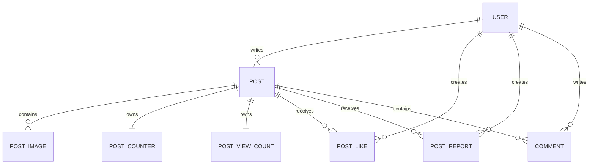

# 09. 게시글·댓글 Entity와 상태 흐름

이 장은 인증된 사용자가 게시글과 댓글을 만들거나 변경할 때, HTTP DTO와 Service의
입력이 어떤 JPA Entity 상태로 바뀌는지 확인합니다. Repository의 JPQL과 Controller의
HTTP 매핑은 다음 장에서 본격적으로 다루고, 여기서는 Entity의 선언·연관관계·상태 변경
메서드가 실제 호출 흐름에서 어떤 역할을 하는지에 집중합니다.

## 09.1 이번 장의 기준과 읽는 순서

이번 장에서 대조한 기준 저장소는 다음 하나입니다.

- 백엔드 실제 코드: `/Users/miles/Documents/GitHub/KTB4_Miles_Week12_Back`
- Entity 경로: `/Users/miles/Documents/GitHub/KTB4_Miles_Week12_Back/src/main/java/kr/adapterz/springdatajpa/entity`
- 호출자 확인 경로: `/Users/miles/Documents/GitHub/KTB4_Miles_Week12_Back/src/main/java/kr/adapterz/springdatajpa/service`

기존 문서에 남아 있던 `/study12/backend`와 `98_Redis_조회수_처리.md` 경로는 현재 기준이
아닙니다. 조회수 Redis 구현은 16번 문서에서 다루고, 이 장에서는 `PostViewCount`가
DB에 보관하는 영구 값이라는 점만 연결합니다.

읽는 순서는 선언 순서가 아니라 다음 실행 흐름입니다.

```text
인증된 userId
→ PostService.createPost
→ new Post(user, title, content)
→ Post 생성자에서 PostCounter·PostViewCount 생성
→ Post.replaceImages
→ Post.addImage
→ PostRepository.save
```

이후 같은 Entity들이 다음 요청에서 다시 사용됩니다.

```text
상세 조회: PostService.getPostView
→ Post와 PostCounter·PostViewCount 조회
→ ViewCountUpdater.increment
→ PostViewResponseDto

게시글 수정: PostService.fixPost
→ 권한·version·이미지 검증
→ Post.update
→ replaceImages
→ JPA dirty checking과 version 처리

좋아요: PostService.likePost / cancelLike
→ Like row 저장·삭제
→ PostCounterRepository bulk update

신고: PostService.reportPost
→ PostReport row 저장
→ Post.report와 User.receiveReport

댓글: CommentService.commentPost / commentFix / commentDelete
→ Comment row 생성·수정·물리 삭제
→ PostCounterRepository replyCount bulk update
```

현재 코드에서 좋아요·댓글 수의 production 갱신은 `PostCounterRepository`의
`UPDATE` query가 담당합니다. 과거에 있던 `Post`·`PostCounter`의 직접 증감 메서드는
production caller가 없어서 제거했고, 그 메서드를 직접 호출하던 `PostTest` assertion도
함께 제거했습니다. 반면 신고 수는 현재도 `PostService.reportPost`가
`Post.report()`를 호출하는 실제 Entity 경로입니다.

---

## 09.2 Entity 관계 지도



관계의 주인은 다음처럼 구분합니다.

| 관계 | 실제 foreign key를 가진 Entity | 이유 |
|---|---|---|
| `Post`–`User` | `Post.user` | `posts` table에 `user_id`가 있음 |
| `Post`–`PostImage` | `PostImage.post` | `post_images.post_id`가 있음; `Post.postImages`는 `mappedBy` |
| `Post`–`PostCounter` | `PostCounter.post` | `@MapsId`와 `post_id`로 Post의 ID를 공유 |
| `Post`–`PostViewCount` | `PostViewCount.post` | `@MapsId`와 `post_id`로 Post의 ID를 공유 |
| `Post`–`Like` | `Like.post` | `post_likes.post_id`가 있음 |
| `Post`–`PostReport` | `PostReport.post` | `post_reports.post_id`가 있음 |
| `Post`–`Comment` | `Comment.post` | `comments.post_id`가 있음 |

`mappedBy`는 “반대편 field가 관계의 주인”이라는 JPA 문법입니다. `@JoinColumn`이 붙은
field가 실제 FK 값을 변경하고, `mappedBy`가 붙은 collection 또는 반대쪽 property는
객체 그래프를 읽기 위한 역방향 표현입니다. `@MapsId`는 연관된 Post의 primary key를
Counter Entity 자신의 primary key로도 쓰게 하는 문법입니다.

---

## 09.3 `Post` — 게시글의 본문·삭제·연관관계 진입점

### 파일 책임과 호출 관계

- 파일: `/Users/miles/Documents/GitHub/KTB4_Miles_Week12_Back/src/main/java/kr/adapterz/springdatajpa/entity/Post.java`
- 책임: 게시글 본문, 작성자, 이미지 collection, counter, 영구 조회수, version, soft-delete 상태를 보관합니다.
- 직접 호출하는 코드: `PostService.createPost`, `getPostView`, `fixPost`, `deletePost`, `likePost`, `reportPost`; DTO factory가 getter를 사용합니다.
- 호출하는 Entity: 생성자에서 `PostCounter`, `PostViewCount`를 만들고, `addImage`에서 `PostImage`를 만듭니다.
- 외부 입력: `User`, 제목, 내용, 이미지 문자열, `PostService`가 전달하는 상태 변경 요청입니다.
- 반환/사용: getter 값이 Response DTO와 Service 검증에 사용됩니다. Entity의 `void` 변경 메서드는 반환값 대신 managed 상태를 바꿉니다.
- 예외: Entity 자체는 예외를 던지지 않습니다. `PostService`가 권한·version·이미지 검증 예외를 먼저 처리합니다.

### 실제 원문

```java
package kr.adapterz.springdatajpa.entity;

import java.time.*;
import java.util.ArrayList;
import java.util.List;

import jakarta.persistence.*;
import lombok.AccessLevel;
import lombok.Getter;
import lombok.NoArgsConstructor;


@Getter
@Entity
@Table(name="posts")
@NoArgsConstructor(access = AccessLevel.PROTECTED)

public class Post {
    public static final int REPORT_BLOCK_THRESHOLD = 5;

    @Id
    @GeneratedValue(strategy = GenerationType.IDENTITY)
    @Column(name="post_id")
    private Long postId;

    @Version
    @Column(name = "version", nullable = false)
    private Long version;

    @ManyToOne(fetch = FetchType.LAZY)
    @JoinColumn(name = "user_id", nullable = false)
    private User user;

    @Column(name = "post_title", nullable = false, length = 26)
    private String postTitle;

    @Column(name = "post_content", nullable = false)
    private String postContent;

    @OneToMany(mappedBy = "post", cascade = CascadeType.ALL, orphanRemoval = true)
    @OrderBy("imageOrder ASC")
    private List<PostImage> postImages = new ArrayList<>();

    @OneToOne(
            mappedBy = "post",
            fetch = FetchType.LAZY,
            cascade = CascadeType.ALL,
            orphanRemoval = true,
            optional = false
    )
    private PostCounter postCounter;

    @OneToOne(
            mappedBy = "post",
            fetch = FetchType.LAZY,
            cascade = CascadeType.ALL,
            orphanRemoval = true,
            optional = false
    )
    private PostViewCount postViewCount;

    @Column(name ="created_at", nullable = false, updatable = false)
    private LocalDateTime createdAt;

    @Column(name ="deleted", nullable = false)
    private boolean deleted;

    public Post(User user, String postTitle, String postContent)
    {
        this.user=user;
        this.postTitle=postTitle;
        this.postContent=postContent;

        postCounter = new PostCounter(this);
        postViewCount = new PostViewCount(this);
        createdAt = LocalDateTime.now();
        deleted=false;
    }


    public void update(String title, String contents, List<String> imageFiles) {
        this.postTitle = title;
        this.postContent = contents;
        replaceImages(imageFiles);
    }

    public void replaceImages(List<String> imageFiles) {
        postImages.clear();

        if (imageFiles == null) {
            return;
        }

        for (int i = 0; i < imageFiles.size(); i++) {
            String imageFile = imageFiles.get(i);

            if (imageFile == null || imageFile.isBlank()) {
                continue;
            }

            addImage(imageFile, i);
        }
    }

    public void addImage(String imageFile, int imageOrder) {
        PostImage postImage = new PostImage(this, imageFile, imageOrder);
        postImages.add(postImage);
    }

    public void delete(){deleted=true;}

    public void report() {
        postCounter.report();
    }

    public boolean isBlockedByReports() {
        return postCounter.getReportCount() >= REPORT_BLOCK_THRESHOLD;
    }

    public int getLikeCount() {
        return postCounter.getLikeCount();
    }

    public int getReportCount() {
        return postCounter.getReportCount();
    }

    public int getReplyCount() {
        return postCounter.getReplyCount();
    }

}
```

### 선언부·JPA 매핑

```java
@Getter                                      // Lombok이 모든 private field의 getter를 생성한다.
@Entity                                     // 이 class를 JPA가 posts table과 매핑할 Entity로 등록한다.
@Table(name="posts")                       // table 이름을 posts로 고정한다.
@NoArgsConstructor(access = AccessLevel.PROTECTED) // JPA가 사용할 무인자 생성자를 protected로 만든다.
public class Post {
    public static final int REPORT_BLOCK_THRESHOLD = 5; // 신고 수가 5 이상이면 조회·수정 대상에서 차단한다.

    @Id                                     // postId를 primary key로 지정한다.
    @GeneratedValue(strategy = GenerationType.IDENTITY) // DB auto-increment가 ID를 생성한다.
    @Column(name="post_id")                // Java field와 DB column 이름을 연결한다.
    private Long postId;

    @Version                                // update 시 version을 비교해 optimistic locking에 사용한다.
    @Column(name = "version", nullable = false) // version column은 null을 허용하지 않는다.
    private Long version;
```

`@Getter`, `@Entity`, `@Table`, `@NoArgsConstructor`는 이 프로젝트 첫 Entity에서 처음
배운 문법입니다. Lombok annotation은 소스에 getter 메서드를 직접 쓰지 않아도 compile
시점에 메서드를 생성합니다. 그래서 `post.getPostId()`와 `post.getUser()`는 이 파일에
보이는 메서드 본문이 아니라 Lombok이 생성한 메서드입니다.

`@Version`은 “현재 version과 요청 DTO의 version이 같은지”를 Service가 먼저 확인하는
것만 의미하지 않습니다. managed Entity가 flush될 때 JPA도 version을 조건에 포함해
동시 수정 충돌을 감지합니다. 이 코드에서는 `PostService.fixPost`가 title/content를
바꾸면 dirty checking으로 version 증가가 일어나고, title/content가 같고 이미지
collection만 바뀌는 경우에는 `OPTIMISTIC_FORCE_INCREMENT`를 별도로 요청합니다. 그
이유는 collection 변경만으로도 수정 버전을 진행시키기 위해서입니다.

```java
@ManyToOne(fetch = FetchType.LAZY)         // 여러 Post가 한 User를 참조하고, User는 즉시 읽지 않는다.
@JoinColumn(name = "user_id", nullable = false) // posts.user_id가 실제 FK를 관리한다.
private User user;

@Column(name = "post_title", nullable = false, length = 26) // 제목 column의 null·길이 조건이다.
private String postTitle;

@Column(name = "post_content", nullable = false) // 본문은 null을 허용하지 않는다.
private String postContent;

@OneToMany(mappedBy = "post", cascade = CascadeType.ALL, orphanRemoval = true) // PostImage가 관계 주인이고 생명주기를 함께 관리한다.
@OrderBy("imageOrder ASC")                   // collection을 읽을 때 imageOrder 오름차순으로 정렬한다.
private List<PostImage> postImages = new ArrayList<>(); // 빈 이미지 목록으로 시작한다.
```

`fetch = LAZY`는 `Post`를 읽을 때 연결된 User 또는 OneToOne Entity를 항상 즉시 조회하지
않도록 하는 설정입니다. 실제로 DTO가 `post.getUser()`나 `post.getPostCounter()`를
호출하는 시점에는 transaction 안에서 필요한 연관 객체를 읽을 수 있습니다.

`mappedBy = "post"`의 문자열은 `PostImage` 안의 field 이름 `post`와 정확히 일치해야
합니다. 이는 DB column 이름이 아니라 Java property 이름입니다. 반대로 실제 FK를
관리하는 `PostImage.post`에는 `@JoinColumn(name = "post_id")`가 있습니다.

`cascade = CascadeType.ALL`은 Post에 저장·삭제 같은 JPA 생명주기 동작이 연결된
PostImage에도 전파될 수 있게 합니다. `orphanRemoval = true`는 collection에서 기존
이미지를 제거하면 그 PostImage row도 고아로 판단해 삭제 대상으로 만들 수 있게 합니다.
따라서 `replaceImages`에서 `postImages.clear()`를 호출하는 것은 단순히 Java list를
비우는 작업이 아니라, managed Post를 flush할 때 기존 이미지 삭제와 새 이미지 저장으로
이어질 수 있습니다.

```java
@OneToOne(                                  // Post와 Counter를 1:1로 연결한다.
        mappedBy = "post",                  // 관계 주인은 PostCounter.post다.
        fetch = FetchType.LAZY,              // counter를 필요한 시점에 읽는다.
        cascade = CascadeType.ALL,           // Post 저장/삭제 생명주기를 counter에 전파한다.
        orphanRemoval = true,                // Post에서 분리된 counter를 고아로 처리한다.
        optional = false                     // Post에는 counter가 반드시 있어야 한다.
)
private PostCounter postCounter;

@OneToOne(                                  // 영구 조회수도 Post와 1:1이다.
        mappedBy = "post",
        fetch = FetchType.LAZY,
        cascade = CascadeType.ALL,
        orphanRemoval = true,
        optional = false
)
private PostViewCount postViewCount;

@Column(name ="created_at", nullable = false, updatable = false) // 생성 후 수정하지 않는 시각이다.
private LocalDateTime createdAt;

@Column(name ="deleted", nullable = false) // soft delete 여부를 저장한다.
private boolean deleted;
```

`PostCounter`와 `PostViewCount`는 Post 생성자에서 항상 만들어지고 `optional = false`로
필수 관계를 표현합니다. 이 둘은 같은 table의 column으로 합쳐지지 않고 각각 별도 table에
있습니다. `PostCounter`는 좋아요·신고·댓글 수, `PostViewCount`는 영구 조회수라는 서로
다른 변경 흐름을 분리합니다.

### 생성과 이미지 교체

```java
public Post(User user, String postTitle, String postContent) {
    this.user=user;                           // Service가 조회한 작성자를 연결한다.
    this.postTitle=postTitle;                 // 요청 DTO의 제목을 Entity 상태로 복사한다.
    this.postContent=postContent;             // 요청 DTO의 본문을 Entity 상태로 복사한다.

    postCounter = new PostCounter(this);     // 게시글과 같은 시점에 0인 counter를 만든다.
    postViewCount = new PostViewCount(this);  // 영구 조회수도 0부터 시작하게 만든다.
    createdAt = LocalDateTime.now();          // 생성 시각을 애플리케이션에서 기록한다.
    deleted=false;                            // 새 게시글은 활성 상태다.
}

public void update(String title, String contents, List<String> imageFiles) {
    this.postTitle = title;                   // 기존 제목을 새 제목으로 교체한다.
    this.postContent = contents;              // 기존 본문을 새 본문으로 교체한다.
    replaceImages(imageFiles);                // 이미지 전체 목록도 요청 목록으로 교체한다.
}

public void replaceImages(List<String> imageFiles) {
    postImages.clear();                       // 기존 collection을 먼저 모두 제거한다.

    if (imageFiles == null) {                 // null 목록은 이미지가 없는 요청으로 처리한다.
        return;                               // 현재 메서드만 끝내고 빈 collection을 유지한다.
    }

    for (int i = 0; i < imageFiles.size(); i++) { // 요청 목록의 원래 위치를 순회한다.
        String imageFile = imageFiles.get(i);     // 현재 위치의 Data URL 문자열을 가져온다.

        if (imageFile == null || imageFile.isBlank()) { // null·빈 문자열·공백만 있는 값은 제외한다.
            continue;                              // 현재 반복만 건너뛰고 다음 이미지로 이동한다.
        }

        addImage(imageFile, i);                     // 원래 index를 imageOrder로 전달한다.
    }
}

public void addImage(String imageFile, int imageOrder) {
    PostImage postImage = new PostImage(this, imageFile, imageOrder); // 양방향 연결을 가진 child를 만든다.
    postImages.add(postImage);                                        // Post가 child를 collection으로 관리한다.
}
```

호출 순서는 `PostService.createPost`의 `new Post(...)` 뒤
`post.replaceImages(request.getImageFiles())`입니다. 수정에서는 `PostService.fixPost`가
`post.update(...)` 하나를 호출하고, 그 안에서 동일한 이미지 교체가 다시 실행됩니다.
`PostService`는 이보다 앞서 `ImageDataUrlValidator.validatePostImages`를 실행하므로,
Entity는 형식 검증의 책임을 갖지 않고 이미 전달된 값을 상태로 구성하는 책임만 가집니다.

`continue`는 반복문 전체를 끝내는 `return`이 아니라 현재 이미지 하나를 건너뜁니다.
따라서 `["first.png", null, " ", "second.png"]`는 두 개의 `PostImage`를 만들고,
두 번째 유효 이미지의 `imageOrder`는 3이 됩니다. `@OrderBy("imageOrder ASC")`는 이
값을 기준으로 DB에서 collection을 읽을 때 정렬합니다.

### soft delete·신고·조회 검증

```java
public void delete(){deleted=true;}          // row를 삭제하지 않고 soft-delete flag만 true로 바꾼다.

public void report() {
    postCounter.report();                    // 신고 수 증가를 Counter에 위임한다.
}

public boolean isBlockedByReports() {
    return postCounter.getReportCount() >= REPORT_BLOCK_THRESHOLD; // 5 이상이면 true를 반환한다.
}
```

현재 production Service의 좋아요·댓글 수 갱신은 Entity의 직접 증감 메서드가 아니라
다음 Repository bulk query를 사용합니다. 직접 증감 메서드는 production caller가 없어
삭제했으므로, 현재 소스에는 이 동작을 위한 Entity API가 없습니다.

```java
postCounterRepository.incrementLikeCount(postId); // PostService.likePost에서 호출
postCounterRepository.decrementLikeCount(postId); // PostService.cancelLike에서 호출
postCounterRepository.incrementReplyCount(postId); // CommentService.commentPost에서 호출
postCounterRepository.decrementReplyCount(postId); // CommentService.commentDelete에서 호출
```

따라서 Repository bulk query와 Entity의 실제 메서드 흐름을 혼동하면 안 됩니다.
`Post.report()`는
현재 `PostService.reportPost`에서 실제로 호출되고, `PostCounter.report()`의 변경은
transaction flush 때 DB에 반영됩니다.

`delete()`는 `PostRepository`에서 row를 지우는 호출이 아닙니다. Service가 managed
Post에 `post.delete()`를 호출하면 `deleted=true`가 되고, 이후
`findByPostIdAndDeletedFalse`, `findActivePostForInteraction` 같은 query가 활성 게시글만
찾도록 조건을 적용합니다. 신고 수 차단은 `getViewablePost`와
`validatePostModificationPermission`에서 `isBlockedByReports()`를 사용해 조회·수정
대상에서 제외하는 데 쓰입니다.

---

## 09.4 `PostImage` — 게시글 이미지 child Entity

### 파일 책임과 호출 관계

- 파일: `/Users/miles/Documents/GitHub/KTB4_Miles_Week12_Back/src/main/java/kr/adapterz/springdatajpa/entity/PostImage.java`
- 호출자: 현재 production에서는 `Post.addImage`만 `new PostImage(...)`를 호출합니다.
- 입력: 부모 `Post`, Data URL 문자열, 원래 이미지 index입니다.
- 반환값: 생성자가 `void`를 반환하는 대신 새 Entity instance를 만들고, `Post.addImage`가 collection에 저장합니다.
- 상태 변경: `imageFile`, `imageOrder`, `post`는 생성 후 별도 변경 메서드가 없습니다.
- 삭제: `Post.postImages`에서 빠지고 Post가 managed 상태라면 부모의 `orphanRemoval=true` 규칙에 따라 삭제 대상으로 처리될 수 있습니다.

### 실제 원문

```java
package kr.adapterz.springdatajpa.entity;

import jakarta.persistence.*;
import lombok.AccessLevel;
import lombok.Getter;
import lombok.NoArgsConstructor;

@Getter
@Entity
@Table(name = "post_images")
@NoArgsConstructor(access = AccessLevel.PROTECTED)
public class PostImage {
    @Id
    @GeneratedValue(strategy = GenerationType.IDENTITY)
    @Column(name = "post_image_id")
    private Long postImageId;

    @ManyToOne(fetch = FetchType.LAZY)
    @JoinColumn(name = "post_id", nullable = false)
    private Post post;

    @Lob
    @Column(name = "image_file", nullable = false, columnDefinition = "LONGTEXT")
    private String imageFile;

    @Column(name = "image_order", nullable = false)
    private int imageOrder;

    public PostImage(Post post, String imageFile, int imageOrder) {
        this.post = post;
        this.imageFile = imageFile;
        this.imageOrder = imageOrder;
    }
}
```

### 생성자와 FK

```java
@ManyToOne(fetch = FetchType.LAZY)       // 여러 이미지가 하나의 Post에 속한다.
@JoinColumn(name = "post_id", nullable = false) // post_images.post_id가 실제 FK다.
private Post post;

@Lob                                   // 긴 문자열을 저장할 수 있는 대용량 column 매핑이다.
@Column(name = "image_file", nullable = false, columnDefinition = "LONGTEXT")
private String imageFile;

@Column(name = "image_order", nullable = false) // 화면/응답 순서를 저장한다.
private int imageOrder;

public PostImage(Post post, String imageFile, int imageOrder) {
    this.post = post;                    // child가 부모 Post를 참조하게 한다.
    this.imageFile = imageFile;          // 이미지 원문을 저장한다.
    this.imageOrder = imageOrder;        // 요청의 index를 저장한다.
}
```

`Post.postImages`에 `mappedBy = "post"`가 있는 이유는 이 `post` field가 FK의 주인이기
때문입니다. 두 방향을 모두 `@JoinColumn`으로 선언하면 JPA가 같은 관계를 두 번 관리하려
하므로 현재처럼 한쪽만 주인으로 둡니다.

---

## 09.5 `PostCounter` — 좋아요·신고·댓글 수

### 파일 책임과 호출 관계

- 파일: `/Users/miles/Documents/GitHub/KTB4_Miles_Week12_Back/src/main/java/kr/adapterz/springdatajpa/entity/PostCounter.java`
- 생성자 호출: `Post` 생성자에서 `new PostCounter(this)`.
- 실제 production 변경: 신고는 `post.report()` → `postCounter.report()`; 좋아요·댓글 수는 `PostCounterRepository` bulk update.
- 조회자: `Post`, `PostListResponseDto`, `PostViewResponseDto`, `PostService`가 getter를 사용합니다.
- 외부 입력: 부모 Post와 각 상호작용의 증가·감소 요청입니다.
- 예외: Counter Entity 메서드 자체는 예외를 검사하지 않습니다. Repository update 결과가 1인지 Service가 검사하고 아니면 `CounterUpdateException`을 던집니다.

### 실제 원문

```java
package kr.adapterz.springdatajpa.entity;

import jakarta.persistence.Column;
import jakarta.persistence.Entity;
import jakarta.persistence.FetchType;
import jakarta.persistence.Id;
import jakarta.persistence.JoinColumn;
import jakarta.persistence.MapsId;
import jakarta.persistence.OneToOne;
import jakarta.persistence.Table;
import lombok.AccessLevel;
import lombok.Getter;
import lombok.NoArgsConstructor;

@Getter
@Entity
@Table(name = "post_counters")
@NoArgsConstructor(access = AccessLevel.PROTECTED)
public class PostCounter {

    @Id
    @Column(name = "post_id")
    private Long postId;

    @MapsId
    @OneToOne(fetch = FetchType.LAZY, optional = false)
    @JoinColumn(name = "post_id")
    private Post post;

    @Column(name = "like_count", nullable = false)
    private int likeCount;

    @Column(name = "report_count", nullable = false)
    private int reportCount;

    @Column(name = "reply_count", nullable = false)
    private int replyCount;

    public PostCounter(Post post) {
        this.post = post;
        this.likeCount = 0;
        this.reportCount = 0;
        this.replyCount = 0;
    }

    public void report() {
        reportCount++;
    }
}
```

### 공유 primary key와 counter 상태

```java
@Id                                      // post_counters.post_id가 이 Entity의 PK다.
@Column(name = "post_id")
private Long postId;

@MapsId                                  // 연결된 Post의 ID를 postId에도 사용한다.
@OneToOne(fetch = FetchType.LAZY, optional = false) // 하나의 Post에 하나의 Counter다.
@JoinColumn(name = "post_id")            // 같은 column이 Post FK 역할도 한다.
private Post post;

@Column(name = "like_count", nullable = false)
private int likeCount;
@Column(name = "report_count", nullable = false)
private int reportCount;
@Column(name = "reply_count", nullable = false)
private int replyCount;
```

`@MapsId` 때문에 Counter의 `postId`를 별도로 생성하지 않습니다. Post가 DB에서 발급받은
ID가 Counter의 PK/FK가 됩니다. 이것이 `PostCounter`가 일반적인 독립 ID를 가진 Entity가
아니라 특정 Post의 counter임을 DB 수준에서도 표현합니다.

```java
public PostCounter(Post post) {
    this.post = post;            // 어느 Post의 수인지 연결한다.
    this.likeCount = 0;          // 새 게시글은 좋아요가 없다.
    this.reportCount = 0;        // 새 게시글은 신고가 없다.
    this.replyCount = 0;         // 새 게시글은 댓글이 없다.
}

public void report() { reportCount++; }     // 신고 수 증가
```

현재 production Service의 좋아요·댓글 수 변경은
PostCounterRepository의 bulk UPDATE query를 사용합니다. 이전에 있던 Entity 직접 증감
메서드는 production caller가 없어 삭제했고, 그 메서드를 호출하던 Entity 테스트도
삭제했습니다. 신고 수는 여전히 `post.report()` → `PostCounter.report()` 경로로
변경됩니다. 좋아요와 댓글의 lock 구조는 완전히 같지 않습니다.

```java
postCounterRepository.incrementLikeCount(postId);   // PostService.likePost
postCounterRepository.decrementLikeCount(postId);   // PostService.cancelLike
postCounterRepository.incrementReplyCount(postId);  // CommentService.commentPost
postCounterRepository.decrementReplyCount(postId);  // CommentService.commentDelete
```

bulk update는 DB가 현재 column 값에 `+ 1` 또는 `- 1`을 적용하므로 여러 요청의 변경을
한 SQL에서 처리할 수 있습니다. Service는 반환된 affected row 수가 1인지
`validateCounterUpdate`로 확인합니다. 이 문서에서 Repository query의 JPQL 문법과
비관적 lock의 정확한 실행 순서는 10번 문서에서 다시 연결합니다.

---

## 09.6 `PostViewCount` — DB에 남는 조회수 baseline

### 파일 책임과 호출 관계

- 파일: `/Users/miles/Documents/GitHub/KTB4_Miles_Week12_Back/src/main/java/kr/adapterz/springdatajpa/entity/PostViewCount.java`
- 생성자 호출: `Post` 생성자에서 항상 생성합니다.
- 조회자: `PostService.getPostView`가 `post.getPostViewCount().getViewCount()`로 baseline을 읽습니다.
- 변경자: 이 Entity의 field를 직접 증가시키는 production method는 현재 파일에 없습니다. `ViewCountUpdater` 구현과 `PostViewCountRepository`가 조회수 저장 흐름을 담당합니다.
- 반환 사용: baseline은 `viewCountUpdater.increment(postId, baselineViewCount)`의 두 번째 인자로 전달됩니다.

### 실제 원문

```java
package kr.adapterz.springdatajpa.entity;

import jakarta.persistence.Column;
import jakarta.persistence.Entity;
import jakarta.persistence.FetchType;
import jakarta.persistence.Id;
import jakarta.persistence.JoinColumn;
import jakarta.persistence.MapsId;
import jakarta.persistence.OneToOne;
import jakarta.persistence.Table;
import lombok.AccessLevel;
import lombok.Getter;
import lombok.NoArgsConstructor;

@Getter
@Entity
@Table(name = "post_view_counts")
@NoArgsConstructor(access = AccessLevel.PROTECTED)
public class PostViewCount {

    @Id
    @Column(name = "post_id")
    private Long postId;

    @MapsId
    @OneToOne(fetch = FetchType.LAZY, optional = false)
    @JoinColumn(name = "post_id")
    private Post post;

    @Column(name = "view_count", nullable = false)
    private long viewCount;

    public PostViewCount(Post post) {
        this.post = post;
        this.viewCount = 0L;
    }
}
```

```java
@Column(name = "view_count", nullable = false) // DB에 보존되는 현재 조회수 column이다.
private long viewCount;

public PostViewCount(Post post) {
    this.post = post;             // Post와 shared primary key 관계를 만든다.
    this.viewCount = 0L;          // 새로운 게시글의 DB baseline은 0이다.
}
```

현재 상세 조회는 먼저 이 DB 값을 baseline으로 읽고, `ViewCountUpdater`가 Redis 활성화
여부에 따라 Redis 값 또는 DB 값을 사용해 증가값을 반환합니다. 따라서 이 Entity 자체가
“매 요청마다 조회수를 1 증가시키는 코드”는 아닙니다. Redis가 활성화된 경우 빠른 증가값은
Redis의 count key에 임시로 쌓이고, scheduler가 나중에 이 table에 영구 반영합니다.

---

## 09.7 `Like` — 좋아요 이력 row와 중복 방지

### 파일 책임과 호출 관계

- 파일: `/Users/miles/Documents/GitHub/KTB4_Miles_Week12_Back/src/main/java/kr/adapterz/springdatajpa/entity/Like.java`
- 생성자 호출: `PostService.likePost`에서 `new Like(post, user)`.
- 삭제: `PostService.cancelLike`가 Entity를 직접 `delete`하지 않고 `LikeRepository.deleteByPostIdAndUserId` bulk delete를 실행합니다.
- 반환 사용: Entity 자체 반환값은 없고, Repository의 저장/삭제 결과와 Counter query 결과가 응답 DTO의 like count로 사용됩니다.
- 예외: 중복 저장 시 현재 Service가 `DataIntegrityViolationException`을 `InvalidRequestException("Already_Liked")`로 변환합니다.

### 실제 원문

```java
package kr.adapterz.springdatajpa.entity;

import jakarta.persistence.*;
import lombok.AccessLevel;
import lombok.Getter;
import lombok.NoArgsConstructor;

@Entity
@Table(
        name = "post_likes",
        uniqueConstraints = {
                @UniqueConstraint(
                        name = "uk_post_like_post_user",
                        columnNames = {"post_id", "user_id"}
                )
        }
)
@Getter
@NoArgsConstructor(access = AccessLevel.PROTECTED)
public class Like {

    @Id
    @GeneratedValue(strategy = GenerationType.IDENTITY)
    @Column(name = "post_like_id")
    private Long postLikeId;

    @ManyToOne(fetch = FetchType.LAZY)
    @JoinColumn(name = "post_id", nullable = false)
    private Post post;

    @ManyToOne(fetch = FetchType.LAZY)
    @JoinColumn(name = "user_id", nullable = false)
    private User user;

    public Like(Post post, User user) {
        this.post = post;
        this.user = user;
    }
}
```

```java
@UniqueConstraint(                         // DB가 중복 조합을 허용하지 않도록 한다.
        name = "uk_post_like_post_user",   // constraint의 DB 이름이다.
        columnNames = {"post_id", "user_id"} // 같은 Post·User 조합을 한 번만 허용한다.
)
```

`@UniqueConstraint`는 “좋아요 수가 중복되지 않는다”가 아니라 “같은 사용자가 같은
게시글을 나타내는 Like row를 두 개 만들 수 없다”를 보장합니다. 좋아요 숫자는 별도
`PostCounter.likeCount` column이고, row와 숫자를 Service transaction이 함께 갱신합니다.

현재 모든 독립 식별자 Entity의 생성 전략은 `GenerationType.IDENTITY`입니다.
`Like`만 과거에 `AUTO`였지만 현재 source에서는 다른 Entity와 동일하게
`IDENTITY`로 통일되었습니다.

- `IDENTITY`: MySQL의 `AUTO_INCREMENT`가 INSERT 시 ID를 만들고, Hibernate가 DB가
  반환한 생성 ID를 Entity에 반영합니다.
- `AUTO`: JPA provider와 DB dialect가 선택한 생성 전략을 사용합니다. 이 프로젝트의
  과거 `Like` 구조에서는 B3 baseline의 `post_likes_seq` 보조 table과 연결된 방식으로
  동작할 수 있었습니다.

따라서 이 변경은 Java annotation 한 줄만 바꾼 것이 아닙니다. 기존 RDS의
`post_likes.post_like_id`가 `AUTO_INCREMENT`가 아니고 `post_likes_seq`가 존재할 수
있으므로, 이미 적용된 migration을 수정하지 않고 V6 migration을 추가해 DB 구조도
현재 Entity와 맞춥니다. V6의 실제 SQL과 기존·신규 RDS 적용 순서는 17장에서 확인합니다.

```java
public Like(Post post, User user) {
    this.post = post;              // 좋아요 대상 게시글을 연결한다.
    this.user = user;              // 좋아요를 누른 사용자를 연결한다.
}
```

현재 `PostService.likePost`의 실제 순서는 `Post` lock → 활성 상태 재확인 → Like 저장
및 flush → duplicate 예외 변환 → Counter 증가 query → 새 count 조회입니다. 반대로
취소는 Like row 삭제 결과가 정확히 1인지 확인한 뒤 Counter를 감소시킵니다. 이 순서를
알아야 “Like Entity가 있는데 왜 PostCounter의 count를 Entity 메서드로 직접 바꾸지
않는가?”라는 의문을 해결할 수 있습니다. 현재 production은
`PostCounterRepository` query를 호출합니다.

---

## 09.8 `PostReport` — 신고 이력과 Counter·작성자 상태

### 파일 책임과 호출 관계

- 파일: `/Users/miles/Documents/GitHub/KTB4_Miles_Week12_Back/src/main/java/kr/adapterz/springdatajpa/entity/PostReport.java`
- 생성자 호출: `PostService.reportPost`에서 `new PostReport(post, reporter)`.
- 함께 변경되는 값: `Post.report()`가 게시글 report count를 증가시키고, `User.receiveReport()`가 작성자의 누적 신고 수를 증가시킵니다.
- 중복 방지: `(post_id, user_id)` unique constraint와 Service의 `existsByPostAndUser` 사전 확인을 함께 사용합니다.
- 예외: 현재 `reportPost`에는 Like처럼 `DataIntegrityViolationException`을 `Already_Reported`로 바꾸는 catch가 없습니다. 동시 신고의 unique 위반 결과는 현재 코드만으로 항상 동일한 업무 예외가 된다고 말할 수 없습니다.

### 실제 원문

```java
package kr.adapterz.springdatajpa.entity;

import jakarta.persistence.*;
import lombok.AccessLevel;
import lombok.Getter;
import lombok.NoArgsConstructor;

import java.time.LocalDateTime;

@Entity
@Table(
        name = "post_reports",
        uniqueConstraints = {
                @UniqueConstraint(
                        name = "uk_post_report_post_user",
                        columnNames = {"post_id", "user_id"}
                )
        }
)
@Getter
@NoArgsConstructor(access = AccessLevel.PROTECTED)
public class PostReport {

    @Id
    @GeneratedValue(strategy = GenerationType.IDENTITY)
    @Column(name = "post_report_id")
    private Long postReportId;

    @ManyToOne(fetch = FetchType.LAZY)
    @JoinColumn(name = "post_id", nullable = false)
    private Post post;

    @ManyToOne(fetch = FetchType.LAZY)
    @JoinColumn(name = "user_id", nullable = false)
    private User user;


    @Column(name = "created_at", nullable = false, updatable = false)
    private LocalDateTime createdAt;

    public PostReport(Post post, User user) {
        this.post = post;
        this.user = user;
        this.createdAt = LocalDateTime.now();
    }
}
```

```java
@UniqueConstraint(                              // 신고 이력 중복을 DB에서도 막는다.
        name = "uk_post_report_post_user",
        columnNames = {"post_id", "user_id"}   // 한 사용자는 같은 게시글을 한 번만 신고한다.
)

@Column(name = "created_at", nullable = false, updatable = false)
private LocalDateTime createdAt;                // 신고가 생성된 시각이며 수정하지 않는다.

public PostReport(Post post, User user) {
    this.post = post;                            // 신고 대상 게시글이다.
    this.user = user;                            // 신고를 생성한 사용자다.
    this.createdAt = LocalDateTime.now();       // 생성 시각을 즉시 기록한다.
}
```

현재 신고 Service의 흐름은 다음과 같습니다.

```java
Post post = getActivePostForUpdate(postId);      // 게시글 row를 lock해서 수정 대상 확보
User reporter = getLoginUser(loginUserId);       // 신고자 확인
User writer = getUserForUpdate(post.getUser().getUserId()); // 작성자 row도 lock

if (writer.getUserId().equals(reporter.getUserId())) { ... } // 자기 글 신고 금지
if (postReportRepository.existsByPostAndUser(post, reporter)) { ... } // 기존 신고 확인

postReportRepository.save(new PostReport(post, reporter)); // 신고 이력 row 생성
post.report();                                             // PostCounter.report()
writer.receiveReport();                                     // User.receivedReportCount 증가
```

세 개의 상태는 서로 다른 목적을 가집니다. `PostReport`는 누가 언제 신고했는지의 이력,
`PostCounter.reportCount`는 게시글 차단 기준에 쓰는 빠른 숫자, `User.receivedReportCount`는
작성자 정지 기준에 쓰는 누적 숫자입니다. `PostService.reportPost`가 같은 transaction
안에서 모두 변경하므로 하나만 성공하고 나머지가 실패하는 상황을 줄이도록 설계되어
있습니다. 다만 현재 코드에 동시 신고 예외를 별도 업무 예외로 변환하는 catch가 있는 것은
아닙니다.

---

## 09.9 `Comment` — 댓글 생성·수정·물리 삭제

### 파일 책임과 호출 관계

- 파일: `/Users/miles/Documents/GitHub/KTB4_Miles_Week12_Back/src/main/java/kr/adapterz/springdatajpa/entity/Comment.java`
- 생성자 호출: `CommentService.commentPost`에서 `new Comment(user, post, content)`.
- 수정 호출: `CommentService.commentFix`가 기존 Entity의 `changeComment`를 호출합니다.
- 삭제 호출: `CommentService.commentDelete`가 `commentRepository.delete(comment)`를 호출합니다.
- 삭제 형태: `Comment`에는 `deleted` field가 없으므로 현재 코드는 soft delete가 아니라 JPA delete를 통한 physical delete입니다.
- counter: 댓글 row 생성·삭제와 별개로 `PostCounterRepository.incrementReplyCount`·`decrementReplyCount`가 실행됩니다.

### 실제 원문

```java
package kr.adapterz.springdatajpa.entity;

import jakarta.persistence.*;
import lombok.AccessLevel;
import lombok.Getter;
import lombok.NoArgsConstructor;

import java.time.LocalDateTime;

@Getter
@Entity
@Table(name="comments")
@NoArgsConstructor(access = AccessLevel.PROTECTED)

public class Comment {

    @Id
    @GeneratedValue(strategy = GenerationType.IDENTITY)
    @Column(name="comment_id")
    private Long commentId;

    @ManyToOne(fetch = FetchType.LAZY)
    @JoinColumn(name = "user_id", nullable = false)
    private User user;

    @ManyToOne(fetch = FetchType.LAZY)
    @JoinColumn(name = "post_id", nullable = false)
    private Post post;

    @Column(name = "comment_content", nullable = false)
    private String commentContent;

    @Column(name = "created_at", nullable = false, updatable = false)
    private LocalDateTime createdAt;

    public Comment(User user, Post post, String commentContent)
    {
        this.user=user;
        this.post=post;
        this.commentContent=commentContent;
        createdAt=LocalDateTime.now();
    }

    public void changeComment(String commentContent){
        this.commentContent=commentContent;
    }
}
```

### 생성·변경 코드

```java
@ManyToOne(fetch = FetchType.LAZY)             // 여러 댓글이 한 작성자를 참조한다.
@JoinColumn(name = "user_id", nullable = false) // comments.user_id가 User FK다.
private User user;

@ManyToOne(fetch = FetchType.LAZY)             // 여러 댓글이 하나의 Post에 속한다.
@JoinColumn(name = "post_id", nullable = false) // comments.post_id가 Post FK다.
private Post post;

public Comment(User user, Post post, String commentContent)
{
    this.user=user;                             // 인증 사용자에서 조회한 User를 저장한다.
    this.post=post;                             // 활성 게시글을 저장한다.
    this.commentContent=commentContent;         // 요청 DTO의 댓글 내용을 저장한다.
    createdAt=LocalDateTime.now();              // 생성 시각을 기록한다.
}

public void changeComment(String commentContent){
    this.commentContent=commentContent;         // managed 기존 Entity의 내용만 바꾼다.
}
```

`commentFix`는 새 `Comment`를 만들지 않습니다. `commentRepository.findById`로 기존
Entity를 찾고 게시글 ID와 작성자 ID를 확인한 다음 `changeComment`를 호출합니다.
`CommentService`가 transaction 안에서 managed Entity를 변경했으므로 commit 시 JPA dirty
checking이 column 변경을 감지합니다. 반대로 삭제는 `deleted` flag를 바꾸는 method가
없고 `commentRepository.delete(comment)`를 호출하므로 row 자체가 삭제됩니다.

---

## 09.10 실제 Service와 Entity의 연결

### 게시글 생성

실제 `/Users/miles/Documents/GitHub/KTB4_Miles_Week12_Back/src/main/java/kr/adapterz/springdatajpa/service/PostService.java`의
`createPost`는 다음 순서로 실행됩니다.

```java
ImageDataUrlValidator.validatePostImages(request.getImageFiles()); // 이미지 형식 검증
User user = getLoginUser(loginUserId);                             // 활성 User 조회
Post post = new Post(user, request.getTitle(), request.getContent()); // Post + Counter + ViewCount 생성
post.replaceImages(request.getImageFiles());                       // PostImage child 생성
postRepository.save(post);                                         // aggregate 저장 시작
return postResponseDto;                                             // 현재 구현의 빈 응답 DTO 반환
```

`postRepository.save(post)` 한 줄이 모든 child를 무조건 즉시 INSERT한다는 뜻은 아닙니다.
`cascade = CascadeType.ALL` 때문에 Post가 저장될 때 연결된 Counter·ViewCount·Image도
JPA 생명주기에 포함될 수 있고, 실제 SQL 시점은 flush/transaction commit 시점입니다.
이 문서에서는 SQL을 실행했다고 주장하지 않고, Entity graph가 어떻게 구성되는지만
설명합니다.

### 게시글 수정과 version

```java
Post post = getActivePost(postId);                                // deleted=false 게시글 조회
validatePostModificationPermission(post, loginUserId);            // 작성자·신고 차단 확인
validatePostVersion(post, request.getVersion());                   // 요청 version과 현재 version 비교
ImageDataUrlValidator.validatePostImages(request.getImageFiles()); // 이미지 검증

boolean sameTitleAndContent = hasSameTitleAndContent(post, request);
boolean sameImageFiles = hasSameImageFiles(post, request);

if (sameTitleAndContent && sameImageFiles) {
    return postFixResponseDto;                                     // 바뀐 상태가 없으면 종료
}

if (sameTitleAndContent) {
    entityManager.lock(post, LockModeType.OPTIMISTIC_FORCE_INCREMENT); // 이미지 collection만 바뀌어도 version 진행
}

post.update(request.getTitle(), request.getContent(), request.getImageFiles()); // 본문·이미지 변경
```

`validatePostVersion`은 애플리케이션이 요청 version을 먼저 확인하는 단계입니다.
`Post.update`는 title/content를 대입하고 `replaceImages`로 collection을 교체합니다.
title/content가 실제로 바뀌면 dirty checking과 `@Version`이 함께 동작할 수 있고,
title/content가 같으면 `OPTIMISTIC_FORCE_INCREMENT`로 collection-only 수정도 version을
진행시킵니다. 이 장에서 “version이 반영된다”고 표현할 때는 이 코드 경로를 뜻합니다.

### 좋아요·취소

```java
Post post = getActivePostForInteraction(postId);                   // 상호작용 가능한 게시글 조회
User user = getLoginUser(loginUserId);                             // 사용자 확인
getPostCounterForUpdate(postId);                                   // Counter 비관적 lock
validateActivePostAfterCounterUpdate(postId);                      // lock 이후에도 활성인지 재확인

try {
    likeRepository.saveAndFlush(new Like(post, user));             // Like 이력 저장을 즉시 flush
} catch (DataIntegrityViolationException e) {
    throw new InvalidRequestException("Already_Liked");            // unique 위반 등을 업무 예외로 변환
}
validateCounterUpdate(postCounterRepository.incrementLikeCount(postId)); // 숫자 bulk 증가
return new LikeResponseDto(getPostCounter(postId).getLikeCount()); // 갱신 후 count를 응답
```

이 흐름은 PostCounter Entity의 직접 증감 메서드를 호출하지 않습니다. 먼저
`getPostCounterForUpdate`가
`PostCounter` row에 `PESSIMISTIC_WRITE` lock을 요청하고, 이후
`UPDATE like_count = like_count + 1` bulk query가 실행됩니다. 좋아요 흐름에서는
counter row lock과 bulk update가 함께 연결됩니다.
`saveAndFlush`가 필요한 이유는 unique constraint 위반을 Service의 try/catch 안에서
확인하기 위해서입니다. `flush`하지 않고 transaction 끝까지 미루면 예외가 다른 시점에
발생할 수 있습니다.

취소는 `deleteByPostIdAndUserId`의 반환 행 수가 1인지 확인한 뒤
`decrementLikeCount`를 호출합니다. 감소 query에는 `likeCount > 0` 조건도 있으므로
잘못된 상태에서 음수가 되는 것을 막고, affected row가 0이면 `CounterUpdateException`
대상이 됩니다.

### 신고

```java
Post post = getActivePostForUpdate(postId);                        // Post row lock
User reporter = getLoginUser(loginUserId);                         // 신고자 확인
User writer = getUserForUpdate(post.getUser().getUserId());         // 작성자 row lock

if (writer.getUserId().equals(reporter.getUserId())) {              // 자기 글이면 거부
    throw new InvalidRequestException("Cannot_Report_Own_Post");
}
if (postReportRepository.existsByPostAndUser(post, reporter)) {    // 기존 신고면 거부
    throw new InvalidRequestException("Already_Reported");
}

postReportRepository.save(new PostReport(post, reporter));          // 신고 이력 row
post.report();                                                      // PostCounter.report()
writer.receiveReport();                                             // User.receivedReportCount 증가
```

여기서는 Entity method가 실제 호출됩니다. `post.report()`는 Counter 숫자만 바꾸고,
`PostReport` row와 `User` 상태는 각각 별도 객체의 상태입니다. 따라서 세 값이 모두
정상적으로 반영되어야 신고 이력·게시글 차단·작성자 정지 기준이 같은 transaction의
결과를 보게 됩니다.

### 댓글

```java
User user = getLoginUser(loginUserId);                              // 활성 사용자 조회
Post post = getActivePostForInteraction(postId);                    // 상호작용 가능한 게시글 조회
Comment comment = new Comment(user, post, request.getCommentContent()); // 새 Comment 생성

validateCounterUpdate(postCounterRepository.incrementReplyCount(postId)); // replyCount 증가
validateActivePostWithLock(postId);                                 // counter update 뒤 Post 상태 확인
commentRepository.save(comment);                                    // 댓글 row 저장
return new CommentResponseDto(comment, user, true);                  // 생성 댓글 응답
```

현재 댓글 수는 `incrementReplyCount` bulk query로 변경됩니다. 이후
`validateActivePostWithLock`가
`PostRepository.findActivePostForInteractionCheck`를 호출해 게시글 row에
`PESSIMISTIC_READ` lock을 요청합니다. 따라서 댓글 흐름은 좋아요처럼
`PostCounter` PESSIMISTIC_WRITE lock을 먼저 획득하는 구조가 아닙니다.
`CommentService.commentDelete`는 `decrementReplyCount` query를 호출한 뒤
`commentRepository.delete`로 row를 물리 삭제합니다. 댓글 수정만 Entity method
`changeComment`를 사용합니다.

---

## 09.11 Entity 단위 테스트가 확인하는 것

현재 실제 테스트 경로는 다음과 같습니다.

- `src/test/java/kr/adapterz/springdatajpa/entity/PostTest.java`
- `PostImageTest.java`
- `PostCounterTest.java`
- `PostViewCountTest.java`
- `PostReportTest.java`
- `CommentTest.java`

확인 범위는 다음과 같습니다.

| 테스트 | 실제로 확인하는 내용 |
|---|---|
| `PostTest` | 생성 시 Counter·ViewCount·createdAt·deleted 기본값, 이미지 교체, 제목·본문 수정, 신고·soft delete, null/공백 이미지 제외 |
| `PostImageTest` | 부모 Post·파일·순서가 생성자에 저장되는지 |
| `PostCounterTest` | Post와 함께 생성되고 세 count가 0인지 |
| `PostViewCountTest` | Post와 함께 생성되고 view count가 0인지 |
| `PostReportTest` | 신고 대상·신고자·createdAt이 생성되는지 |
| `CommentTest` | 기존 Comment의 `changeComment`가 내용만 바꾸는지 |

현재 Entity 테스트는 production에서 실제 사용하는 `Post.report()`와
`Post.delete()`의 상태 변경, 그리고 생성·이미지·수정 동작을 확인합니다. 좋아요·댓글
수 변경은 Entity 직접 메서드가 아니라 Service와 Repository bulk query가 담당하므로,
그 실제 경로는 해당 Service·Repository 테스트에서 확인해야 합니다. 이 문서 갱신 시
`PostTest`와 `PostCounterTest`를 실행했고 모두 통과했습니다.

---

## 09.12 이 장에서 확인하지 않는 범위

- DTO field의 JSON 이름과 응답 factory 상세: `10_게시글_댓글_DTO_Repository_실제흐름.md`
- Repository JPQL, `Pageable`, affected row와 row lock의 정확한 SQL 흐름: 10번 문서
- Controller HTTP route와 예외 응답: `11_게시글_댓글_Service_Controller_실제흐름.md`
- Redis count key, dirty set, flush scheduler: `16_Redis_조회수_처리.md`
- Flyway가 `post_counters`·`post_view_counts` table을 생성·변경하는 이력: `17_Flyway_RDS_마이그레이션_실제흐름.md`
- Entity 통합 테스트·MySQL 동시성 테스트의 실제 실행: `18_테스트_범위와_테스트_코드_실제흐름.md`

다만 위 문서로 넘어갈 때도 이 장에서 만든 다음 객체를 전제로 합니다.

```text
Post
├─ PostImage[*]
├─ PostCounter (like/report/reply count)
└─ PostViewCount (DB baseline)

Like(post, user)
PostReport(post, user)
Comment(user, post, content)
```

---

## 09.13 이해 checkpoint와 모범 답안

### 질문 1. `Post` 생성자에서 `PostCounter`와 `PostViewCount`를 같이 만드는 이유는?

**모범 답안:** 게시글이 생성된 뒤 좋아요·신고·댓글 수와 영구 조회수 Entity가 반드시
필요하기 때문입니다. `Post` 생성자는 두 객체를 `this`와 연결하고 각각 0으로 초기화합니다.
`cascade = ALL`, `optional = false`가 이 관계의 생명주기와 필수성을 표현합니다.

### 질문 2. `mappedBy = "post"`는 어떤 뜻인가?

**모범 답안:** `Post` 쪽 collection이 foreign key를 직접 관리하지 않고, child Entity의
`post` field가 관계 주인이라는 뜻입니다. 실제 FK를 가진 `@JoinColumn`은
`PostImage.post`, `PostCounter.post`, `PostViewCount.post` 등에 있습니다.

### 질문 3. `@MapsId`는 무엇을 공유하는가?

**모범 답안:** `PostCounter` 또는 `PostViewCount`의 `postId`가 연결된 Post의 ID를
자신의 primary key로 함께 사용합니다. 같은 `post_id`가 PK이면서 Post를 가리키는 FK가
됩니다.

### 질문 4. `replaceImages(null)`은 무엇을 하는가?

**모범 답안:** 먼저 기존 `postImages`를 clear한 뒤 null을 확인하고 return하므로, 최종
이미지 collection은 빈 목록입니다. 빈 문자열과 공백 문자열은 `isBlank()` 조건으로
건너뛰며, 유효 이미지의 `imageOrder`는 원래 요청 index를 사용합니다.

### 질문 5. 이미지 교체가 DB 삭제로 이어질 수 있는 이유는?

**모범 답안:** `Post.postImages`에 `orphanRemoval = true`가 있고 `cascade = ALL`이
설정되어 있기 때문입니다. managed Post의 collection에서 빠진 기존 `PostImage`는
orphan으로 판단되어 flush 때 삭제 대상이 될 수 있습니다.

### 질문 6. 현재 좋아요·댓글 수는 어느 코드가 실제로 증가시키는가?

**모범 답안:** `PostService.likePost`·`cancelLike`와 `CommentService.commentPost`·
`commentDelete`가 `PostCounterRepository`의 bulk update query를 호출합니다. 이전
Entity 직접 증감 메서드는 production caller와 필요한 테스트가 없어 삭제했습니다.
`Post.report()`는 `PostService.reportPost`가 실제로 호출하므로 남아 있습니다.

### 질문 7. 신고는 왜 Entity method가 실제 흐름에 포함되는가?

**모범 답안:** `PostService.reportPost`가 신고 row를 저장한 뒤 `post.report()`를
명시적으로 호출하기 때문입니다. 이 호출은 `PostCounter.reportCount`를 증가시키고,
별도로 `writer.receiveReport()`가 작성자의 누적 신고 수를 증가시킵니다.

### 질문 8. `Post.delete()`와 댓글 삭제의 차이는?

**모범 답안:** `Post.delete()`는 `deleted=true`만 바꾸는 soft delete입니다. 댓글에는
`deleted` field나 삭제 method가 없고 `commentRepository.delete(comment)`가 실행되므로
현재 댓글 삭제는 physical delete입니다.

### 질문 9. `@Version`은 언제 필요한가?

**모범 답안:** 동시에 두 요청이 같은 Post를 수정할 때 오래된 요청이 최신 수정을 덮어쓰지
못하도록 version을 비교합니다. `PostService.fixPost`는 요청 version을 먼저 비교하고,
title/content가 바뀌면 dirty checking과 version 증가를 사용하며, collection만 바뀌는
경우 `OPTIMISTIC_FORCE_INCREMENT`로 version을 진행시킵니다.

### 질문 10. Like·Report의 unique constraint가 보장하는 것은?

**모범 답안:** 같은 사용자와 같은 게시글의 조합으로 이력 row를 두 개 만들지 못하게
합니다. 좋아요·신고 count 자체의 정확한 갱신을 보장하는 기능은 아니므로, Service의 row
저장·삭제와 Counter update가 같은 transaction 안에서 함께 처리되어야 합니다.

---

## 09.14 이번 문서의 진행 상태

- 실제 source 확인 파일: `Post.java`, `PostImage.java`, `PostCounter.java`, `PostViewCount.java`, `Like.java`, `PostReport.java`, `Comment.java`
- 실제 호출자 대조 파일: `PostService.java`, `CommentService.java`
- 테스트 존재 확인: Entity 6개 테스트 파일과 각 테스트가 확인하는 범위까지 대조
- 수정한 source 코드: `Post.java`, `PostCounter.java`, `PostTest.java`
- 삭제한 Entity 직접 증감 메서드: `addReply()`, `deleteReply()`, `like()`,
  `likeCancle()`와 `PostCounter`의 대응 메서드
- 실행한 검증: `./gradlew test --tests kr.adapterz.springdatajpa.entity.PostTest --tests kr.adapterz.springdatajpa.entity.PostCounterTest`
  (두 테스트 클래스 통과)
- 실행하지 않은 검증: 전체 `./gradlew test` 실행 중 Gradle이 클래스 이름 뒤에 ` 2`를
  붙인 class를 실행하려다 실패했으며, H2/MySQL, Redis, Docker 배포
- 이번 변경은 새 파일을 추가하지 않아 공식 파일 진행도에는 영향을 주지 않음
- 공식 파일 진행도: `59/214 (약 27.6%)`
- 다음 학습 시작점: `10_게시글_댓글_DTO_Repository_실제흐름.md`
