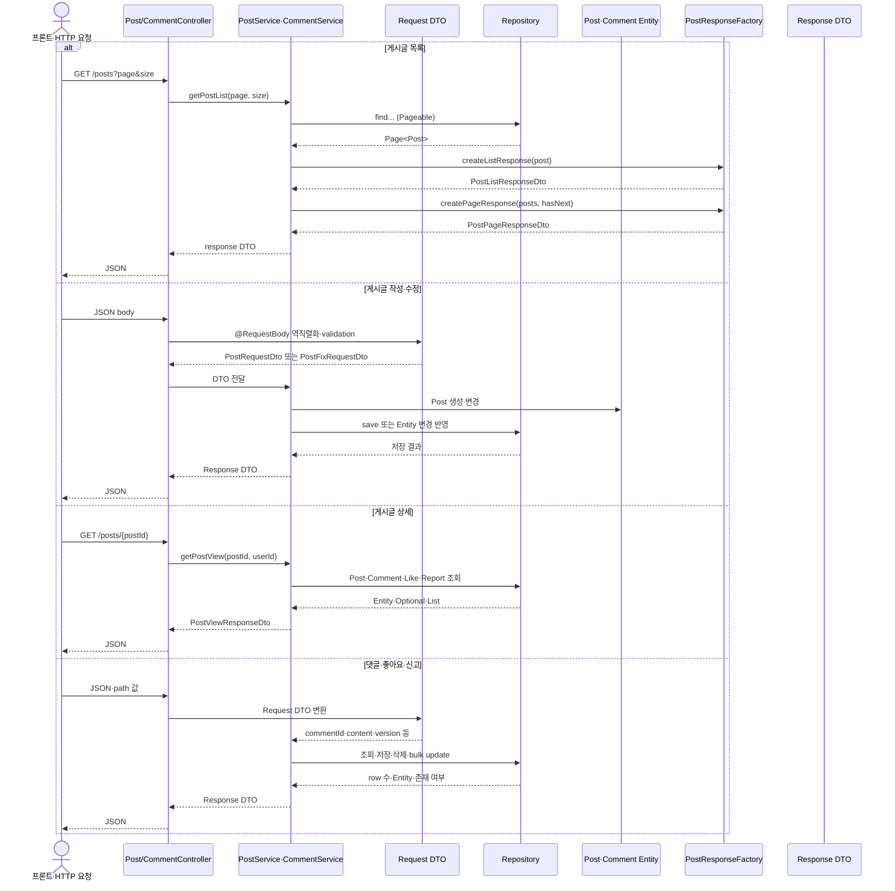

# 10. 게시글·댓글 DTO와 Repository



9번에서는 Entity가 어떤 상태와 관계를 가지는지 확인했습니다. 이 문서는 그 Entity에
HTTP 입력을 넣는 Request DTO, 응답을 만드는 Response DTO, DB 조회·수정 query를 제공하는
Repository를 연결합니다.

기준 저장소:

- 백엔드 기준 저장소: `/Users/miles/Documents/GitHub/KTB4_Miles_Week12_Back`
- `isFixed` 변경 대조 source: `/Users/miles/Documents/GitHub/kakao_tech_bootcamp_study/study12/backend`
- 이전 학습: `actual-code-learning/09_게시글_댓글_Entity_실제흐름.md`
- Redis 보관 자료: `actual-code-learning/98_Redis_조회수_처리.md`

이 문서는 DTO·Repository source와 호출 관계를 정적으로 확인해 작성했습니다. DB query와
통합 테스트는 실행하지 않았습니다.

---

## 10.1 학습 목표

```text
HTTP JSON·Query·Path 값
→ Request DTO
→ Controller가 Service에 전달
→ Repository query parameter
→ Entity·Page·Optional 결과
→ Response DTO·Factory
→ JSON response
```

다음 질문에 답할 수 있어야 합니다.

1. Request DTO와 Response DTO는 각각 어느 방향으로 데이터를 전달하는가?
2. `version`은 게시글 수정·삭제에서 왜 필요한가?
3. 목록 응답의 `Page<Post>`가 `posts`와 `hasNextPage`로 어떻게 바뀌는가?
4. Repository method 이름과 `@Query`는 각각 어떤 query를 만드는가?
5. `@EntityGraph`가 상세·목록 조회에서 필요한 이유는 무엇인가?
6. `@Lock`과 `@Modifying`은 어떤 DB 동작을 표시하는가?

---

## 10.2 9번 Entity와 연결되는 전체 지도

```text
작성
PostRequestDto
→ PostController.createPost
→ PostService.createPost
→ new Post + PostImage
→ PostRepository.save
→ PostResponseDto

목록
page·size
→ PostController.getPostList
→ PostService.getPostList
→ PostRepository Page<Post>
→ PostResponseFactory.createListResponse
→ PostListResponseDto
→ PostPageResponseDto

상세
postId
→ PostRepository 상세 조회
→ PostViewCount·PostCounter·PostImage
→ CommentRepository 댓글+작성자 조회
→ Like/Report 존재 여부
→ PostViewResponseDto

수정·삭제
version
→ PostFixRequestDto 또는 PostDeleteRequestDto
→ Service version 검사
→ Post Entity 변경

댓글·좋아요·신고
→ 각 Request DTO 또는 path 값
→ Repository 조회·저장·삭제·bulk count query
```

Service 전체 업무 순서는 다음 문서에서 다룹니다. 이 문서에서는 DTO와 Repository가
어떤 입력·출력 계약을 만드는지에 집중합니다.

---

## 10.3 게시글 Request DTO

### `PostRequestDto.java` 전체 코드

실제 파일:

`/Users/miles/Documents/GitHub/KTB4_Miles_Week12_Back/src/main/java/kr/adapterz/springdatajpa/dto/post/PostRequestDto.java`

```java
package kr.adapterz.springdatajpa.dto.post;

import jakarta.validation.constraints.NotBlank;
import jakarta.validation.constraints.Size;
import lombok.Getter;
import lombok.NoArgsConstructor;

import java.util.List;

@Getter
@NoArgsConstructor
public class PostRequestDto {
    @NotBlank
    @Size(max = 26)
    private String title;
    @NotBlank
    private String content;
    private List<String> imageFiles;
}
```

호출 연결:

```text
PostCreatePage/PostEditor
→ { title, content, imageFiles }
→ JSON body
→ PostController.createPost
→ @RequestBody PostRequestDto
→ PostService.createPost
```

- `title`: 필수이고 최대 26자입니다.
- `content`: 필수입니다.
- `imageFiles`: Data URL 목록이며 DTO 자체에는 이미지 개수·signature 검증이 없습니다.
- 이미지의 자세한 검증은 Service가 `ImageDataUrlValidator`를 호출할 때 실행됩니다.

### `PostFixRequestDto.java` 전체 코드

```java
package kr.adapterz.springdatajpa.dto.post;

import jakarta.validation.constraints.Size;
import jakarta.validation.constraints.NotNull;
import lombok.Getter;
import lombok.NoArgsConstructor;

import java.util.List;

@Getter
@NoArgsConstructor
public class PostFixRequestDto {
    @NotNull
    private Long version;

    @Size(max = 26)
    private String title;
    private String content;
    private List<String> imageFiles;
}
```

`version`은 수정 화면이 읽었던 게시글 version입니다. Controller가 DTO로 받은 뒤
Service가 현재 Entity version과 비교합니다. `title`·`content`에는 이 DTO에서
`@NotBlank`가 없으므로 현재 backend의 최종 입력 정책은 Service와 DB 조건까지 함께
확인해야 합니다.

### `PostDeleteRequestDto.java` 전체 코드

```java
package kr.adapterz.springdatajpa.dto.post;

import jakarta.validation.constraints.NotNull;
import lombok.Getter;
import lombok.NoArgsConstructor;

@Getter
@NoArgsConstructor
public class PostDeleteRequestDto {
    @NotNull
    private Long version;
}
```

삭제도 `version`을 요구합니다. 삭제가 soft delete여도 오래된 화면의 삭제 요청이 최신
수정 결과를 덮지 못하도록 현재 version을 비교합니다.

### Request DTO의 반환값과 사용 위치 checkpoint

- Request DTO는 DB에 저장되는 Entity가 아닙니다.
- `@RequestBody`가 JSON을 DTO field에 넣습니다.
- `@Valid`가 붙은 Controller parameter에서 DTO annotation 검증이 실행됩니다.
- `PostService`는 DTO getter로 값을 읽고 Entity 생성·변경에 사용합니다.

---

## 10.4 게시글 Response DTO

### `PostResponseDto.java` 전체 코드

```java
package kr.adapterz.springdatajpa.dto.post;

import lombok.Getter;
import lombok.NoArgsConstructor;

@Getter
@NoArgsConstructor
public class PostResponseDto {
    String message="post_success";
}
```

게시글 작성 성공 응답은 현재 `message`만 가집니다. 생성된 게시글 전체를 응답하는 DTO가
아니며, 화면은 성공 후 목록으로 이동합니다.

### `PostFixResponseDto.java` 전체 코드

```java
package kr.adapterz.springdatajpa.dto.post;

import lombok.Getter;
import lombok.NoArgsConstructor;

@Getter
@NoArgsConstructor
public class PostFixResponseDto {
    String message="fix_success";
}
```

수정 성공을 표현하는 응답 모양입니다. 실제 게시글 상세 정보는 수정 성공 후 frontend가
상세 endpoint를 다시 요청하는 흐름과 연결해 확인합니다.

### `PostDeleteResponseDto.java` 전체 코드

```java
package kr.adapterz.springdatajpa.dto.post;

import lombok.Getter;
import lombok.NoArgsConstructor;

@Getter
@NoArgsConstructor
public class PostDeleteResponseDto {
    private String message="remove_success";
}
```

현재 Controller에는 `@ResponseStatus(NO_CONTENT)`도 있으므로, 실제 HTTP body와 DTO 반환
객체가 함께 있을 때 최종 response가 어떻게 처리되는지는 Controller와 테스트에서 별도로
대조해야 합니다. DTO class가 존재한다고 body가 항상 전송된다고 단정하지 않습니다.

### `PostListResponseDto.java` 전체 코드

```java
package kr.adapterz.springdatajpa.dto.post;

import kr.adapterz.springdatajpa.entity.Post;
import kr.adapterz.springdatajpa.entity.PostCounter;
import lombok.Getter;
import lombok.NoArgsConstructor;

import java.time.LocalDateTime;

@Getter
@NoArgsConstructor
public class PostListResponseDto {
    private Long postId;
    private String title;
    private int likeCount;
    private int reportCount;
    private int commentCount;
    private long viewCount;
    private LocalDateTime createdAt;

    public PostListResponseDto(Post post, PostCounter counter) {
        this.postId = post.getPostId();
        this.title = post.getPostTitle();
        this.likeCount = counter.getLikeCount();
        this.reportCount = counter.getReportCount();
        this.commentCount = counter.getReplyCount();
        this.viewCount = post.getPostViewCount().getViewCount();
        this.createdAt = post.getCreatedAt();
    }
}
```

`PostListResponseDto`는 Entity 전체를 화면에 노출하지 않고 목록에 필요한 field만 복사합니다.
`PostResponseFactory.createListResponse()`가 `Post`와 `PostCounter`를 생성자에 넣습니다.

### `PostPageResponseDto.java` 전체 코드

```java
package kr.adapterz.springdatajpa.dto.post;

import lombok.Getter;

import java.util.List;

@Getter
public class PostPageResponseDto {

    private List<PostListResponseDto> posts;
    private boolean hasNextPage;

    public PostPageResponseDto(List<PostListResponseDto> posts, boolean hasNextPage) {
        this.posts = posts;
        this.hasNextPage = hasNextPage;
    }
}
```

목록 frontend가 필요한 페이지 계약은 현재 목록 배열과 `hasNextPage`입니다. Spring Data의
`Page<Post>` 자체를 그대로 frontend에 보내지 않고 이 DTO로 변환합니다.

### `PostViewResponseDto.java` 전체 코드

실제 파일:

`/Users/miles/Documents/GitHub/kakao_tech_bootcamp_study/study12/backend/src/main/java/kr/adapterz/springdatajpa/dto/post/PostViewResponseDto.java`

이 DTO는 게시글 상세 endpoint의 응답 구조다. `PostViewReadService.read()`가 게시글 Entity,
 Counter, DB 기준 조회수, 댓글 목록, 현재 사용자의 좋아요·신고·소유 여부를 모으고,
`PostService.getPostView()`가 조회수 증가 결과와 함께 생성자에 전달하고,
`PostController.getPostView()`가 반환한 객체를 Jackson이 JSON body로 직렬화한다.

```java
package kr.adapterz.springdatajpa.dto.post;

import kr.adapterz.springdatajpa.dto.comment.CommentResponseDto;
import kr.adapterz.springdatajpa.entity.Post;
import kr.adapterz.springdatajpa.entity.PostCounter;
import kr.adapterz.springdatajpa.entity.PostImage;
import lombok.Getter;
import lombok.NoArgsConstructor;

import java.time.LocalDateTime;
import java.util.ArrayList;
import java.util.List;

@Getter
@NoArgsConstructor
public class PostViewResponseDto {

    private Long postId;
    private Long version;
    private String title;
    private String content;
    private List<String> imageUrls;
    private int likeCount;
    private int reportCount;
    private int commentCount;
    private long viewCount;
    private LocalDateTime createdAt;

    private Boolean isMine;
    private Boolean isReported;
    private Boolean isLiked;

    private List<CommentResponseDto> comments;

    public PostViewResponseDto(
            Post post,
            PostCounter counter,
            long viewCount,
            List<CommentResponseDto> comments,
            Boolean isLiked,
            Boolean isReported,
            Boolean isMine
    ) {
        this.postId = post.getPostId();
        this.version = post.getVersion();
        this.title = post.getPostTitle();
        this.content = post.getPostContent();
        this.imageUrls = getImageUrls(post);
        this.likeCount = counter.getLikeCount();
        this.reportCount = counter.getReportCount();
        this.commentCount = counter.getReplyCount();
        this.viewCount = viewCount;
        this.createdAt = post.getCreatedAt();

        this.isMine = isMine;
        this.isLiked = isLiked;
        this.isReported = isReported;

        this.comments = comments;
    }

    private List<String> getImageUrls(Post post) {
        List<String> result = new ArrayList<>();

        for (PostImage postImage : post.getPostImages()) {
            result.add(postImage.getImageFile());
        }

        return result;
    }
}
```

#### 이 DTO의 값 이동

```text
PostViewReadService.read
→ Post·PostCounter·CommentResponseDto·DB 기준 조회수·현재 사용자 상태 준비
→ PostService.getPostView에서 ViewCountUpdater.increment 실행
→ new PostViewResponseDto(...)
→ PostController.getPostView 반환
→ Spring MVC/Jackson이 getter 값을 JSON body로 직렬화
→ PostDetailPage가 상세 화면 state에 저장
```

`PostViewResponseDto`는 Entity를 그대로 반환하지 않는다. Entity의 연관관계와 내부 method를
화면에 필요한 값으로 복사하고, 현재 사용자별 `isMine`, `isLiked`, `isReported`를 함께 담는다.
`getImageUrls()`는 `PostImage` 객체 자체를 노출하지 않고 `imageFile` 문자열만 반환한다.

현재 코드에서는 `PostViewResponseDto`에 `isFixed`가 없습니다. 게시글 수정 여부를
응답 JSON에 별도 boolean으로 노출하거나 Entity의 `is_fixed` column에서 복사하지 않습니다.
수정 충돌과 변경 여부는 `version` 및 `PostService.fixPost()`의 제목·본문·이미지 비교로
처리합니다. 따라서 이전 문서나 과거 코드에서 `isFixed`를 읽었다면 현재 흐름에는 없는
과거 field로 구분해야 합니다.

### `PostResponseFactory.java` 전체 코드

```java
package kr.adapterz.springdatajpa.dto.post;

import kr.adapterz.springdatajpa.entity.Post;

import java.util.List;

public final class PostResponseFactory {

    private PostResponseFactory() {
    }

    public static PostListResponseDto createListResponse(Post post) {
        return new PostListResponseDto(post, post.getPostCounter());
    }

    public static PostPageResponseDto createPageResponse(
            List<PostListResponseDto> posts,
            boolean hasNextPage
    ) {
        return new PostPageResponseDto(posts, hasNextPage);
    }
}
```

Factory는 `PostService`의 DTO 조립 코드를 별도 class의 static method로 분리합니다.

```text
PostService의 Page<Post>
→ for문에서 createListResponse(post)
→ List<PostListResponseDto>
→ createPageResponse(list, posts.hasNext())
→ PostPageResponseDto
```

### 좋아요·신고 Response DTO

#### `ReportResponseDto.java` — 현재 흐름에서 사용되지 않음

실제 파일:

`/Users/miles/Documents/GitHub/KTB4_Miles_Week12_Back/src/main/java/kr/adapterz/springdatajpa/dto/post/ReportResponseDto.java`

현재 production 코드의 `PostService.reportPost()`와 `PostController.reportPost()`는
`PostReportResponseDto`를 반환합니다. `rg`로 확인한 현재 main source와 test source에는
`ReportResponseDto`의 생성·반환·import 호출이 없습니다. 따라서 이 class는 존재하지만 현재
게시글 신고 실행 흐름에서는 사용되지 않는 코드로 표시하고, `PostReportResponseDto`와
혼동하지 않습니다.

#### `LikeResponseDto.java`

```java
package kr.adapterz.springdatajpa.dto.post;

import lombok.Getter;
import lombok.NoArgsConstructor;

@Getter
@NoArgsConstructor
public class LikeResponseDto {
    private String message = "like_success";
    private int likeCount;
    public LikeResponseDto(int likeCount){
        this.likeCount=likeCount;
    }
}
```

#### `LikeCancelResponseDto.java`

```java
package kr.adapterz.springdatajpa.dto.post;

import lombok.Getter;
import lombok.NoArgsConstructor;

@Getter
@NoArgsConstructor
public class LikeCancelResponseDto {
    private String message = "cancel_success";
    private int likeCount;
    public LikeCancelResponseDto(int likeCount){
        this.likeCount=likeCount;
    }
}
```

#### `PostReportResponseDto.java`

```java
package kr.adapterz.springdatajpa.dto.post;

import lombok.Getter;
import lombok.NoArgsConstructor;

@Getter
@NoArgsConstructor
public class PostReportResponseDto {

    private String message = "report_success";
    private Long postId;
    private int reportCount;

    public PostReportResponseDto(
            Long postId,
            int reportCount
    ) {
        this.postId = postId;
        this.reportCount = reportCount;
    }
}
```

좋아요 등록·취소 응답은 변경된 `likeCount`를, 신고 응답은 게시글 ID와 변경된
`reportCount`를 전달합니다. 이 값들의 생성자는 Service가 Repository 또는 Entity 변경
후 읽은 값을 넣어 호출합니다.

---

## 10.5 댓글 DTO

### `CommentPostRequestDto.java` 전체 코드

```java
package kr.adapterz.springdatajpa.dto.comment;

import lombok.Getter;
import lombok.NoArgsConstructor;

@Getter
@NoArgsConstructor
public class CommentPostRequestDto {
    private String commentContent;
}
```

### `CommentFixRequestDto.java` 전체 코드

```java
package kr.adapterz.springdatajpa.dto.comment;

import lombok.Getter;
import lombok.NoArgsConstructor;

@Getter
@NoArgsConstructor
public class CommentFixRequestDto {
    private Long commentId;
    private String commentContent;
}
```

### `CommentDeleteRequestDto.java` 전체 코드

```java
package kr.adapterz.springdatajpa.dto.comment;

import lombok.Getter;
import lombok.NoArgsConstructor;

@Getter
@NoArgsConstructor
public class CommentDeleteRequestDto {
    private Long commentId;
}
```

현재 댓글 Request DTO에는 Bean Validation annotation이 없습니다. `CommentController`의
request body에도 `@Valid`가 없으므로, 댓글 내용의 빈 값·길이 제한이 DTO 단계에서 자동
거부된다고 가정하면 안 됩니다.

### `CommentResponseDto.java` 전체 코드

```java
package kr.adapterz.springdatajpa.dto.comment;

import kr.adapterz.springdatajpa.entity.Comment;
import kr.adapterz.springdatajpa.entity.User;
import lombok.Getter;
import lombok.NoArgsConstructor;

import java.time.LocalDateTime;

@Getter
@NoArgsConstructor
public class CommentResponseDto {

    private Long commentId;
    private String content;
    private String authorNickname;
    private String authorProfileImage;
    private Boolean isMine;
    private LocalDateTime createdAt;

    public CommentResponseDto(
            Comment comment,
            User user,
            Boolean isMine
    ) {
        this.commentId = comment.getCommentId();
        this.content = comment.getCommentContent();
        this.authorNickname = user.getNickname();
        this.authorProfileImage = user.getProfileImage();
        this.isMine = isMine;
        this.createdAt = comment.getCreatedAt();
    }
}
```

Response DTO는 Comment Entity와 User Entity를 직접 반환하지 않고, 화면에 필요한 댓글
내용·작성자·작성자 이미지·본인 여부·생성 시각만 복사합니다.

### `CommentDeleteResponseDto.java` 전체 코드

```java
package kr.adapterz.springdatajpa.dto.comment;

import lombok.Getter;
import lombok.NoArgsConstructor;

@Getter
@NoArgsConstructor
public class CommentDeleteResponseDto {
    private String message="remove_success";
}
```

### 댓글 DTO 값 이동

```text
CommentEditor
→ CommentPostRequestDto.commentContent
→ CommentService
→ Comment Entity

CommentFixRequestDto.commentId
→ CommentService가 route post와 댓글 소속·작성자 확인
→ Comment.changeComment

Comment Entity + User Entity + isMine
→ CommentResponseDto
→ normalizeComment
→ frontend comments state
```

### 10.5 checkpoint

- 댓글 작성·수정·삭제 Request DTO의 차이는 무엇인가?
- 댓글 DTO에 `@Valid`가 없다는 것은 어떤 의미인가?
- Response DTO가 Comment·User Entity를 그대로 반환하지 않는 이유는 무엇인가?
- `isMine`은 Entity field인가, Service가 계산해 DTO에 넣는 값인가?

---

## 10.6 `PostRepository.java`: 게시글 조회 query

### `PostRepository.java` 전체 코드

실제 파일:

`/Users/miles/Documents/GitHub/KTB4_Miles_Week12_Back/src/main/java/kr/adapterz/springdatajpa/repository/PostRepository.java`

```java
package kr.adapterz.springdatajpa.repository;

import kr.adapterz.springdatajpa.entity.Post;
import jakarta.persistence.LockModeType;
import org.springframework.data.domain.Page;
import org.springframework.data.domain.Pageable;
import org.springframework.data.jpa.repository.EntityGraph;
import org.springframework.data.jpa.repository.JpaRepository;
import org.springframework.data.jpa.repository.Lock;
import org.springframework.data.jpa.repository.Query;
import org.springframework.data.repository.query.Param;

import java.util.Optional;

public interface PostRepository extends JpaRepository<Post, Long> {

    @EntityGraph(
            attributePaths = {
                    "user",
                    "postImages",
                    "postCounter",
                    "postViewCount"
            }
    )
    @Query("""
            SELECT post
            FROM Post post
            WHERE post.deleted = false
              AND post.postCounter.reportCount < :reportCount
            ORDER BY post.postId DESC
            """)
    Page<Post> findByDeletedFalseAndReportCountLessThanOrderByPostIdDesc(
            @Param("reportCount") int reportCount,
            Pageable pageable
    );

    @EntityGraph(
            attributePaths = {
                    "user",
                    "postImages",
                    "postCounter",
                    "postViewCount"
            }
    )
    @Query("""
            SELECT post
            FROM Post post
            WHERE post.postId = :postId
              AND post.deleted = false
            """)
    Optional<Post> findByPostIdAndDeletedFalse(
            @Param("postId") Long postId
    );

    @Lock(LockModeType.PESSIMISTIC_WRITE)
    @EntityGraph(attributePaths = "postCounter")
    @Query("""
            SELECT post
            FROM Post post
            WHERE post.postId = :postId
              AND post.deleted = false
            """)
    Optional<Post> findActivePostForUpdate(@Param("postId") Long postId);

    @Query("""
            SELECT post
            FROM Post post
            WHERE post.postId = :postId
              AND post.deleted = false
            """)
    Optional<Post> findActivePostForInteraction(
            @Param("postId") Long postId
    );

    @Lock(LockModeType.PESSIMISTIC_READ)
    @Query("""
            SELECT post
            FROM Post post
            WHERE post.postId = :postId
              AND post.deleted = false
            """)
    Optional<Post> findActivePostForInteractionCheck(
            @Param("postId") Long postId
    );

}
```

### 목록 query

```java
@EntityGraph(
        attributePaths = {
                "user",
                "postImages",
                "postCounter",
                "postViewCount"
        }
)
@Query("""
        SELECT post
        FROM Post post
        WHERE post.deleted = false
          AND post.postCounter.reportCount < :reportCount
        ORDER BY post.postId DESC
        """)
Page<Post> findByDeletedFalseAndReportCountLessThanOrderByPostIdDesc(
        @Param("reportCount") int reportCount,
        Pageable pageable
);
```

- `Page<Post>`: 현재 페이지 Entity와 다음 페이지 정보를 담습니다.
- `post.deleted = false`: soft delete된 게시글을 제외합니다.
- `reportCount < :reportCount`: 신고 차단 기준 미만만 노출합니다.
- `ORDER BY postId DESC`: 최신 ID부터 정렬합니다.
- `@EntityGraph`: 목록 DTO가 사용하는 User·Image·Counter·ViewCount 연관관계를 함께 조회하도록 지정합니다.

### 상세 query

```java
@EntityGraph(
        attributePaths = {
                "user",
                "postImages",
                "postCounter",
                "postViewCount"
        }
)
@Query("""
        SELECT post
        FROM Post post
        WHERE post.postId = :postId
          AND post.deleted = false
        """)
Optional<Post> findByPostIdAndDeletedFalse(
        @Param("postId") Long postId
);
```

상세 Service가 `Optional<Post>`를 받아 없으면 `DataNullException`으로 변환합니다.
`@EntityGraph`가 없으면 DTO 생성 중 LAZY 연관관계를 각각 읽는 추가 query가 발생할 수
있습니다.

### lock query

```java
@Lock(LockModeType.PESSIMISTIC_WRITE)
@EntityGraph(attributePaths = "postCounter")
@Query("""
        SELECT post
        FROM Post post
        WHERE post.postId = :postId
          AND post.deleted = false
        """)
Optional<Post> findActivePostForUpdate(@Param("postId") Long postId);
```

좋아요·신고·삭제처럼 게시글과 counter를 함께 바꾸는 Service가 사용합니다.
`PESSIMISTIC_WRITE`는 조회한 row를 transaction 동안 다른 write 요청과 경쟁하도록
잠그는 설정입니다.

### 10.6 checkpoint

- `Page<Post>`와 `Optional<Post>`는 각각 어떤 상황의 결과를 표현하는가?
- `@EntityGraph`의 attributePaths에는 왜 `postViewCount`가 포함되는가?
- soft delete된 Post를 query에서 제외하는 조건은 무엇인가?
- `PESSIMISTIC_WRITE`가 필요한 query와 일반 상세 query의 차이는 무엇인가?

---

## 10.7 `PostCounterRepository.java`: counter lock과 bulk update

### `PostCounterRepository.java` 전체 코드

실제 파일:

`/Users/miles/Documents/GitHub/KTB4_Miles_Week12_Back/src/main/java/kr/adapterz/springdatajpa/repository/PostCounterRepository.java`

```java
package kr.adapterz.springdatajpa.repository;

import jakarta.persistence.LockModeType;
import kr.adapterz.springdatajpa.entity.PostCounter;
import org.springframework.data.jpa.repository.JpaRepository;
import org.springframework.data.jpa.repository.Lock;
import org.springframework.data.jpa.repository.Modifying;
import org.springframework.data.jpa.repository.Query;
import org.springframework.data.repository.query.Param;

import java.util.Optional;

public interface PostCounterRepository extends JpaRepository<PostCounter, Long> {

    @Lock(LockModeType.PESSIMISTIC_WRITE)
    @Query("""
            SELECT counter
            FROM PostCounter counter
            WHERE counter.postId = :postId
            """)
    Optional<PostCounter> findByPostIdForUpdate(
            @Param("postId") Long postId
    );

    @Modifying(clearAutomatically = true, flushAutomatically = true)
    @Query("""
            UPDATE PostCounter counter
            SET counter.likeCount = counter.likeCount + 1
            WHERE counter.postId = :postId
            """)
    int incrementLikeCount(@Param("postId") Long postId);

    @Modifying(clearAutomatically = true, flushAutomatically = true)
    @Query("""
            UPDATE PostCounter counter
            SET counter.likeCount = counter.likeCount - 1
            WHERE counter.postId = :postId
              AND counter.likeCount > 0
            """)
    int decrementLikeCount(@Param("postId") Long postId);

    @Modifying(clearAutomatically = true, flushAutomatically = true)
    @Query("""
            UPDATE PostCounter counter
            SET counter.replyCount = counter.replyCount + 1
            WHERE counter.postId = :postId
            """)
    int incrementReplyCount(@Param("postId") Long postId);

    @Modifying(clearAutomatically = true, flushAutomatically = true)
    @Query("""
            UPDATE PostCounter counter
            SET counter.replyCount = counter.replyCount - 1
            WHERE counter.postId = :postId
              AND counter.replyCount > 0
            """)
    int decrementReplyCount(@Param("postId") Long postId);
}
```

### 조회 lock과 변경 query

```java
@Lock(LockModeType.PESSIMISTIC_WRITE)
Optional<PostCounter> findByPostIdForUpdate(@Param("postId") Long postId);
```

이 method는 counter row를 조회하면서 write lock을 요청합니다. 여러 요청이 같은 counter를
바꾸는 상황에서 Service가 이 method와 transaction을 함께 사용합니다.

```java
@Modifying(clearAutomatically = true, flushAutomatically = true)
@Query("""
        UPDATE PostCounter counter
        SET counter.likeCount = counter.likeCount + 1
        WHERE counter.postId = :postId
        """)
int incrementLikeCount(@Param("postId") Long postId);
```

- `@Modifying`: SELECT가 아닌 UPDATE query임을 Spring Data에 알립니다.
- `clearAutomatically`: bulk update 뒤 persistence context를 정리합니다.
- `flushAutomatically`: query 실행 전 pending 변경을 flush합니다.
- 반환 `int`: 실제로 변경된 row 수입니다.

`decrementLikeCount`와 `decrementReplyCount`의 `> 0` 조건은 counter가 음수가 되는 것을
query 단계에서 막습니다. Service는 반환 row 수가 1인지 추가로 확인합니다.

---

## 10.8 `CommentRepository.java`: 댓글과 작성자 조회

### `CommentRepository.java` 전체 코드

실제 파일:

`/Users/miles/Documents/GitHub/KTB4_Miles_Week12_Back/src/main/java/kr/adapterz/springdatajpa/repository/CommentRepository.java`

```java
package kr.adapterz.springdatajpa.repository;

import kr.adapterz.springdatajpa.entity.Comment;
import kr.adapterz.springdatajpa.entity.Post;
import org.springframework.data.jpa.repository.JpaRepository;
import org.springframework.data.jpa.repository.Query;
import org.springframework.data.repository.query.Param;

import java.util.List;
import java.util.Optional;

public interface CommentRepository extends JpaRepository<Comment, Long> {

    @Query("""
        select c
        from Comment c
        join fetch c.user
        where c.post = :post
        order by c.commentId asc
    """)
    List<Comment> findByPostWithUser(Post post);

}
```

`findByPostWithUser`는 댓글을 조회하면서 작성자 User를 `join fetch`로 함께 가져옵니다.
`CommentResponseDto`가 작성자 nickname과 profile image를 필요로 하기 때문입니다.
`commentId asc`는 댓글 표시 순서를 고정합니다.

이 Repository에는 현재 `postId`와 `commentId`가 같은 댓글인지 확인하는 query가 없습니다.
그 소속·작성자 확인은 다음 Service가 Entity를 조회한 뒤 수행합니다.

---

## 10.9 `LikeRepository.java`: 좋아요 존재·삭제 query

### `LikeRepository.java` 전체 코드

실제 파일:

`/Users/miles/Documents/GitHub/KTB4_Miles_Week12_Back/src/main/java/kr/adapterz/springdatajpa/repository/LikeRepository.java`

```java
package kr.adapterz.springdatajpa.repository;

import kr.adapterz.springdatajpa.entity.Like;
import kr.adapterz.springdatajpa.entity.Post;
import kr.adapterz.springdatajpa.entity.User;
import org.springframework.data.jpa.repository.JpaRepository;
import org.springframework.data.jpa.repository.Modifying;
import org.springframework.data.jpa.repository.Query;
import org.springframework.data.repository.query.Param;

public interface LikeRepository extends JpaRepository<Like, Long> {

    boolean existsByPostAndUser(Post post, User user);

    @Modifying(clearAutomatically = true, flushAutomatically = true)
    @Query("""
            DELETE FROM Like postLike
            WHERE postLike.post.postId = :postId
              AND postLike.user.userId = :userId
            """)
    int deleteByPostIdAndUserId(
            @Param("postId") Long postId,
            @Param("userId") Long userId
    );
}
```

- `existsByPostAndUser`: Spring Data method-name query로 특정 사용자·게시글 좋아요 존재 여부를 반환합니다.
- `deleteByPostIdAndUserId`: 두 ID를 모두 조건으로 사용해 다른 사용자의 좋아요를 삭제하지 않습니다.
- 반환 `int`: 삭제된 row 수이며 Service가 정확한 결과인지 확인합니다.

---

## 10.10 `PostReportRepository.java`: 신고 존재 query

### `PostReportRepository.java` 전체 코드

실제 파일:

`/Users/miles/Documents/GitHub/KTB4_Miles_Week12_Back/src/main/java/kr/adapterz/springdatajpa/repository/PostReportRepository.java`

```java
package kr.adapterz.springdatajpa.repository;

import kr.adapterz.springdatajpa.entity.Post;
import kr.adapterz.springdatajpa.entity.PostReport;
import kr.adapterz.springdatajpa.entity.User;
import org.springframework.data.jpa.repository.JpaRepository;

public interface PostReportRepository extends JpaRepository<PostReport, Long> {

    boolean existsByPostAndUser(Post post, User user);
}
```

상세 화면에서 `isReported`를 만들거나 신고 중복을 확인할 때 사용합니다. 실제 신고 row
저장과 Post·User counter 변경 순서는 Service가 transaction 안에서 조합합니다.

---

## 10.11 `PostViewCountRepository.java`: Entity 9와 조회수 계약 연결

Redis는 `98` 보관 자료에서 학습하지만, DTO·Repository 단계에서 query 계약만 확인합니다.

### 전체 코드

실제 파일:

`/Users/miles/Documents/GitHub/KTB4_Miles_Week12_Back/src/main/java/kr/adapterz/springdatajpa/repository/PostViewCountRepository.java`

```java
package kr.adapterz.springdatajpa.repository;

import kr.adapterz.springdatajpa.entity.PostViewCount;
import org.springframework.data.jpa.repository.JpaRepository;
import org.springframework.data.jpa.repository.Modifying;
import org.springframework.data.jpa.repository.Query;
import org.springframework.data.repository.query.Param;

public interface PostViewCountRepository
        extends JpaRepository<PostViewCount, Long> {

    @Modifying(clearAutomatically = true, flushAutomatically = true)
    @Query(
            value = """
                    UPDATE post_view_counts
                    SET view_count = GREATEST(
                            view_count,
                            :baselineViewCount
                        ) + 1
                    WHERE post_id = :postId
                    """,
            nativeQuery = true
    )
    int incrementViewCount(
            @Param("postId") Long postId,
            @Param("baselineViewCount") long baselineViewCount
    );

    @Modifying(clearAutomatically = true, flushAutomatically = true)
    @Query(
            value = """
                    UPDATE post_view_counts
                    SET view_count = GREATEST(
                            view_count,
                            :snapshotViewCount
                        )
                    WHERE post_id = :postId
                    """,
            nativeQuery = true
    )
    int persistMaxViewCount(
            @Param("postId") Long postId,
            @Param("snapshotViewCount") long snapshotViewCount
    );
}
```

이 Repository는 9번 Entity와 98번 Redis 자료 사이의 계약입니다.

- `incrementViewCount`: Redis 비활성 DB 구현에서 사용합니다.
- `persistMaxViewCount`: Redis snapshot을 DB에 저장할 때 사용합니다.
- 두 query 모두 `post_view_counts` table의 실제 column 이름을 사용하므로 `nativeQuery = true`입니다.

---

## 10.12 DTO·Repository 값 이동 정리

### 게시글 목록

```text
page·size query parameter
→ PageRequest
→ PostRepository Page<Post>
→ Page.getContent()
→ PostResponseFactory.createListResponse
→ PostListResponseDto 목록
→ PostResponseFactory.createPageResponse
→ PostPageResponseDto(posts, hasNextPage)
```

### 게시글 작성

```text
PostRequestDto.title·content·imageFiles
→ PostService
→ Post Entity·PostImage
→ PostRepository.save
→ PostResponseDto.message
```

### 게시글 수정·삭제

```text
PostFixRequestDto.version
→ 현재 Post.version과 비교
→ Post.update
→ PostFixResponseDto

PostDeleteRequestDto.version
→ 현재 Post.version과 비교
→ Post.delete
→ PostDeleteResponseDto
```

### 댓글

```text
CommentPostRequestDto
→ CommentService
→ CommentRepository.save
→ CommentResponseDto

CommentFixRequestDto.commentId·commentContent
→ Comment 조회·소유권 확인
→ Comment.changeComment
→ CommentResponseDto

CommentDeleteRequestDto.commentId
→ Comment 조회·소유권 확인
→ CommentRepository.delete
→ CommentDeleteResponseDto
```

---

## 10.13 이번 문서에서 아직 다루지 않는 코드

다음 자료에서 Service와 Controller의 전체 업무 흐름을 학습합니다.

- `PostService.java` 전체 method
- `CommentService.java` 전체 method
- `PostController.java` 전체 endpoint
- `CommentController.java` 전체 endpoint
- transaction·소유권·version·row lock의 실행 순서
- DTO 입력이 각 Service 조건문으로 들어가는 실제 정상·실패 흐름

`98_Redis_조회수_처리.md`는 Redis 구현의 별도 보관 자료이며, 이 문서의 DTO·Repository
계약을 이해한 뒤 실제 Redis 학습 차례가 되었을 때 사용합니다.

### User 보조 DTO 6개는 왜 이 문서에서 집계했는가

회원가입에서 이미 Request/Response DTO의 공통 Lombok·검증 구조를 설명했으므로 아래
파일은 전체 구조를 반복하지 않고 실제 field와 Controller/Service 연결을 확인했습니다.
따라서 “읽지 않은 파일”이 아니라 “중복 문법은 스킵하고 사용 위치를 확인한 파일”입니다.

| 파일 | 핵심 field·역할 | 실제 사용 위치 |
|---|---|---|
| `UserInfoResponseDto.java` | userId, email, nickname, profileImage를 User에서 복사 | `UserController.getMyInfo` → `UserService.getMyInfo` |
| `UserDeleteResponseDto.java` | remove_success 메시지 응답 | `UserController.deleteUser` → `UserService.deleteUser` |
| `UserPatchRequestDto.java` | nickname, profileImage 입력과 nickname 검증 | `UserController.patchUser` → `UserService.patchUser` |
| `UserPatchResponseDto.java` | fix_success 메시지 응답 | `patchUser`의 반환값 |
| `UserPasswordRequestDto.java` | currentPassword, password, passwordCheck와 검증 | `UserController.setPassword` → `UserService.setPassword` |
| `UserPasswordResponseDto.java` | fix_success 메시지 응답 | `setPassword`의 반환값 |

이 묶음에서 새로 설명할 문법은 없고, `@Valid`가 붙은 두 Request DTO의 검증이 Controller
진입 시 실행된다는 점과 Response DTO가 JSON body가 된다는 점만 앞의 DTO 규칙으로 연결합니다.

---

## 10.14 최종 이해 checkpoint

1. Request DTO와 Response DTO는 데이터 흐름에서 어느 방향으로 이동하는가?
2. `PostRequestDto.imageFiles`의 이미지 내용 검증은 DTO가 모두 담당하는가?
3. `PostFixRequestDto.version`과 `PostDeleteRequestDto.version`은 어디에서 사용되는가?
4. `PostResponseFactory`가 필요한 이유는 무엇인가?
5. `Page<Post>`가 `PostPageResponseDto`로 변환될 때 어떤 값이 보존되는가?
6. `@EntityGraph`가 목록·상세 query에 지정된 이유는 무엇인가?
7. `findActivePostForUpdate`와 일반 상세 query의 lock 차이는 무엇인가?
8. `@Modifying` query의 반환 `int`는 무엇을 의미하는가?
9. `PostCounterRepository`의 증가·감소 query가 Entity method와 별도로 존재하는 이유는 무엇인가?
10. CommentRepository가 `join fetch c.user`를 사용하는 이유는 무엇인가?
11. LikeRepository의 delete query가 postId와 userId를 모두 조건으로 사용하는 이유는 무엇인가?
12. `PostViewCountRepository.incrementViewCount`와 `persistMaxViewCount`의 사용 시점은 어떻게 다른가?

이 checkpoint를 통과하기 전에는 PostService·CommentService 전체 흐름으로 넘어가지
않습니다. 막힌 항목은 해당 DTO 또는 Repository의 전체 원문과 호출 위치로 돌아가 다시
확인합니다.

---

## 10.15 원문 대조 위치

### 게시글 DTO

- `dto/post/PostRequestDto.java`
- `dto/post/PostFixRequestDto.java`
- `dto/post/PostDeleteRequestDto.java`
- `dto/post/PostResponseDto.java`
- `dto/post/PostFixResponseDto.java`
- `dto/post/PostDeleteResponseDto.java`
- `dto/post/PostListResponseDto.java`
- `dto/post/PostPageResponseDto.java`
- `dto/post/PostViewResponseDto.java`
- `dto/post/PostResponseFactory.java`
- `dto/post/LikeResponseDto.java`
- `dto/post/LikeCancelResponseDto.java`
- `dto/post/PostReportResponseDto.java`
- `dto/post/ReportResponseDto.java` — 현재 production 코드의 Controller·Service 호출 위치가 확인되지 않아, 현재 흐름에서는 사용되지 않는 DTO로 표시만 한다.

### 댓글 DTO

- `dto/comment/CommentPostRequestDto.java`
- `dto/comment/CommentFixRequestDto.java`
- `dto/comment/CommentDeleteRequestDto.java`
- `dto/comment/CommentResponseDto.java`
- `dto/comment/CommentDeleteResponseDto.java`

### Repository

- `repository/PostRepository.java`
- `repository/PostCounterRepository.java`
- `repository/PostViewCountRepository.java`
- `repository/CommentRepository.java`
- `repository/LikeRepository.java`
- `repository/PostReportRepository.java`

이 문서는 DTO·Repository source를 확인한 자료이며, Service·Controller의 전체 업무
완료를 의미하지 않습니다.

---

## 10.16 checkpoint 모범 답안

### Request DTO의 반환값과 사용 위치 답안

- Request DTO는 frontend의 JSON을 backend Controller parameter로 전달하는 입력 객체입니다. Response DTO는 Service가 만든 결과를 Controller를 거쳐 frontend JSON으로 보내는 출력 객체입니다.
- `@RequestBody`가 JSON field를 DTO field에 넣고, `@Valid`가 붙어 있을 때 DTO annotation 검증이 실행됩니다.
- `PostService`가 DTO getter로 값을 읽어 Post 생성·수정·삭제 조건에 사용합니다. DTO 자체가 DB Entity로 저장되지는 않습니다.

### 10.5 댓글 DTO 답안

1. 작성 DTO는 `commentContent`만 받고, 수정 DTO는 `commentId`와 새 content를 받으며, 삭제 DTO는 삭제할 `commentId`만 받습니다.
2. 현재 댓글 DTO와 Controller body에는 `@Valid`가 없으므로 Bean Validation이 자동으로 빈 content나 길이를 거부한다고 볼 수 없습니다.
3. Response DTO는 Entity 전체와 연관관계를 노출하지 않고 화면에 필요한 값만 복사하며, `isMine` 같은 화면용 계산값도 함께 담기 위해 사용합니다.
4. `isMine`은 Comment Entity의 저장 field가 아닙니다. Service가 로그인 사용자 ID와 댓글 작성자 ID를 비교해 계산하고 Response DTO 생성자에 전달합니다.

### 10.6 `PostRepository` 답안

1. `Page<Post>`는 현재 페이지의 여러 Post와 page metadata를 표현하고, `Optional<Post>`는 단일 Post가 있거나 없을 수 있음을 표현합니다.
2. 목록·상세 DTO가 User·Image·Counter·ViewCount 값을 사용하므로 `@EntityGraph`에 포함합니다. 필요한 LAZY 관계를 함께 조회해 DTO 조립 중 추가 query 가능성을 줄이는 목적입니다.
3. `post.deleted = false` 조건이 soft delete된 Post를 제외합니다.
4. `findActivePostForUpdate`는 `PESSIMISTIC_WRITE`로 row를 잠가 좋아요·신고·삭제 같은 동시 변경을 제어하고, 일반 상세 query는 조회와 EntityGraph가 목적이며 write lock을 요청하지 않습니다.

### 전체 Repository 답안

1. `@Modifying` query의 반환 `int`는 실제로 UPDATE·DELETE된 row 수입니다. Service가 정확히 1인지 확인해 대상이 없거나 비정상적으로 여러 row가 바뀐 경우를 감지합니다.
2. PostCounterRepository의 bulk update는 DB가 현재 count에 `+ 1` 또는 `- 1`을 수행하게 해 동시 요청의 count 변경을 처리합니다. Entity method와 Repository query는 서로 다른 구현 경로입니다.
3. `CommentRepository`의 `join fetch c.user`는 CommentResponseDto가 작성자 nickname과 profile image를 필요로 하므로 댓글과 작성자를 함께 조회하기 위해 사용합니다.
4. Like delete query가 `postId`와 `userId`를 모두 조건으로 쓰는 이유는 특정 사용자의 특정 게시글 좋아요만 삭제하기 위해서입니다.
5. `incrementViewCount`는 Redis가 비활성화된 요청에서 `GREATEST(DB 값, baseline) + 1`을 실행하고, `persistMaxViewCount`는 Redis Scheduler가 이미 증가한 snapshot을 `GREATEST(DB 값, snapshot)`으로 영구 반영할 때 사용합니다.

### 10.14 최종 checkpoint 답안

1. Request DTO는 client → Controller 입력 방향이고, Response DTO는 Service·Controller → client 응답 방향입니다.
2. 아닙니다. `imageFiles` field에는 목록만 들어오며, 실제 이미지 개수·MIME·크기·signature 검증은 Service가 `ImageDataUrlValidator`를 호출할 때 실행됩니다.
3. 두 version은 Service가 현재 Post Entity의 version과 비교해 오래된 수정·삭제 요청을 거부하는 데 사용됩니다.
4. Factory는 Post Entity와 Counter를 화면용 DTO로 바꾸는 조립 책임을 별도 class에 모읍니다.
5. `Page<Post>.getContent()`는 현재 page의 Entity 목록이 되고, `Page.hasNext()`는 `PostPageResponseDto.hasNextPage`가 됩니다. 각 Entity는 `PostListResponseDto`로 변환됩니다.
6. DTO가 연관된 User·Image·Counter·ViewCount를 사용하므로 필요한 LAZY 관계를 함께 조회하고 추가 query 가능성을 줄이기 위해 지정합니다.
7. `findActivePostForUpdate`는 `PESSIMISTIC_WRITE`로 row를 잠그고, 일반 상세 query는 write lock 없이 조회합니다.
8. `@Modifying` query가 실제 DB 변경 query임을 표시하고, 반환 int는 영향을 받은 row 수입니다.
9. Entity method는 상태 변경 의도를 표현하고, Repository bulk query는 DB에서 동시성 있는 count를 직접 변경합니다.
10. 댓글 response가 작성자 User 정보까지 필요하므로 `join fetch c.user`로 함께 조회합니다.
11. 특정 게시글·특정 사용자 조합의 Like만 삭제하기 위해 두 ID를 모두 조건에 넣습니다.
12. `incrementViewCount`는 DB fallback 요청에서 직접 증가할 때 사용하고, `persistMaxViewCount`는 Redis Scheduler가 snapshot을 DB에 반영할 때 사용합니다. 전자는 `+ 1`, 후자는 이미 증가한 snapshot을 max로 저장합니다.

## 진행 상태

- 공식 파일 진행도: **90/214개 = 약 42.1%**
- 이번 문서 보완에서 전체 원문을 추가·확인한 파일: `PostViewResponseDto.java`
- 이미 다른 문서의 조회수 흐름에서 확인된 파일: `PostViewResponseDto.java`는 중복 집계하지 않음
- 현재 흐름 이해 checkpoint: 진행 중
- 다음 학습 시작점: `11_게시글_댓글_Service_Controller_실제흐름.md`의 최종 checkpoint 이후 프론트 게시글 목록·페이징
- 실행하지 않은 검증: Repository 통합 테스트, H2·MySQL·Redis 실행, 실제 HTTP 요청
