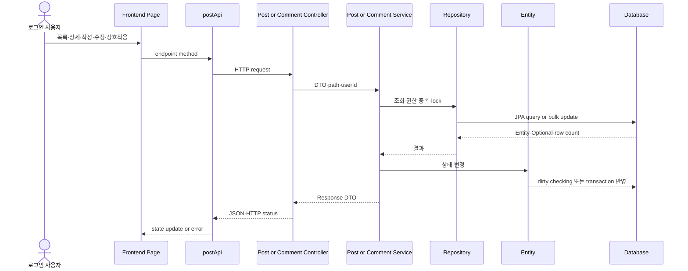

# 11. 게시글·댓글 Service와 Controller

9번 Entity와 10번 DTO·Repository에서 확인한 상태·입력·query 계약이 실제 업무 흐름으로
조합되는 과정을 학습합니다. 이 문서에서는 PostService·CommentService의 검증 순서,
transaction, lock, Entity 변경과 Controller endpoint 연결을 확인합니다.



기준 저장소:

- 백엔드 기준 저장소: `/Users/miles/Documents/GitHub/KTB4_Miles_Week12_Back`
- `isFixed` 변경 대조 source: `/Users/miles/Documents/GitHub/kakao_tech_bootcamp_study/study12/backend`
- 이전 자료: `09_게시글_댓글_Entity_실제흐름.md`, `10_게시글_댓글_DTO_Repository_실제흐름.md`
- Redis 자료: `98_Redis_조회수_처리.md`

이 문서는 현재 backend source를 정적으로 확인해 작성했습니다. Service·Controller test,
DB·Redis·실제 HTTP 요청은 실행하지 않았습니다.

---

## 11.1 학습 목표

1. Controller는 어떤 HTTP 값을 Service parameter로 바꾸는가?
2. `PostService`가 목록·상세·작성·수정·삭제·좋아요·신고를 어떤 순서로 처리하는가?
3. `CommentService`가 댓글 소유권과 게시글 소속을 왜 확인하는가?
4. transaction과 dirty checking은 Entity 변경을 어떻게 DB에 반영하는가?
5. version 검사와 pessimistic lock은 각각 어떤 동시성 문제를 막는가?
6. Repository 반환 row 수가 1인지 확인하는 이유는 무엇인가?

### 이 문서의 코드 설명 형식

각 파일은 `파일 경로와 책임 → 전체 실제 코드 → 코드 일부와 학습용 주석 → 바로 아래
호출·값·예외 설명` 순서로 읽습니다. 전체 코드는 실제 source 대조용으로 한 번만 두고,
설명 구간에서는 필요한 코드만 다시 발췌합니다. 발췌 코드의 `//`는 학습 문서용
주석이며 백엔드 파일을 수정한 것이 아닙니다. 서로 다른 파일의 코드를 하나의 블록에
섞지 않고, 한 파일의 설명이 끝난 뒤 다음 파일로 넘어갑니다.

---

## 11.2 Entity·DTO·Repository에서 Service로 연결

```text
Entity 상태
→ Request DTO 입력
→ Controller가 DTO·path·authenticated userId 수집
→ Service가 검증·Repository·Entity 변경 순서 조합
→ Response DTO 생성
→ Controller 반환
→ JSON response
```

Redis 구현은 `98_Redis_조회수_처리.md`에서 다루므로 이 문서에서는
`ViewCountUpdater.increment()` 계약만 연결합니다.

---

## 11.3 조회수 계약과 DB 구현

### `ViewCountUpdater.java` 전체 코드

실제 파일:

`/Users/miles/Documents/GitHub/KTB4_Miles_Week12_Back/src/main/java/kr/adapterz/springdatajpa/service/ViewCountUpdater.java`

```java
package kr.adapterz.springdatajpa.service;

public interface ViewCountUpdater {

    long increment(Long postId, long baselineViewCount);
}
```

`PostService`는 interface만 호출하고 Redis 내부 key·Lua·connection을 알지 않습니다.

### 11.3.1 전체 원문 바로 아래에서 보는 계약

```java
public interface ViewCountUpdater { // 조회수 구현체가 제공해야 하는 공통 계약이다.
    long increment(Long postId, long baselineViewCount); // 게시글 ID와 DB 기준값을 받아 증가 후 값을 반환한다.
}
```

`interface`는 실제 Redis나 DB 코드를 실행하는 class가 아니라 호출자가 알아야 할 method
모양만 선언합니다. `/Users/miles/Documents/GitHub/kakao_tech_bootcamp_study/study12/backend/src/main/java/kr/adapterz/springdatajpa/service/PostService.java`의
`getPostView()`가 이 method를 호출하고, Spring이 설정에 맞는 구현체를 주입합니다. 따라서
PostService는 Redis key·Lua script·DB query 중 어느 방식인지 알 필요가 없습니다.

### `DatabaseViewCountUpdater.java` 전체 코드

실제 파일:

`/Users/miles/Documents/GitHub/KTB4_Miles_Week12_Back/src/main/java/kr/adapterz/springdatajpa/service/DatabaseViewCountUpdater.java`

```java
package kr.adapterz.springdatajpa.service;

import kr.adapterz.springdatajpa.entity.PostViewCount;
import kr.adapterz.springdatajpa.exception.CounterUpdateException;
import kr.adapterz.springdatajpa.repository.PostViewCountRepository;
import lombok.RequiredArgsConstructor;
import org.springframework.boot.autoconfigure.condition.ConditionalOnProperty;
import org.springframework.stereotype.Component;
import org.springframework.transaction.annotation.Transactional;

@Component
@RequiredArgsConstructor
@ConditionalOnProperty(
        prefix = "app.view-count",
        name = "enabled",
        havingValue = "false"
)
public class DatabaseViewCountUpdater implements ViewCountUpdater {

    private final PostViewCountRepository postViewCountRepository;

    @Override
    @Transactional
    public long increment(Long postId, long baselineViewCount) {
        int updatedRowCount =
                postViewCountRepository.incrementViewCount(
                        postId,
                        baselineViewCount
                );

        if (updatedRowCount != 1) {
            throw new CounterUpdateException();
        }

        return postViewCountRepository.findById(postId)
                .map(PostViewCount::getViewCount)
                .orElseThrow(CounterUpdateException::new);
    }
}
```

### 11.3.2 전체 원문 바로 아래에서 보는 DB 구현

```java
@Component // 이 class를 Spring Bean으로 등록한다.
@RequiredArgsConstructor // final repository를 받는 생성자를 Lombok이 만든다.
@ConditionalOnProperty( // 설정값에 따라 이 구현체를 만들지 결정한다.
        prefix = "app.view-count", // 확인할 설정 key의 앞부분이다.
        name = "enabled", // 실제 확인할 key 이름이다.
        havingValue = "false" // 값이 false일 때 DB 구현체가 선택된다.
)
public class DatabaseViewCountUpdater implements ViewCountUpdater { // 공통 계약의 DB 구현이다.
    private final PostViewCountRepository postViewCountRepository; // DB update/query를 담당하는 Repository다.

    @Override // interface의 increment 계약을 구현한다.
    @Transactional // update query와 후속 조회를 하나의 transaction으로 묶는다.
    public long increment(Long postId, long baselineViewCount) {
        int updatedRowCount = postViewCountRepository.incrementViewCount( // 기준값을 사용해 DB count를 증가시킨다.
                postId, baselineViewCount);
        if (updatedRowCount != 1) { // 정확히 한 게시글 row가 바뀌었는지 확인한다.
            throw new CounterUpdateException(); // 대상이 없거나 예상과 다르면 업무 오류로 중단한다.
        }
        return postViewCountRepository.findById(postId) // 증가 후 값을 다시 읽는다.
                .map(PostViewCount::getViewCount) // Optional 안 Entity에서 count만 추출한다.
                .orElseThrow(CounterUpdateException::new); // row가 사라졌으면 같은 오류를 던진다.
    }
}
```

`@ConditionalOnProperty`는 interface를 호출할 때마다 조건문을 실행한다는 뜻이 아닙니다.
애플리케이션 시작 시 Spring이 설정값을 읽고 이 Bean을 등록할지 결정합니다. 등록된 뒤
실제 요청에서 `PostService.getPostView()`가 `increment()`를 호출하면, 먼저 Repository
bulk update의 반환 row 수를 검사하고, 성공한 경우 DB의 최신 count를 반환합니다.
Redis 구현이 선택된 환경에서는 이 class가 Bean으로 선택되지 않고 다른 구현체가 같은
`increment` 계약을 수행합니다.

설정에 따라 이 구현 또는 Redis 구현이 Bean으로 선택됩니다. Service의 호출 계약은
동일합니다.

---

## 11.4 `PostService.java` 전체 코드

실제 파일:

`/Users/miles/Documents/GitHub/kakao_tech_bootcamp_study/study12/backend/src/main/java/kr/adapterz/springdatajpa/service/PostService.java`

```java
package kr.adapterz.springdatajpa.service;

import jakarta.persistence.EntityManager;
import jakarta.persistence.LockModeType;
import kr.adapterz.springdatajpa.dto.comment.CommentResponseDto;
import kr.adapterz.springdatajpa.dto.post.*;
import kr.adapterz.springdatajpa.entity.*;
import kr.adapterz.springdatajpa.exception.DataNullException;
import kr.adapterz.springdatajpa.exception.AuthException;
import kr.adapterz.springdatajpa.exception.CounterUpdateException;
import kr.adapterz.springdatajpa.exception.ForbiddenException;
import kr.adapterz.springdatajpa.exception.InvalidRequestException;
import kr.adapterz.springdatajpa.exception.PostVersionConflictException;
import kr.adapterz.springdatajpa.repository.*;
import kr.adapterz.springdatajpa.validation.ImageDataUrlValidator;

import lombok.RequiredArgsConstructor;

import org.springframework.data.domain.Page;
import org.springframework.data.domain.PageRequest;
import org.springframework.data.domain.Pageable;
import org.springframework.dao.DataIntegrityViolationException;
import org.springframework.stereotype.Service;
import org.springframework.transaction.annotation.Transactional;

import java.util.ArrayList;
import java.util.List;
import java.util.Objects;

@Service
@RequiredArgsConstructor
@Transactional(readOnly = true)
public class PostService {
    private final PostRepository postRepository;
    private final UserRepository userRepository;
    private final CommentRepository commentRepository;
    private final LikeRepository likeRepository;
    private final PostReportRepository postReportRepository;
    private final PostCounterRepository postCounterRepository;
    private final ViewCountUpdater viewCountUpdater;
    private final EntityManager entityManager;

    public PostPageResponseDto getPostList(int page, int size) {
        validatePagination(page, size);

        Pageable pageable = PageRequest.of(page, size);
        Page<Post> posts = postRepository
                .findByDeletedFalseAndReportCountLessThanOrderByPostIdDesc(
                        Post.REPORT_BLOCK_THRESHOLD,
                        pageable
                );

        List<PostListResponseDto> result = new ArrayList<>();

        for (Post post : posts.getContent()) {
            result.add(PostResponseFactory.createListResponse(post));
        }

        return PostResponseFactory.createPageResponse(result, posts.hasNext());
    }

    private void validatePagination(int page, int size) {
        if (page < 0) {
            throw new InvalidRequestException("Invalid_Page");
        }
        if (size < 1) {
            throw new InvalidRequestException("Invalid_Page_Size");
        }
    }

    @Transactional
    public PostResponseDto createPost(Long loginUserId, PostRequestDto request) {
        ImageDataUrlValidator.validatePostImages(request.getImageFiles());

        PostResponseDto postResponseDto= new PostResponseDto();
        User user = getLoginUser(loginUserId);
        Post post = new Post(
                user,
                request.getTitle(),
                request.getContent()
        );
        post.replaceImages(request.getImageFiles());
        postRepository.save(post);

        return postResponseDto;
    }

    @Transactional
    public PostViewResponseDto getPostView(Long postId, Long loginUserId) {
        Post post = getViewablePost(postId);
        User loginUser = getLoginUser(loginUserId);

        List<Comment> comments = commentRepository.findByPostWithUser(post);
        List<CommentResponseDto> commentResponseDtos = new ArrayList<>();

        for (Comment comment : comments) {
            boolean isMyComment=comment.getUser().getUserId().equals(loginUserId);
            CommentResponseDto commentResponseDto =
                    new CommentResponseDto(comment, comment.getUser(),isMyComment);
            commentResponseDtos.add(commentResponseDto);
        }

        boolean isLiked = likeRepository.existsByPostAndUser(post, loginUser);
        boolean isReported = postReportRepository.existsByPostAndUser(post, loginUser);
        boolean isMine = post.getUser().getUserId().equals(loginUserId);

        long baselineViewCount = post.getPostViewCount().getViewCount();
        long updatedViewCount = viewCountUpdater.increment(
                postId,
                baselineViewCount
        );

        return new PostViewResponseDto(
                post,
                post.getPostCounter(),
                updatedViewCount,
                commentResponseDtos,
                isLiked,
                isReported,
                isMine
        );
    }

    @Transactional
    public PostFixResponseDto fixPost(Long postId, Long loginUserId, PostFixRequestDto request) {
        PostFixResponseDto postFixResponseDto = new PostFixResponseDto();
        Post post = getActivePost(postId);

        validatePostModificationPermission(post, loginUserId);
        validatePostVersion(post, request.getVersion());
        ImageDataUrlValidator.validatePostImages(request.getImageFiles());

        boolean sameTitleAndContent = hasSameTitleAndContent(post, request);
        boolean sameImageFiles = hasSameImageFiles(post, request);

        if (sameTitleAndContent && sameImageFiles) {
            return postFixResponseDto;
        }

        if (sameTitleAndContent) {
            entityManager.lock(post, LockModeType.OPTIMISTIC_FORCE_INCREMENT);
        }

        post.update(
                request.getTitle(),
                request.getContent(),
                request.getImageFiles()
        );
        return postFixResponseDto;
    }
    @Transactional
    public PostDeleteResponseDto deletePost(
            Long postId,
            Long loginUserId,
            PostDeleteRequestDto request
    ){
        PostDeleteResponseDto postDeleteResponseDto = new PostDeleteResponseDto();
        Post post = getActivePost(postId);

        validatePostModificationPermission(post, loginUserId);
        validatePostVersion(post, request.getVersion());
        getPostCounterForUpdate(postId);

        post.delete();
        return postDeleteResponseDto;
    }

    @Transactional
    public LikeResponseDto likePost(Long postId, Long loginUserId) {
        Post post = getActivePostForInteraction(postId);

        User user = getLoginUser(loginUserId);

        getPostCounterForUpdate(postId);
        validateActivePostAfterCounterUpdate(postId);

        try {
            likeRepository.saveAndFlush(new Like(post, user));
        } catch (DataIntegrityViolationException e) {
            throw new InvalidRequestException("Already_Liked");
        }
        validateCounterUpdate(
                postCounterRepository.incrementLikeCount(postId)
        );

        return new LikeResponseDto(getPostCounter(postId).getLikeCount());
    }

    @Transactional
    public LikeCancelResponseDto cancelLike(Long postId, Long loginUserId) {
        getActivePostForInteraction(postId);
        getLoginUser(loginUserId);

        getPostCounterForUpdate(postId);
        validateActivePostAfterCounterUpdate(postId);

        int deletedRowCount = likeRepository.deleteByPostIdAndUserId(
                postId,
                loginUserId
        );
        if (deletedRowCount != 1) {
            throw new InvalidRequestException("Not_Liked");
        }
        validateCounterUpdate(
                postCounterRepository.decrementLikeCount(postId)
        );

        return new LikeCancelResponseDto(getPostCounter(postId).getLikeCount());
    }

    @Transactional
    public PostReportResponseDto reportPost(
            Long postId,
            Long loginUserId
    ) {
        Post post = getActivePostForUpdate(postId);
        User reporter = getLoginUser(loginUserId);
        User writer = getUserForUpdate(post.getUser().getUserId());

        if (writer.getUserId().equals(reporter.getUserId())) {
            throw new InvalidRequestException("Cannot_Report_Own_Post");
        }

        if (postReportRepository.existsByPostAndUser(post, reporter)) {
            throw new InvalidRequestException("Already_Reported");
        }


        postReportRepository.save(new PostReport(post, reporter));

        post.report();
        writer.receiveReport();

        return new PostReportResponseDto(
                post.getPostId(),
                post.getPostCounter().getReportCount()
        );
    }


    private User getLoginUser(Long loginUserId) {
        return userRepository.findByUserIdAndDeletedFalse(loginUserId)
                .orElseThrow(() -> new AuthException("No_User"));
    }

    private Post getActivePost(Long postId) {
        return postRepository.findByPostIdAndDeletedFalse(postId)
                .orElseThrow(() -> new DataNullException("No_Post"));
    }

    private Post getViewablePost(Long postId) {
        Post post = getActivePost(postId);

        if (post.isBlockedByReports()) {
            throw new DataNullException("No_Post");
        }

        return post;
    }

    private Post getActivePostForUpdate(Long postId) {
        return postRepository.findActivePostForUpdate(postId)
                .orElseThrow(() -> new DataNullException("No_Post"));
    }

    private Post getActivePostForInteraction(Long postId) {
        return postRepository.findActivePostForInteraction(postId)
                .orElseThrow(() -> new DataNullException("No_Post"));
    }

    private void validateActivePostAfterCounterUpdate(Long postId) {
        postRepository.findActivePostForInteractionCheck(postId)
                .orElseThrow(() -> new DataNullException("No_Post"));
    }

    private User getUserForUpdate(Long userId) {
        return userRepository.findByUserIdForUpdate(userId)
                .orElseThrow(() -> new DataNullException("No_User"));
    }

    private PostCounter getPostCounter(Long postId) {
        return postCounterRepository.findById(postId)
                .orElseThrow(CounterUpdateException::new);
    }

    private PostCounter getPostCounterForUpdate(Long postId) {
        return postCounterRepository.findByPostIdForUpdate(postId)
                .orElseThrow(CounterUpdateException::new);
    }

    private void validateCounterUpdate(int updatedRowCount) {
        if (updatedRowCount != 1) {
            throw new CounterUpdateException();
        }
    }

    private void validatePostModificationPermission(Post post, Long loginUserId) {
        boolean isWriter = post.getUser().getUserId().equals(loginUserId);

        if (!isWriter || post.isBlockedByReports()) {
            throw new ForbiddenException("Forbidden_Access");
        }
    }

    private void validatePostVersion(Post post, Long requestVersion) {
        if (!Objects.equals(post.getVersion(), requestVersion)) {
            throw new PostVersionConflictException();
        }
    }

    private boolean hasSameTitleAndContent(
            Post post,
            PostFixRequestDto request
    ) {
        return Objects.equals(post.getPostTitle(), request.getTitle())
                && Objects.equals(post.getPostContent(), request.getContent());
    }

    private boolean hasSameImageFiles(
            Post post,
            PostFixRequestDto request
    ) {
        List<String> currentImageFiles = post.getPostImages().stream()
                .map(PostImage::getImageFile)
                .toList();

        List<String> requestedImageFiles = request.getImageFiles() == null
                ? List.of()
                : request.getImageFiles().stream()
                .filter(imageFile -> imageFile != null && !imageFile.isBlank())
                .toList();

        return Objects.equals(currentImageFiles, requestedImageFiles);
    }
}
```

### 11.4.1 전체 원문 바로 아래에서 보는 Service 선언과 의존성

```java
@Service // Spring이 이 class를 업무 로직 Bean으로 등록한다.
@RequiredArgsConstructor // final field를 주입받는 생성자를 Lombok이 만든다.
@Transactional(readOnly = true) // 별도 지정이 없는 public method를 읽기 전용 transaction으로 시작한다.
public class PostService {
    private final PostRepository postRepository; // 게시글 조회·lock·삭제 query를 호출한다.
    private final UserRepository userRepository; // 인증 사용자와 작성자 User를 조회한다.
    private final CommentRepository commentRepository; // 상세 화면의 댓글을 조회한다.
    private final LikeRepository likeRepository; // 좋아요 존재 여부·저장을 호출한다.
    private final PostReportRepository postReportRepository; // 신고 존재 여부·저장을 호출한다.
    private final PostCounterRepository postCounterRepository; // count bulk update와 lock을 호출한다.
    private final ViewCountUpdater viewCountUpdater; // Redis/DB 조회수 구현을 공통 계약으로 호출한다.
    private final EntityManager entityManager; // 수정 시 JPA lock을 직접 요청한다.
}
```

이 field들은 Service가 직접 `new`로 만들지 않습니다. Spring이 애플리케이션 시작 때 각
Repository와 조건에 맞는 `ViewCountUpdater` Bean을 생성해 생성자 parameter에 넣습니다.
class-level `readOnly = true`는 기본값이고, 생성·수정·삭제·상호작용 method의
`@Transactional`이 해당 method에서 쓰기 가능한 transaction으로 다시 지정합니다.

### 11.4.2 목록 조회: Controller의 page·size가 Page DTO가 되는 지점

```java
public PostPageResponseDto getPostList(int page, int size) {
    validatePagination(page, size); // Controller에서 온 page·size의 범위를 먼저 검증한다.
    Pageable pageable = PageRequest.of(page, size); // Spring Data가 이해하는 페이지 요청 객체를 만든다.
    Page<Post> posts = postRepository
            .findByDeletedFalseAndReportCountLessThanOrderByPostIdDesc(
                    Post.REPORT_BLOCK_THRESHOLD, pageable); // soft delete·신고 차단 글을 제외한다.
    List<PostListResponseDto> result = new ArrayList<>(); // 응답 DTO 목록을 준비한다.
    for (Post post : posts.getContent()) { // 현재 페이지의 Entity만 순회한다.
        result.add(PostResponseFactory.createListResponse(post)); // 각 Entity를 목록 DTO로 변환한다.
    }
    return PostResponseFactory.createPageResponse(result, posts.hasNext()); // 다음 페이지 존재 여부와 함께 반환한다.
}
```

호출자는 `/Users/miles/Documents/GitHub/KTB4_Miles_Week12_Back/src/main/java/kr/adapterz/springdatajpa/controller/PostController.java`의
`getPostList()`입니다. `page`와 `size`는 `@RequestParam`에서 오며, 반환 DTO는 Controller가
그대로 HTTP JSON body로 반환합니다. Repository가 반환한 `Page<Post>` 전체를 프론트에
노출하지 않고 `PostResponseFactory`를 거치는 이유는 Entity·JPA 내부 상태를 API 계약에
그대로 노출하지 않고 필요한 field와 `hasNext`만 DTO로 만들기 위해서입니다.

```java
private void validatePagination(int page, int size) {
    if (page < 0) { // Spring Data page index는 0부터 시작하므로 음수를 막는다.
        throw new InvalidRequestException("Invalid_Page"); // GlobalExceptionHandler의 400 경로로 이동한다.
    }
    if (size < 1) { // 0건 페이지 요청은 허용하지 않는다.
        throw new InvalidRequestException("Invalid_Page_Size"); // 잘못된 입력을 같은 예외 경로로 보낸다.
    }
}
```

`validatePagination()`은 Controller가 아니라 Service 내부 private method입니다. 외부 HTTP
호출뿐 아니라 다른 호출자가 Service를 직접 사용하더라도 업무 범위를 지키게 합니다.

### 11.4.3 게시글 생성·상세 조회

```java
@Transactional // User·Post·PostImage 저장을 쓰기 transaction으로 묶는다.
public PostResponseDto createPost(Long loginUserId, PostRequestDto request) {
    ImageDataUrlValidator.validatePostImages(request.getImageFiles()); // 이미지 형식·개수를 먼저 검증한다.
    PostResponseDto postResponseDto = new PostResponseDto(); // 현재 응답 DTO 구현의 반환 객체를 만든다.
    User user = getLoginUser(loginUserId); // 인증 ID로 삭제되지 않은 User를 조회한다.
    Post post = new Post(user, request.getTitle(), request.getContent()); // Counter·ViewCount도 함께 생성한다.
    post.replaceImages(request.getImageFiles()); // 요청 이미지 목록을 PostImage collection으로 바꾼다.
    postRepository.save(post); // transaction commit 시 Post와 cascade Entity를 저장 대상으로 만든다.
    return postResponseDto; // Controller가 이 객체를 HTTP 응답 body로 직렬화한다.
}
```

`loginUserId`는 Controller의 `@AuthenticationPrincipal CustomUserDetails`에서 나온 값이고,
`request`는 JSON body 역직렬화 결과입니다. 이미지 검증이나 User 조회가 실패하면 아래
저장 단계로 가지 않고 예외가 GlobalExceptionHandler로 이동합니다. 현재 코드의
`PostResponseDto` 생성 방식과 응답 field는 DTO 문서에서 다시 대조해야 하며, 여기서는
Service가 생성 후 반환한다는 흐름만 확정합니다.

```java
@Transactional // 조회수 증가 구현이 DB를 사용할 수 있으므로 읽기 전용으로 고정하지 않는다.
public PostViewResponseDto getPostView(Long postId, Long loginUserId) {
    Post post = getViewablePost(postId); // 삭제·신고 차단 글이 아닌지 확인한다.
    User loginUser = getLoginUser(loginUserId); // 좋아요·신고·댓글 소유권 비교용 User를 읽는다.
    List<Comment> comments = commentRepository.findByPostWithUser(post); // 댓글과 작성자 정보를 조회한다.
    List<CommentResponseDto> commentResponseDtos = new ArrayList<>(); // 댓글 응답 목록을 만든다.
    for (Comment comment : comments) { // 조회된 댓글마다 현재 사용자와의 관계를 계산한다.
        boolean isMyComment = comment.getUser().getUserId().equals(loginUserId); // 내 댓글 여부를 계산한다.
        commentResponseDtos.add(new CommentResponseDto(comment, comment.getUser(), isMyComment)); // DTO로 변환한다.
    }
    boolean isLiked = likeRepository.existsByPostAndUser(post, loginUser); // 현재 사용자의 좋아요 여부다.
    boolean isReported = postReportRepository.existsByPostAndUser(post, loginUser); // 현재 사용자의 신고 여부다.
    boolean isMine = post.getUser().getUserId().equals(loginUserId); // 글 작성자 본인 여부다.
    long baselineViewCount = post.getPostViewCount().getViewCount(); // DB 영구값을 현재 기준으로 읽는다.
    long updatedViewCount = viewCountUpdater.increment(postId, baselineViewCount); // 활성 조회수 구현에 증가를 위임한다.
    return new PostViewResponseDto(post, post.getPostCounter(), updatedViewCount,
            commentResponseDtos, isLiked, isReported, isMine); // Controller 응답 DTO를 완성한다.
}
```

이 method의 호출자는 `PostController.getPostView()`이고 `postId`는 URL path,
`loginUserId`는 Security principal에서 옵니다. `getViewablePost()`가 `No_Post`를
던지면 댓글·좋아요 조회와 조회수 증가가 모두 실행되지 않습니다. 반대로 조회 가능한
게시글이면 댓글 목록, 현재 사용자의 상태, 조회수 증가 결과를 하나의
`PostViewResponseDto`에 모아 Controller로 반환합니다.

### 11.4.4 수정·삭제: 권한·version·soft delete 순서

```java
@Transactional // Entity 변경과 lock을 하나의 transaction으로 묶는다.
public PostFixResponseDto fixPost(Long postId, Long loginUserId, PostFixRequestDto request) {
    PostFixResponseDto postFixResponseDto = new PostFixResponseDto(); // 현재 응답 객체를 준비한다.
    Post post = getActivePost(postId); // 삭제되지 않은 게시글을 managed 상태로 조회한다.
    validatePostModificationPermission(post, loginUserId); // 작성자이고 신고 차단이 아닌지 확인한다.
    validatePostVersion(post, request.getVersion()); // 화면이 본 version과 DB version을 비교한다.
   ImageDataUrlValidator.validatePostImages(request.getImageFiles()); // 새 이미지 입력을 검증한다.
    boolean sameTitleAndContent = hasSameTitleAndContent(post, request); // 제목과 본문이 기존 Entity와 같은지 비교한다.
    boolean sameImageFiles = hasSameImageFiles(post, request); // 현재 이미지 순서·내용과 요청 이미지 목록을 비교한다.
    if (sameTitleAndContent && sameImageFiles) { // 모든 수정 가능한 값이 같으면 실제 변경이 없다.
        return postFixResponseDto; // Entity update와 version 증가 없이 정상 응답한다.
    }
    if (sameTitleAndContent) { // 제목·본문은 같지만 이미지만 달라진 경우다.
        entityManager.lock(post, LockModeType.OPTIMISTIC_FORCE_INCREMENT); // 이미지 변경도 version 충돌 기준에 포함한다.
    }
   post.update(request.getTitle(), request.getContent(), request.getImageFiles()); // managed Entity를 변경한다.
    return postFixResponseDto; // commit 후 Controller가 응답한다.
}
```

`validatePostModificationPermission()`과 `validatePostVersion()`이 먼저 실행되므로 남의
글·차단 글·오래된 화면의 요청은 Entity 변경 전에 중단됩니다. 그 뒤 이미지 입력을
검증하고 제목·본문·이미지를 각각 비교합니다. 세 값이 모두 같으면 조기 반환하므로
불필요한 update와 version 증가가 없습니다. 제목·본문이 같고 이미지만 다르면
`OPTIMISTIC_FORCE_INCREMENT`를 요청해 이미지 변경도 version 충돌 대상이 되게 합니다.
그 외에는 `post.update()`가 managed Entity를 변경하고 transaction commit 시 dirty
checking과 일반 version 처리가 이어집니다.

`hasSameImageFiles()`는 대표 이미지 하나만 비교하지 않습니다. 현재 Entity의
`PostImage` 전체를 `List<String>`으로 변환하고, 요청의 `imageFiles`에서도 null·공백을
제외한 목록을 만든 뒤 값과 순서를 함께 비교합니다. 따라서 현재 `Post`에 없는
`getImageFile()`이나 단일 이미지 overload를 호출하는 흐름은 존재하지 않습니다.

```java
@Transactional // soft delete와 counter lock을 함께 처리한다.
public PostDeleteResponseDto deletePost(Long postId, Long loginUserId, PostDeleteRequestDto request) {
    PostDeleteResponseDto postDeleteResponseDto = new PostDeleteResponseDto(); // 삭제 응답 객체를 만든다.
    Post post = getActivePost(postId); // 이미 삭제된 글은 대상에서 제외한다.
    validatePostModificationPermission(post, loginUserId); // 작성자와 차단 여부를 검사한다.
    validatePostVersion(post, request.getVersion()); // 오래된 화면의 삭제를 막는다.
    getPostCounterForUpdate(postId); // counter row를 비관적 write lock으로 잠근다.
    post.delete(); // deleted=true만 바꾸는 soft delete다.
    return postDeleteResponseDto; // Controller의 204 응답으로 연결된다.
}
```

`getPostCounterForUpdate()`의 반환 객체를 여기서 사용하지 않는 것처럼 보여도, Repository
query가 row lock을 획득하는 호출 자체가 목적입니다. 실제 DB DELETE가 아니라
`Post.delete()`의 flag 변경만 발생하므로 이후 Repository가 `deleted=false` 조건으로
제외합니다.

### 11.4.5 좋아요·신고: unique 제약과 counter 동시성

```java
@Transactional // Like row와 counter update를 같은 transaction으로 묶는다.
public LikeResponseDto likePost(Long postId, Long loginUserId) {
    Post post = getActivePostForInteraction(postId); // 상호작용 가능한 게시글을 확인한다.
    User user = getLoginUser(loginUserId); // 좋아요 사용자 Entity를 조회한다.
    getPostCounterForUpdate(postId); // 같은 글의 counter 변경 순서를 직렬화한다.
    validateActivePostAfterCounterUpdate(postId); // lock 대기 중 글이 삭제·차단되지 않았는지 재확인한다.
    try {
        likeRepository.saveAndFlush(new Like(post, user)); // unique constraint 오류를 이 try에서 즉시 받는다.
    } catch (DataIntegrityViolationException e) {
        throw new InvalidRequestException("Already_Liked"); // DB 예외를 API 업무 예외로 변환한다.
    }
    validateCounterUpdate(postCounterRepository.incrementLikeCount(postId)); // 정확히 한 counter row가 증가했는지 확인한다.
    return new LikeResponseDto(getPostCounter(postId).getLikeCount()); // 최신 count를 응답에 넣는다.
}
```

`saveAndFlush()`는 단순 `save()`보다 DB 제약조건 검사를 현재 transaction 구간에서
실행시키기 위해 사용됩니다. Like row 저장과 counter bulk update가 하나의 transaction에
있으므로 둘 중 하나가 실패하면 함께 rollback됩니다.

```java
@Transactional // Like 삭제와 counter 감소를 함께 처리한다.
public LikeCancelResponseDto cancelLike(Long postId, Long loginUserId) {
    getActivePostForInteraction(postId); // 대상 글이 상호작용 가능한지 확인한다.
    getLoginUser(loginUserId); // 삭제 요청 사용자가 활성 계정인지 확인한다.
    getPostCounterForUpdate(postId); // counter 변경 순서를 잠근다.
    validateActivePostAfterCounterUpdate(postId); // lock 이후 상태를 재확인한다.
    int deletedRowCount = likeRepository.deleteByPostIdAndUserId(postId, loginUserId); // 해당 조합의 Like row를 삭제한다.
    if (deletedRowCount != 1) { // 삭제할 좋아요가 정확히 하나였는지 확인한다.
        throw new InvalidRequestException("Not_Liked"); // 없거나 여러 건이면 count를 줄이지 않는다.
    }
    validateCounterUpdate(postCounterRepository.decrementLikeCount(postId)); // counter도 정확히 한 row를 줄인다.
    return new LikeCancelResponseDto(getPostCounter(postId).getLikeCount()); // 감소 후 count를 반환한다.
}
```

신고는 게시글 counter와 작성자 User의 누적 신고 수를 동시에 변경하므로 두 row를
`findActivePostForUpdate()`와 `findByUserIdForUpdate()`로 lock합니다.

```java
@Transactional // 신고 이력과 두 counter 변경을 하나로 묶는다.
public PostReportResponseDto reportPost(Long postId, Long loginUserId) {
    Post post = getActivePostForUpdate(postId); // 신고 가능한 글을 lock과 함께 조회한다.
    User reporter = getLoginUser(loginUserId); // 신고자 Entity를 조회한다.
    User writer = getUserForUpdate(post.getUser().getUserId()); // 작성자 신고 누적 row를 lock한다.
    if (writer.getUserId().equals(reporter.getUserId())) { // 자기 글 신고인지 확인한다.
        throw new InvalidRequestException("Cannot_Report_Own_Post"); // 자기 신고를 거부한다.
    }
    if (postReportRepository.existsByPostAndUser(post, reporter)) { // 같은 조합의 기존 이력을 확인한다.
        throw new InvalidRequestException("Already_Reported"); // 중복 신고를 업무 오류로 반환한다.
    }
    postReportRepository.save(new PostReport(post, reporter)); // 신고 이력 row를 저장한다.
    post.report(); // 게시글 counter 신고 수를 증가시킨다.
    writer.receiveReport(); // 작성자의 누적 신고 수를 증가시킨다.
    return new PostReportResponseDto(post.getPostId(), post.getPostCounter().getReportCount()); // 새 신고 수를 반환한다.
}
```

### 11.4.6 private method가 public 흐름에서 맡는 역할

```java
private Post getViewablePost(Long postId) {
    Post post = getActivePost(postId); // 먼저 soft delete 여부를 검사한다.
    if (post.isBlockedByReports()) { // 신고 기준을 넘은 글인지 확인한다.
        throw new DataNullException("No_Post"); // 외부에는 조회 불가 글처럼 처리한다.
    }
    return post; // 검사를 통과한 managed Entity를 호출자에게 반환한다.
}

private void validatePostModificationPermission(Post post, Long loginUserId) {
    boolean isWriter = post.getUser().getUserId().equals(loginUserId); // 인증 사용자가 작성자인지 계산한다.
    if (!isWriter || post.isBlockedByReports()) { // 둘 중 하나라도 실패하면 수정·삭제를 막는다.
        throw new ForbiddenException("Forbidden_Access"); // Controller의 403 경로로 이동한다.
    }
}

private void validatePostVersion(Post post, Long requestVersion) {
    if (!Objects.equals(post.getVersion(), requestVersion)) { // null도 안전하게 비교한다.
        throw new PostVersionConflictException(); // 낡은 요청을 409 경로로 보낸다.
    }
}

private void validateCounterUpdate(int updatedRowCount) {
    if (updatedRowCount != 1) { // bulk query가 정확히 한 대상만 바꿨는지 확인한다.
        throw new CounterUpdateException(); // count 불일치를 transaction 실패로 만든다.
    }
}
```

private method는 Controller가 직접 호출하지 않습니다. 같은 `PostService`의 public method가
검증·조회 순서를 재사용하기 위해 호출합니다. `orElseThrow()`가 발생시키는 예외는 각
public method 밖으로 전파되고, Controller까지 올라간 뒤 `GlobalExceptionHandler`가 HTTP
status와 error body로 변환합니다.

### 11.4.7 PostService 전체 연결 요약

```text
getPostList
→ page·size 검증
→ PageRequest
→ Page<Post>
→ List DTO·Page DTO

createPost
→ image validation
→ active User 조회
→ Post·Counter·ViewCount 생성
→ image collection 구성
→ save

getPostView
→ viewable Post·User 조회
→ comments·like·report 상태 조회
→ ViewCountUpdater.increment
→ PostViewResponseDto

fixPost
→ active Post
→ writer·report·version 검사
→ image validation
→ Post.update

deletePost
→ writer·version 검사
→ counter lock
→ Post.delete soft delete
```

### 11.4.8 좋아요·신고의 동시성 요약

좋아요는 counter row를 `PESSIMISTIC_WRITE`로 잠근 뒤 Like를 저장하고 counter를
bulk update합니다. 신고는 게시글과 작성자 User를 각각 lock한 뒤 신고 row와 두 종류의
신고 count를 변경합니다.

`validateCounterUpdate(int)`가 반환 row 수를 확인하는 이유는 query가 기대한 정확한
대상 하나를 바꿨는지 확인하기 위해서입니다.

---

## 11.5 `CommentService.java` 전체 코드

실제 파일:

`/Users/miles/Documents/GitHub/KTB4_Miles_Week12_Back/src/main/java/kr/adapterz/springdatajpa/service/CommentService.java`

```java
package kr.adapterz.springdatajpa.service;

import kr.adapterz.springdatajpa.dto.comment.*;
import kr.adapterz.springdatajpa.entity.Comment;
import kr.adapterz.springdatajpa.entity.Post;
import kr.adapterz.springdatajpa.entity.User;
import kr.adapterz.springdatajpa.exception.AuthException;
import kr.adapterz.springdatajpa.exception.CounterUpdateException;
import kr.adapterz.springdatajpa.exception.DataNullException;
import kr.adapterz.springdatajpa.exception.ForbiddenException;
import kr.adapterz.springdatajpa.repository.CommentRepository;
import kr.adapterz.springdatajpa.repository.PostRepository;
import kr.adapterz.springdatajpa.repository.PostCounterRepository;
import kr.adapterz.springdatajpa.repository.UserRepository;
import lombok.RequiredArgsConstructor;
import org.springframework.stereotype.Service;
import org.springframework.transaction.annotation.Transactional;

@Service
@RequiredArgsConstructor
@Transactional
public class CommentService {
    private final CommentRepository commentRepository;
    private final PostRepository postRepository;
    private final PostCounterRepository postCounterRepository;
    private final UserRepository userRepository;

    public CommentResponseDto commentPost(Long postId, Long loginUserId, CommentPostRequestDto request){
        User user = getLoginUser(loginUserId);
        Post post = getActivePostForInteraction(postId);
        Comment comment = new Comment(
                user,
                post,
                request.getCommentContent()
        );
        validateCounterUpdate(
                postCounterRepository.incrementReplyCount(postId)
        );
        validateActivePostWithLock(postId);
        commentRepository.save(comment);
        return new CommentResponseDto(comment, user, true);
    }

    public CommentResponseDto commentFix(Long postId, Long loginUserId, CommentFixRequestDto request){
        validateActivePostWithLock(postId);
        Comment comment = commentRepository.findById(request.getCommentId())
                .orElseThrow(() -> new DataNullException("No_Comment"));

        if (!comment.getPost().getPostId().equals(postId)) {
            throw new DataNullException("No_Comment");
        }

        if (!comment.getUser().getUserId().equals(loginUserId)) {
            throw new ForbiddenException("Forbidden_Access");
        }
        comment.changeComment(request.getCommentContent());

        return new CommentResponseDto(comment, comment.getUser(), true);
    }

    public CommentDeleteResponseDto commentDelete(Long postId, Long loginUserId, CommentDeleteRequestDto request){
        CommentDeleteResponseDto commentDeleteResponseDto = new CommentDeleteResponseDto();
        getActivePostForInteraction(postId);
        Comment comment = commentRepository.findById(request.getCommentId())
                .orElseThrow(() -> new DataNullException("No_Comment"));

        if (!comment.getPost().getPostId().equals(postId)) {
            throw new DataNullException("No_Comment");
        }

        if (!comment.getUser().getUserId().equals(loginUserId)) {
            throw new ForbiddenException("Forbidden_Access");
        }

        validateCounterUpdate(
                postCounterRepository.decrementReplyCount(postId)
        );
        validateActivePostWithLock(postId);
        commentRepository.delete(comment);
        return commentDeleteResponseDto;
    }

    private User getLoginUser(Long loginUserId) {
        return userRepository.findByUserIdAndDeletedFalse(loginUserId)
                .orElseThrow(() -> new DataNullException("No_Account"));
    }

    private Post getActivePostForInteraction(Long postId) {
        return postRepository.findActivePostForInteraction(postId)
                .orElseThrow(() -> new DataNullException("No_Post"));
    }

    private void validateActivePostWithLock(Long postId) {
        postRepository.findActivePostForInteractionCheck(postId)
                .orElseThrow(() -> new DataNullException("No_Post"));
    }

    private void validateCounterUpdate(int updatedRowCount) {
        if (updatedRowCount != 1) {
            throw new CounterUpdateException();
        }
    }
}
```

### 11.5.1 전체 원문 바로 아래에서 보는 댓글 작성

```java
@Service // 댓글 업무를 처리하는 Spring Bean이다.
@RequiredArgsConstructor // 네 개 Repository를 생성자로 주입받는다.
@Transactional // class의 public method를 기본 쓰기 transaction으로 실행한다.
public class CommentService {
    private final CommentRepository commentRepository; // 댓글 저장·조회·삭제를 호출한다.
    private final PostRepository postRepository; // 게시글 상태와 lock을 확인한다.
    private final PostCounterRepository postCounterRepository; // replyCount bulk update를 호출한다.
    private final UserRepository userRepository; // 로그인 User를 확인한다.
}
```

```java
public CommentResponseDto commentPost(Long postId, Long loginUserId, CommentPostRequestDto request) {
    User user = getLoginUser(loginUserId); // 인증 ID로 활성 User를 조회한다.
    Post post = getActivePostForInteraction(postId); // 삭제·차단 상태를 확인한다.
    Comment comment = new Comment(user, post, request.getCommentContent()); // 작성자·글·본문을 묶는다.
    validateCounterUpdate(postCounterRepository.incrementReplyCount(postId)); // counter가 정확히 한 row 증가했는지 확인한다.
    validateActivePostWithLock(postId); // counter 변경 중 게시글 상태가 바뀌지 않았는지 lock 조회한다.
    commentRepository.save(comment); // Comment row를 저장 대상으로 만든다.
    return new CommentResponseDto(comment, user, true); // Controller가 JSON으로 반환할 DTO를 만든다.
}
```

호출자는 `CommentController.commentPost()`이며 `postId`는 URL, `loginUserId`는
`@AuthenticationPrincipal`, `request`는 JSON body에서 옵니다. counter를 먼저 증가시킨
뒤 게시글을 다시 확인하는 순서는 동시 삭제와 댓글 수 불일치를 감지하기 위한 현재 코드의
구조입니다. 마지막 `save()`까지 성공해야 transaction commit에서 댓글 row와 count가
함께 확정됩니다.

### 11.5.2 댓글 수정·삭제

```java
public CommentResponseDto commentFix(Long postId, Long loginUserId, CommentFixRequestDto request) {
    validateActivePostWithLock(postId); // URL의 게시글이 여전히 활성인지 lock과 함께 확인한다.
    Comment comment = commentRepository.findById(request.getCommentId()) // body의 댓글 ID로 기존 row를 조회한다.
            .orElseThrow(() -> new DataNullException("No_Comment")); // 없으면 404 흐름으로 전파한다.
    if (!comment.getPost().getPostId().equals(postId)) { // 댓글이 URL 게시글에 속하는지 비교한다.
        throw new DataNullException("No_Comment"); // 다른 글의 댓글 조작을 같은 404로 숨긴다.
    }
    if (!comment.getUser().getUserId().equals(loginUserId)) { // 현재 사용자가 작성자인지 확인한다.
        throw new ForbiddenException("Forbidden_Access"); // 타인 댓글 수정은 403으로 끝낸다.
    }
    comment.changeComment(request.getCommentContent()); // 기존 managed Entity의 본문만 변경한다.
    return new CommentResponseDto(comment, comment.getUser(), true); // dirty checking 대상 Entity를 DTO로 변환한다.
}
```

URL `postId`와 body `commentId`를 모두 확인하는 이유는 댓글 ID만으로 다른 게시글의
댓글을 조작하는 요청을 막기 위해서입니다. `changeComment()`는 새 row를 만들지 않으며,
transaction commit 시 JPA dirty checking이 UPDATE를 실행합니다.

```java
public CommentDeleteResponseDto commentDelete(Long postId, Long loginUserId, CommentDeleteRequestDto request) {
    CommentDeleteResponseDto response = new CommentDeleteResponseDto(); // 삭제 응답 객체를 준비한다.
    getActivePostForInteraction(postId); // 게시글이 상호작용 가능한지 확인한다.
    Comment comment = commentRepository.findById(request.getCommentId()) // 댓글 row를 조회한다.
            .orElseThrow(() -> new DataNullException("No_Comment")); // 없으면 이후 count를 변경하지 않는다.
    if (!comment.getPost().getPostId().equals(postId)) { // URL 게시글과 댓글 소속을 비교한다.
        throw new DataNullException("No_Comment"); // 소속이 다르면 삭제를 중단한다.
    }
    if (!comment.getUser().getUserId().equals(loginUserId)) { // 작성자 본인인지 확인한다.
        throw new ForbiddenException("Forbidden_Access"); // 타인 댓글 삭제를 막는다.
    }
    validateCounterUpdate(postCounterRepository.decrementReplyCount(postId)); // 댓글 수를 먼저 정확히 1 줄인다.
    validateActivePostWithLock(postId); // counter 변경 후 게시글 상태를 재확인한다.
    commentRepository.delete(comment); // Comment에는 deleted field가 없어 physical delete다.
    return response; // Controller의 204 응답으로 연결된다.
}
```

댓글 삭제는 `replyCount` 감소와 Comment row 삭제를 하나의 transaction에 묶습니다. 중간
검사나 삭제에서 예외가 나면 transaction rollback으로 count만 먼저 줄어든 상태가 남지
않습니다.

### 11.5.3 댓글 private method와 예외 경로

```java
private User getLoginUser(Long loginUserId) {
    return userRepository.findByUserIdAndDeletedFalse(loginUserId) // 삭제되지 않은 User만 조회한다.
            .orElseThrow(() -> new DataNullException("No_Account")); // 없으면 Service 밖으로 예외를 전파한다.
}

private void validateCounterUpdate(int updatedRowCount) {
    if (updatedRowCount != 1) { // bulk update 대상이 정확히 하나인지 확인한다.
        throw new CounterUpdateException(); // 댓글 row와 count 불일치를 transaction 실패로 만든다.
    }
}
```

이 private method들은 Controller가 직접 호출하지 않고 댓글 public method가 재사용합니다.
발생한 예외는 `CommentController`에서 잡지 않으며, Controller 밖으로 전파된 뒤
`GlobalExceptionHandler`가 상태 코드와 JSON 오류 응답으로 변환합니다.

### 11.5.4 댓글 흐름

```text
commentPost
→ 현재 User·활성 Post 조회
→ Comment 생성
→ replyCount 증가
→ Post가 여전히 활성인지 lock 재확인
→ Comment 저장

commentFix
→ Post lock 확인
→ Comment 조회
→ URL postId와 Comment 소속 비교
→ 작성자 비교
→ changeComment

commentDelete
→ 활성 Post·Comment 조회
→ 소속·작성자 확인
→ replyCount 감소
→ Post 재확인
→ Comment delete
```

댓글 수정·삭제에서 URL의 `postId`와 body의 `commentId` 관계를 확인하는 이유는 다른
게시글의 댓글을 조작하는 요청을 막기 위해서입니다.

---

## 11.6 `PostController.java` 전체 코드

실제 파일:

`/Users/miles/Documents/GitHub/KTB4_Miles_Week12_Back/src/main/java/kr/adapterz/springdatajpa/controller/PostController.java`

```java
package kr.adapterz.springdatajpa.controller;

import jakarta.validation.Valid;
import kr.adapterz.springdatajpa.auth.CustomUserDetails;
import kr.adapterz.springdatajpa.dto.post.*;
import kr.adapterz.springdatajpa.service.PostService;
import lombok.RequiredArgsConstructor;
import org.springframework.http.HttpStatus;
import org.springframework.security.core.annotation.AuthenticationPrincipal;
import org.springframework.web.bind.annotation.*;

import java.util.List;

@RestController
@RequestMapping("/posts")
@RequiredArgsConstructor
public class PostController {
    private final PostService postService;

    @GetMapping
    public PostPageResponseDto getPostList(
            @RequestParam(defaultValue = "0") int page,
            @RequestParam(defaultValue = "10") int size
    ) {
        return postService.getPostList(page, size);
    }

    @PostMapping
    @ResponseStatus(HttpStatus.CREATED)
    public PostResponseDto createPost(
            @AuthenticationPrincipal CustomUserDetails userDetails,
            @Valid @RequestBody PostRequestDto request
    ){
        return postService.createPost(userDetails.getUserId(), request);
    }

    @GetMapping("/{postId}")
    public PostViewResponseDto getPostView(
            @PathVariable("postId") Long postId,
            @AuthenticationPrincipal CustomUserDetails userDetails
    ) {
        return postService.getPostView(postId, userDetails.getUserId());
    }

    @PatchMapping("/{postId}")
    public PostFixResponseDto fixPost(
            @PathVariable("postId") Long postId,
            @AuthenticationPrincipal CustomUserDetails userDetails,
            @Valid @RequestBody PostFixRequestDto request
    ){
        return postService.fixPost(postId, userDetails.getUserId(), request);
    }

    @DeleteMapping("/{postId}")
    @ResponseStatus(HttpStatus.NO_CONTENT)
    public PostDeleteResponseDto deletePost(
            @PathVariable("postId") Long postId,
            @AuthenticationPrincipal CustomUserDetails userDetails,
            @Valid @RequestBody PostDeleteRequestDto request
    ){
        return postService.deletePost(postId, userDetails.getUserId(), request);
    }

    @PostMapping("/{postId}/likes")
    @ResponseStatus(HttpStatus.CREATED)
    public LikeResponseDto likePost(
            @PathVariable("postId") Long postId,
            @AuthenticationPrincipal CustomUserDetails userDetails
    ){
        return postService.likePost(postId, userDetails.getUserId());
    }

    @DeleteMapping("/{postId}/likes")
    @ResponseStatus(HttpStatus.NO_CONTENT)
    public LikeCancelResponseDto cancelLike(
            @PathVariable("postId") Long postId,
            @AuthenticationPrincipal CustomUserDetails userDetails
    ){
        return postService.cancelLike(postId, userDetails.getUserId());
    }

    @PostMapping("/{postId}/reports")
    @ResponseStatus(HttpStatus.CREATED)
    public PostReportResponseDto reportPost(
            @PathVariable("postId") Long postId,
            @AuthenticationPrincipal CustomUserDetails userDetails){
        return postService.reportPost(postId, userDetails.getUserId());
    }
}
```

### 11.6.1 전체 원문 바로 아래에서 보는 HTTP binding과 위임

```java
@RestController // 반환 객체를 HTTP response body(JSON)로 직렬화하는 Controller다.
@RequestMapping("/posts") // 이 class의 모든 endpoint 앞에 /posts를 붙인다.
@RequiredArgsConstructor // PostService를 생성자 주입한다.
public class PostController {
    private final PostService postService; // 업무 처리를 Service에 위임한다.
}
```

```java
@GetMapping
public PostPageResponseDto getPostList(
        @RequestParam(defaultValue = "0") int page, // query string page가 없으면 0을 사용한다.
        @RequestParam(defaultValue = "10") int size // query string size가 없으면 10을 사용한다.
) {
    return postService.getPostList(page, size); // Controller가 값을 Service로 전달하고 반환값을 그대로 돌려준다.
}
```

`@RequestParam` 값은 `GET /posts?page=1&size=10`의 query string에서 들어옵니다. Service가
만든 `PostPageResponseDto`는 Controller method의 반환값이므로 Spring MVC가 JSON body로
직렬화합니다.

```java
@PostMapping
@ResponseStatus(HttpStatus.CREATED) // 성공 시 HTTP 201을 사용한다.
public PostResponseDto createPost(
        @AuthenticationPrincipal CustomUserDetails userDetails, // SecurityContext의 인증 principal을 받는다.
        @Valid @RequestBody PostRequestDto request // JSON body를 DTO로 역직렬화하고 validation을 실행한다.
) {
    return postService.createPost(userDetails.getUserId(), request); // 인증 ID와 입력 DTO를 함께 전달한다.
}
```

`userDetails`는 Controller가 `new`로 생성하지 않습니다. 앞선 JWT Filter가
`SecurityContext`에 저장한 인증 객체에서 Spring Security가 parameter를 주입합니다.
`@RequestBody`는 응답 body가 아니라 요청 body를 읽는 annotation이며, `@Valid`가 실패하면
Service 호출 전에 validation 예외가 발생합니다.

```java
@GetMapping("/{postId}") // /posts/123 형태의 상세 URL을 받는다.
public PostViewResponseDto getPostView(
        @PathVariable("postId") Long postId, // URL 경로의 123을 Long으로 변환한다.
        @AuthenticationPrincipal CustomUserDetails userDetails // 현재 사용자 ID를 받는다.
) {
    return postService.getPostView(postId, userDetails.getUserId()); // path와 인증 ID를 Service에 전달한다.
}
```

이 Controller에는 Repository나 Entity 변경 코드가 없습니다. 정상 반환은 JSON body로
나가고, Service에서 전파된 `DataNullException`, `ForbiddenException`, version 오류
등은 이 method가 직접 처리하지 않고 전역 예외 처리 경로로 이동합니다.

Controller는 URL·HTTP method·입력 binding·Service 위임을 담당합니다. 작성자 검사·
version·lock·Entity 변경은 PostService가 담당합니다.

---

## 11.7 `CommentController.java` 전체 코드

실제 파일:

`/Users/miles/Documents/GitHub/KTB4_Miles_Week12_Back/src/main/java/kr/adapterz/springdatajpa/controller/CommentController.java`

```java
package kr.adapterz.springdatajpa.controller;

import kr.adapterz.springdatajpa.auth.CustomUserDetails;
import kr.adapterz.springdatajpa.dto.comment.*;
import kr.adapterz.springdatajpa.service.CommentService;
import lombok.RequiredArgsConstructor;
import org.springframework.http.HttpStatus;
import org.springframework.security.core.annotation.AuthenticationPrincipal;
import org.springframework.web.bind.annotation.*;

@RestController
@RequestMapping("/posts/{postId}/comments")
@RequiredArgsConstructor
public class CommentController {
    private final CommentService commentService;

    @PostMapping
    @ResponseStatus(HttpStatus.CREATED)
    public CommentResponseDto commentPost(
            @PathVariable("postId") Long postId,
            @AuthenticationPrincipal CustomUserDetails userDetails,
            @RequestBody CommentPostRequestDto request
    ){
        return commentService.commentPost(postId, userDetails.getUserId(), request);
    }

    @DeleteMapping
    @ResponseStatus(HttpStatus.NO_CONTENT)
    public CommentDeleteResponseDto commentDelete(
            @PathVariable("postId") Long postId,
            @AuthenticationPrincipal CustomUserDetails userDetails,
            @RequestBody CommentDeleteRequestDto request
    ){
        return commentService.commentDelete(postId, userDetails.getUserId(), request);
    }

    @PatchMapping
    public CommentResponseDto commentFix(
            @PathVariable("postId") Long postId,
            @AuthenticationPrincipal CustomUserDetails userDetails,
            @RequestBody CommentFixRequestDto request
    ){
        return commentService.commentFix(postId, userDetails.getUserId(), request);
    }
}
```

### 11.7.1 전체 원문 바로 아래에서 보는 댓글 endpoint binding

```java
@RestController // 반환 DTO를 HTTP JSON body로 만든다.
@RequestMapping("/posts/{postId}/comments") // 모든 댓글 endpoint의 공통 URL이다.
@RequiredArgsConstructor // CommentService를 생성자 주입한다.
public class CommentController {
    private final CommentService commentService; // 댓글 업무 흐름을 Service에 위임한다.
}
```

```java
@PostMapping
@ResponseStatus(HttpStatus.CREATED) // 댓글 생성 성공은 201이다.
public CommentResponseDto commentPost(
        @PathVariable("postId") Long postId, // URL의 게시글 ID를 받는다.
        @AuthenticationPrincipal CustomUserDetails userDetails, // SecurityContext의 인증 사용자를 받는다.
        @RequestBody CommentPostRequestDto request // 댓글 JSON body를 DTO로 만든다.
) {
    return commentService.commentPost(postId, userDetails.getUserId(), request); // 세 입력을 Service로 전달한다.
}
```

```java
@DeleteMapping
@ResponseStatus(HttpStatus.NO_CONTENT) // 삭제 성공은 body 없는 204로 표시한다.
public CommentDeleteResponseDto commentDelete(
        @PathVariable("postId") Long postId, // 삭제 대상 게시글 ID다.
        @AuthenticationPrincipal CustomUserDetails userDetails, // 삭제 요청 사용자다.
        @RequestBody CommentDeleteRequestDto request // 삭제할 commentId가 들어 있는 body다.
) {
    return commentService.commentDelete(postId, userDetails.getUserId(), request); // Service가 소유권과 삭제를 처리한다.
}
```

```java
@PatchMapping
public CommentResponseDto commentFix(
        @PathVariable("postId") Long postId, // URL 게시글과 댓글 소속을 비교할 기준이다.
        @AuthenticationPrincipal CustomUserDetails userDetails, // 수정 요청 사용자다.
        @RequestBody CommentFixRequestDto request // commentId와 새 본문이 들어 있는 body다.
) {
    return commentService.commentFix(postId, userDetails.getUserId(), request); // Service가 소유권 확인과 dirty checking을 수행한다.
}
```

Controller는 `commentId`로 댓글을 직접 조회하지 않습니다. URL·body·인증 principal을
수집해 Service에 전달하고, Service에서 전파된 예외는 `GlobalExceptionHandler`가 처리합니다.
`CommentController`의 `@RequestBody`에는 현재 `@Valid`가 붙어 있지 않으므로 이 Controller
자체에서 Bean Validation이 실행된다고 단정할 수 없습니다.

공통 URL은 `/posts/{postId}/comments`이고, `postId`는 path, `commentId`는 수정·삭제
body에서 옵니다. `@AuthenticationPrincipal`은 인증 문서에서 SecurityContext에 저장한
현재 사용자를 전달합니다.

---

## 11.8 정상·실패 흐름 요약

```text
No_Post
→ DataNullException
→ GlobalExceptionHandler
→ 404

작성자 아님·신고 차단
→ ForbiddenException
→ 403

version 불일치
→ PostVersionConflictException
→ 409

중복 좋아요
→ DataIntegrityViolationException
→ InvalidRequestException("Already_Liked")
→ 400

counter row 수 이상
→ CounterUpdateException
→ 500
```

---

## 11.9 최종 이해 checkpoint

1. Controller가 Service에 전달하는 값은 어디에서 오는가?
2. `PostService`가 class-level `readOnly = true`인데 일부 method에 `@Transactional`을 다시 붙이는 이유는 무엇인가?
3. 게시글 수정에서 작성자·신고 차단·version 검사를 모두 하는 이유는 무엇인가?
4. 좋아요 등록에서 `saveAndFlush`와 counter bulk update를 함께 사용하는 이유는 무엇인가?
5. 신고 때 게시글과 작성자 User를 lock하는 이유는 무엇인가?
6. 댓글 수정에서 URL `postId`와 body `commentId`를 비교하는 이유는 무엇인가?
7. 댓글 삭제가 counter 감소 후 Comment delete를 함께 transaction으로 묶는 이유는 무엇인가?
8. `ViewCountUpdater`는 98번 Redis 내부를 직접 알지 않고 어떤 계약만 제공하는가?
9. Repository가 반환한 row count가 1이 아니면 왜 예외를 발생시키는가?
10. Controller가 Entity method를 직접 호출하지 않는 이유는 무엇인가?

## 11.10 checkpoint 모범 답안

1. `postId`는 `@PathVariable`, page·size는 `@RequestParam`, JSON은 `@RequestBody`, 인증 사용자 ID는 `@AuthenticationPrincipal`에서 오며 Controller가 DTO·값을 Service에 전달합니다.
2. 기본 조회는 `readOnly = true`로 처리하지만, 게시글 생성·상세 조회수·수정·삭제·좋아요·신고는 Entity 또는 DB를 변경하므로 method의 일반 `@Transactional`이 필요합니다.
3. 본인 글인지 확인하고, 신고 차단된 글의 변경을 막고, client version과 DB version이 같은지 확인해 권한 침해·차단 글 수정·오래된 화면의 덮어쓰기를 막습니다.
4. `saveAndFlush`로 unique constraint 오류를 현재 try/catch에서 잡고, counter bulk update로 숫자를 DB에서 변경하며, 같은 transaction으로 Like row와 count를 함께 처리하기 위해 사용합니다.
5. 같은 게시글의 report count와 같은 작성자의 누적 report count를 동시에 변경해도 증가분이 유실되지 않도록 각각의 row를 잠급니다.
6. 다른 게시글의 댓글 ID를 현재 URL에 넣거나 남의 댓글을 수정·삭제하는 조작을 막기 위해 댓글이 URL의 Post에 속하는지 확인합니다.
7. Comment row와 `replyCount`가 서로 다른 값을 가지지 않도록 하나의 transaction에서 함께 처리합니다.
8. `increment(Long postId, long baselineViewCount)`라는 공통 계약을 제공합니다. PostService는 Redis key·Lua·connection을 알 필요가 없습니다.
9. 대상 row가 없거나 여러 row가 바뀌면 기대한 한 건의 변경이 보장되지 않으므로 `CounterUpdateException`으로 transaction을 실패시킵니다.
10. Controller는 HTTP 입력·인증 principal·응답 연결을 담당하고 Service가 transaction·검증·lock·Entity 변경 순서를 담당하도록 책임을 분리하기 위해 직접 Entity method를 호출하지 않습니다.

---

## 11.11 진행 상태

- 공식 파일 진행도: `55/213(약 25.8%)`
- 이번 문서에서 확인한 파일: `ViewCountUpdater.java`, `DatabaseViewCountUpdater.java`, `PostService.java`, `CommentService.java`, `PostController.java`, `CommentController.java`
- 문서 작성 상태: 완료
- 사용자 이해 checkpoint: 진행 중
- 다음 학습 시작점: frontend 실행 기반·라우팅 흐름(`package.json` → `main.jsx` → `AppRoutes.jsx`)
- 실행하지 않은 검증: Service·Controller test, H2·MySQL·Redis, 실제 HTTP 요청
