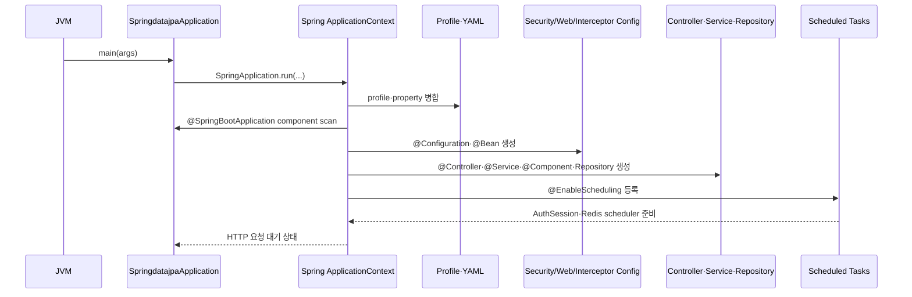
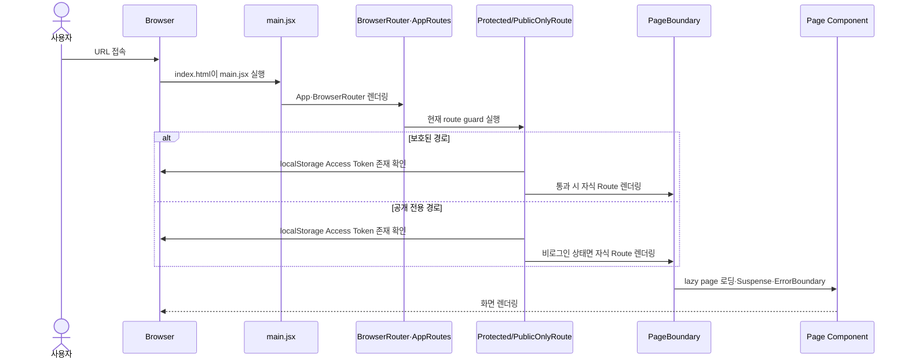
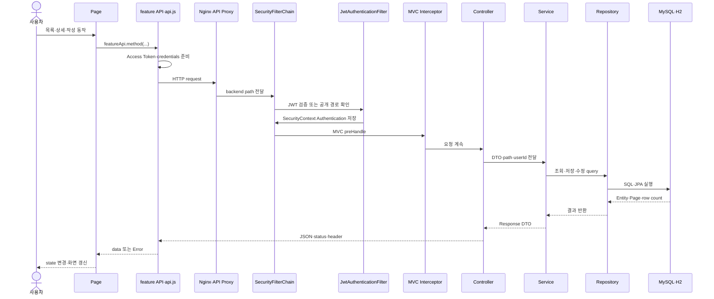
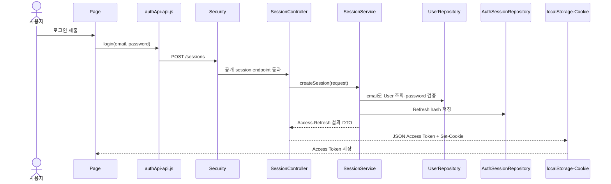
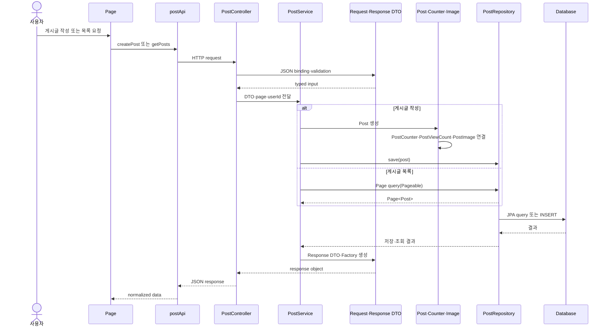
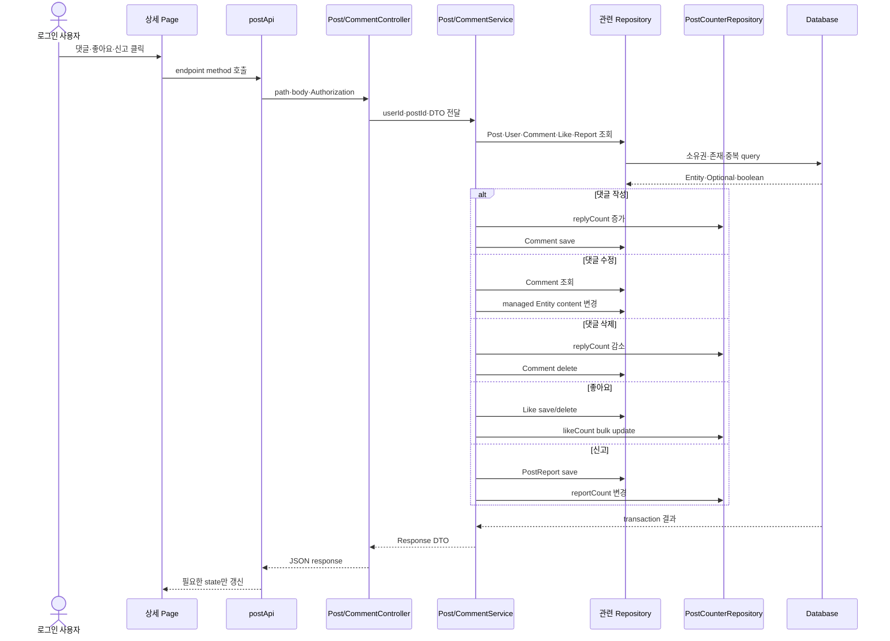
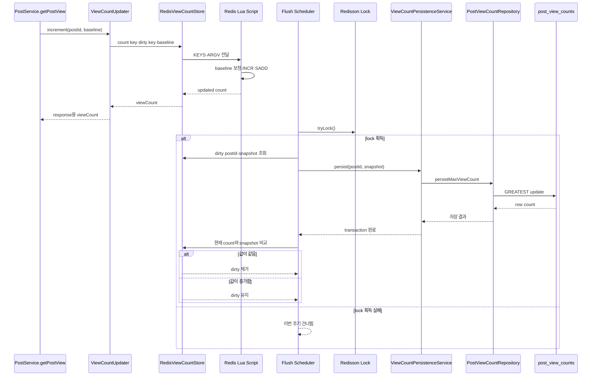
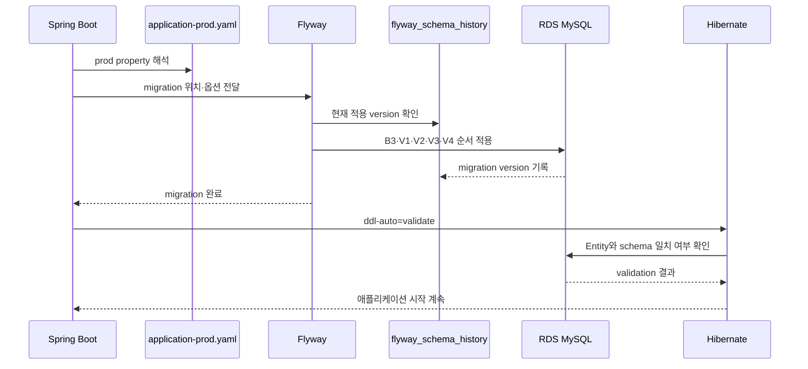
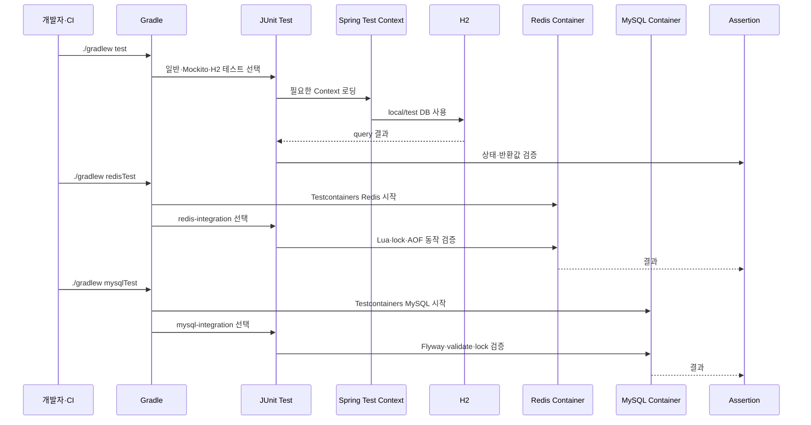
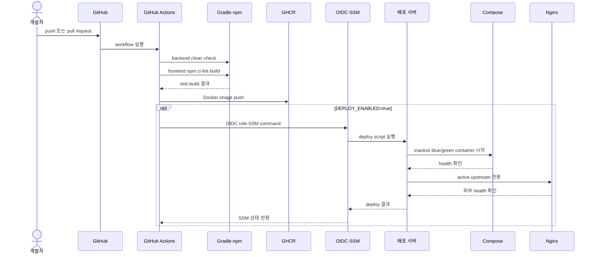

# 프로젝트 전체 실행 Sequence Diagram

이 문서는 actual-code-learning의 각 학습 문서를 읽기 전에 프로젝트 전체 실행 관계를
한눈에 확인하기 위한 지도입니다. 각 diagram은 현재 canonical backend·frontend source와
배포 파일에서 확인한 주요 호출 관계를 표현합니다.

이 문서는 코드 설명을 대체하지 않습니다. 실제 method의 매개변수·반환값·예외·상태 변경은
각 기능별 학습 문서에서 원문과 함께 확인합니다.

기준 저장소:

- 백엔드: `/Users/miles/Documents/GitHub/KTB4_Miles_Week12_Back`
- 프론트엔드: `/Users/miles/Documents/GitHub/KTB4_Miles_Week12_Front`
- 상세 학습 자료: `/Users/miles/Documents/GitHub/kakao_tech_bootcamp_study/study12/project-study/actual-code-learning`

---

## 1. 애플리케이션 시작



---

## 2. 프론트 진입과 라우팅



Route guard의 token 확인은 token의 서명·만료 검증이 아닙니다. 실제 인증은 API 요청이
backend Security Filter를 통과할 때 수행됩니다.

---

## 3. 일반 API 요청



---

## 4. 인증 요청

상세 인증 흐름은 `04-08_인증_통합_실행흐름.md`의 diagram을 기준으로 읽습니다.



---

## 5. 게시글 Entity·DTO·Repository 흐름



---

## 6. 댓글·좋아요·신고 상호작용



---

## 7. Redis 조회수와 DB 반영

Redis 상세 흐름은 `98_Redis_조회수_처리.md`에 보관되어 있습니다.



---

## 8. Flyway·RDS 시작 흐름



실제 production DB·migration 실행 결과는 이 저장소의 정적 diagram만으로 확인하지
않았으므로, 운영 상태로 단정하지 않습니다.

---

## 9. 테스트 실행 흐름



현재 frontend에는 별도 browser 자동화 test runner가 없습니다.

---

## 10. CI/CD와 Blue-Green 배포



---

## 11. 전체 프로젝트 요청 요약

```text
브라우저
→ React route·Page state
→ feature API·공통 request
→ frontend Nginx·backend Nginx
→ Security Filter
→ MVC Interceptor
→ Controller
→ Service transaction
→ Repository·Entity
→ H2·MySQL·Redis
→ DTO·Jackson·HTTP response
→ React state·화면
```

배포 변경은 별도 흐름입니다.

```text
GitHub push
→ GitHub Actions
→ test·lint·build
→ Docker image
→ GHCR
→ AWS OIDC·SSM
→ Compose
→ health check
→ Nginx blue-green 전환
```

---

## 진행 상태

- 이 보조 다이어그램은 새 파일을 집계하지 않습니다. 현재 파일별 진행률은 `00_실제코드_파일목록과_학습지도.md`의 표를 기준으로 합니다.
- 이번 문서에서 새 source 파일을 추가로 학습하지 않음
- 프로젝트 전체 sequence diagram 작성: 완료
- 다음 학습 시작점: `actual-code-learning/10_게시글_댓글_DTO_Repository_실제흐름.md`의 checkpoint 이후
- 테스트·실제 배포·Redis/MySQL runtime 결과: 실행하지 않음
